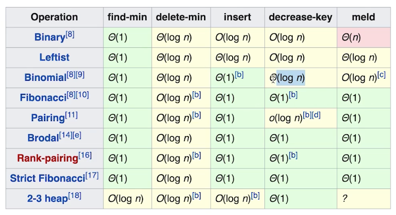
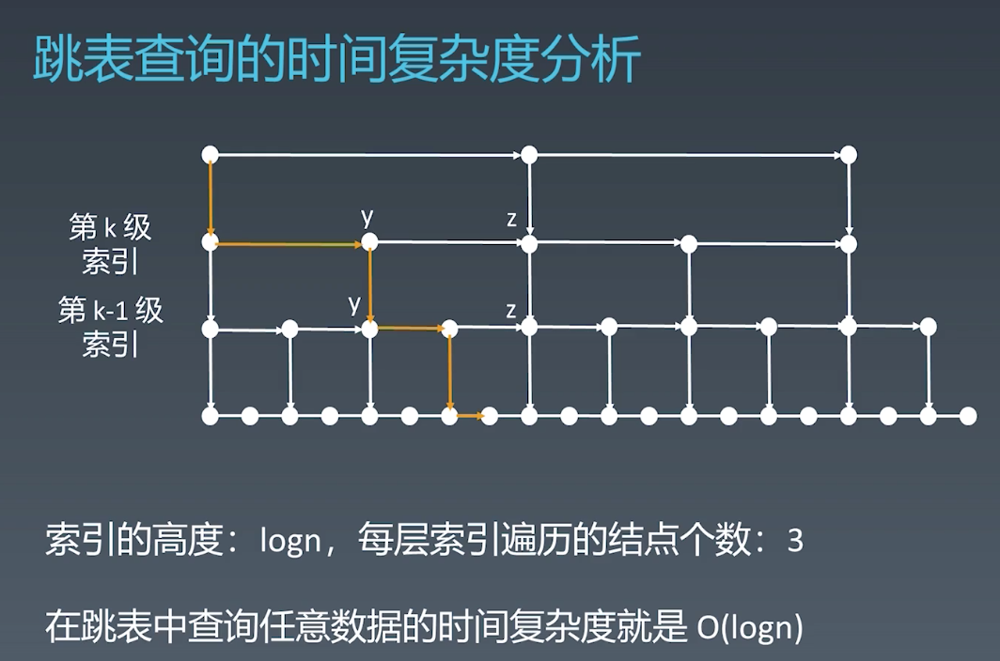
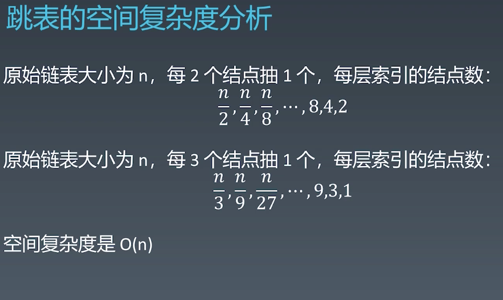

学习笔记

#### 1. 总览

1. 数据结构
   - 一维：数组、链表、栈、队列、双端队列、集合、映射
   - 二维：树、图、二叉搜索树(红黑树、AVL)、堆、并查集、字典树
   - 特殊：位运算、布隆过滤器、LRU Cache
2. 算法
   - 分支：if-else、switch
   - 迭代：for、while
   - 递归
   - 搜索：DFS、BFS、A*
   - 动态规划：dp
   - 二分查找
   - 贪心 
   - 排序
   - 数学、几何
3. 刻意练习
   - 基本功
   - 基本操作的拆解和练习
   - 五遍刷题：（1）十分钟左右读题思考；没有思路直接看解法并比较优劣；背诵默写好的解法；（2）自己写一遍并通过；（3）第二天再写一遍；（4）一周之后再写；（5）面试前一定时间恢复训练；
   - 练习缺陷、缺点
   - 即时反馈
   - 切题四步：Clarification全面确认题目、Possible solutions比较时空复杂度并加强、Coding、Test cases

---

#### 2. 基础知识

##### 2.1 时间复杂度-主定理

用于计算递归算法复杂度的，二分查找`O(logn)`，二叉树遍历`O(n)`，排序的二维矩阵查找(二维的二分)`O(n)`，归并排序`O(nlogn)`

##### 2.2 空间复杂度

一般是程序中开辟的数组长度，或者有递归时的递归树**深度**即为复杂度，二者都有取大。

##### 2.3 数组链表

##### 2.4 堆的时间复杂度

#####2.5 跳表

- 只能用于有序链表
- 对标AVL和红黑树
- 升维+空间换时间
- 每次改动都要维护索引
- 工程中的应用：LRU cache-LinkedList、Redis-SkipList
- 理解原理，不需要会实现

---

#### 3. Queue源码分析

1. 类型：interface，是所有队列类型数据结构都要实现的接口，定义了队列的基本操作；
2. 包含的方法:
(1)boolean add(E e):插入元素e到队列中，在不超过capacity的情况下立即执行，成功返回true，失败返回IllegalStateException；
(2)boolean offer(E e):同样是插入元素到队列中，当队列有容量限制时，总体上该方法好于add
(3)E remove():移除队首元素并返回元素值，当队列空时抛出异常NoSuchElementException；
(4)E poll():同样是移除队首元素，与remove的区别是队列空时返回null
(5)E element():返回队首元素但不删除，空则返回NoSuchElementException；
(6)E peek():返回队首元素但不删除，空则返回NoSuchElementException；

####4. PriorityQueue源码分析

1. Queue的实现，最大的特点是基于传入的比较器，对入队的参数做比较，按照优先级进行排序，使用的数据结构是最小堆，
  所以出队元素是优先级最小的元素；直接父类是AbstractQueue；同时顶层接口有Iterable，即可以使用迭代器迭代容器元素；
  内部物理结构是元素位Object（范型）数组，默认初始大小是11，并用size保存实际元素数量；

2. 构造函数：可传入的参数用以构造的参数类型主要有（1）int initialCapacity，定义初始大小，不传入则11；（2）Comparator<? super E> comparator
  比较器，定义比较依据；（3）Collection<? extends E> c，传入一个包含数据的容器，构造一个优先队列；（4）PriorityQueue<? extends E> c
  以传入的优先队列构造新队列；（5）SortedSet<? extends E> c，以传入的排序集合为参数构造优先队列：当传入的参数是集合类型时，除了传入优先队列为参数
  不需要再进行整理，传入其他容器都需要进行heapify()，将所有元素最小堆化，堆化调用的函数主要是siftUp和siftDown，这方面主要是堆的构造过程。

3. 堆的扩容过程：相关的主要成员变量主要是private static final int MAX_ARRAY_SIZE = Integer.MAX_VALUE - 8;
  在传入新参数造成数组大小不足时，将调用grow函数，在该函数中，当原本容量小于64，则扩容双倍，当大于64，则增加50%；如果扩容之后的
  容量大于MAX_ARRAY_SIZE，就会调用hugeCapacity函数处理；在该函数中，如果grow的参数已经小于0，即已经发生了溢出则抛出OOM异常；如果还没有溢出但是
  大于了MAX_ARRAY_SIZE，则新容量为Integer.MAX_VALUE，否则为MAX_ARRAY_SIZE。

4. remove()相关函数：不传入参数时默认移除堆顶元素，当传入一个具体的元素时，将移除该元素并对堆进行调整；还可以移除特定索引的元素，调用
  removeAt()，remove具体元素时也是先找到该元素的索引，再调用removeAt()；此外还可以移除或者保留满足某些条件的元素，
  比如移除传入的容器中包含的removeAll，或者保留传入的容器中包含的retainAll；

  

---

#### 5. Mac下idea的常用快捷键([参考自](https://www.jianshu.com/p/ec0b5d468eea))

- mac截图：shift+command+3(截全屏)、shift+command+4(手动截屏)
- 查看源码时返回上一步：option+command+左右方向键
- 上下移动某一行代码：shift+command+上下方向键
- 向下复制本行内容：command+d
- 错误自修改：option+enter
- 增加代码块如trycatch：option+command+t
- 选中本行（鼠标在行首或行尾）：shift+command+左右方向键
- 以单词为单位移动光标：option+左右方向键
- 以单词块为移动单位选中：shift+option+左右方向键
- 快速生成getter 和setter：command+n
- 打开最近操作的文件：command+e
- 查看类的继承结构：ctrl+h
- 等效于ctrl+左键：ctrl+b
- 查看一个变量在工程中定义的位置：command+y
- 当前文件查找字段：command+f
- 全局查找：command+o
- 关闭当前文件：command+w
- 整理代码格式：option+command+L
- 代码块注释：shift+command+/
- 撤销撤销：shift+command+z
- 移动到行首：ctrl+a 或 fn+左方向键 或 command+左方向键
- 移动到行尾：ctrl+e 或 fn+右方向键 或 command+右方向键
- 移动到下一行(下方向键)：ctrl+n
- 移动到上一行(上方向键)：ctrl+p
- 从光标到行尾删除：ctrl+k
- fn+上方向键为“page up”
- fn+下方向键为“page down”
- 删除光标右边的内容：fn+delete
- 批量修改变量名replace：command+r 或 fn+shift+f6
- macOS返回上级文件夹：command+方向键上，进入文件夹，command+o或者方向键下

---

#### 6. leetcode

1. 141-环形链表
   - 快慢指针
2. 