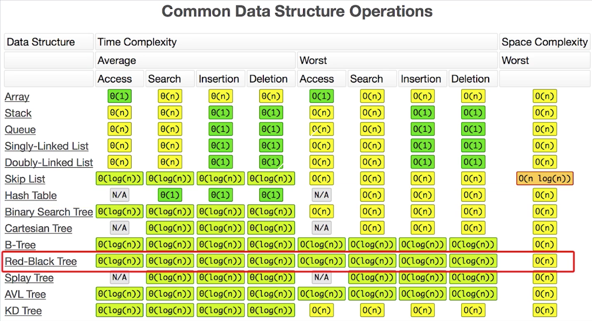
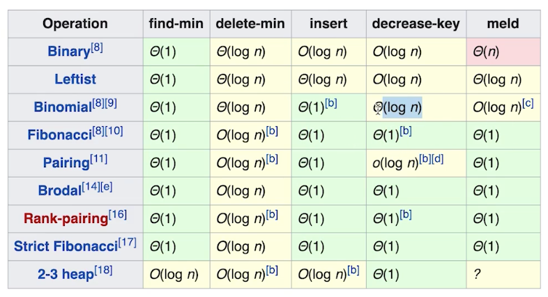
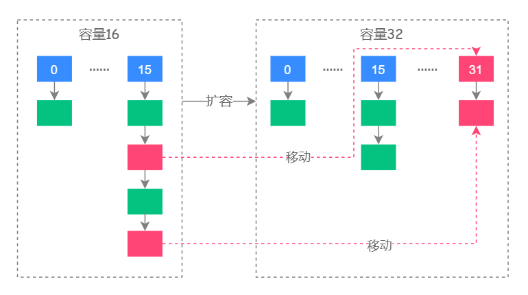

## 学习笔记 Week02


### 1. 基础知识

#### 1.1 Hash、Map、Set

1. `HashMap`的`put()`和`get()`

2. 复杂度分析

   平均情况下，使用Hash复杂度都是O(1)，使用Tree的一般都是红黑树，复杂度O(logn)。

   

#### 2. 树、二叉树、二叉搜索树

1. 减少时间开销的一个点是“**升维**”，比如单链表查找删除等操作O(n)，使用跳表可以提高效率，就是增加了数据结构的维度；使用树结构提高查找效率也是提高维度。

2. 树和图的区别是是否有环。树可以看成两个next的链表，图可以看成有环的树。

3. 为什么会出现树？加速不是主要原因，因为跳表也可以加速；原因在于每个节点代表的状态的下一个状态有多个可能，要在没有直接相连的节点之间移动就需要比该结构的维度更高；

4. 遍历：也可以循环也可以递归，但递归的代码肯定比循环简单很多。

5. 二叉搜索树：利用树结构和节点有序减少查找时间，`O(logn)`，树的相关处理经常使用递归；

6. 堆和二叉堆：堆，迅速找到最大或最小；常见的实现，二叉堆、（严格）斐波那契堆，后者的性能更好，但不要求实现，基于多叉树实现；

   二叉堆的实现比较简单，就是普通堆， 但是性能是比较差的，比较好的是严格斐波那契堆等；

   

   二叉堆的性质：（1）一棵完全树，与二叉搜索树没有本质上的关系；但是使用二叉搜索树可以实现二叉堆，但是因为二叉树完全有序，可以完成许多操作，如找最大最小，但是某些操作慢于二叉堆，比如找最小，二叉堆是`O(1)`，二叉树是`O(logn)`；（2）任何节点，大于两个子节点，所以根是最大值；

   因为二叉堆是满树，所以一般使用数组实现，可以通过索引查找子节点 ，根索引0，左子节点2i+1，右子节点2i+2；

   插入节点到数组最后的位置后，shiftup；删除根节点后将最后一个移到根，再shiftdown；

7. 图：用的比较少，邻接矩阵和邻接表；常见算法：DFS、BFS（记得维护一个已访问数组，这是与树的DFS、BFS最大的区别），

   DFS代码模版

   ```python
   visited=set()
   def dfs(node,visited):
     if node in visited:
       return
     visited.add(node)
     for next_node in node.children():
       if not next_node in visited:
         dfs(next_node,visited)
   ```

   BFS代码模版

   ```python
   def bfs(graph,start,end):
     queue=[]
     queue.append([start])
     visited=set()
     while queue:
       node=queue.pop()
       visited.add(node)
       process(node)
       nodes=generate_related_nodes(node)
       queue.add(nodes)
   ```

   相关问题参考资料：

   [连通图个数](https://leetcode-cn.com/problems/number-of-islands/)

   [拓扑排序](https://zhuanlan.zhihu.com/p/34871092)

   [最短路径：Dijkstra](https://www.bilibili.com/video/av25829980?from=search&seid=13391343514095937158)

   [最小生成树](https://www.bilibili.com/video/av84820276?from=search&seid=17476598104352152051)

---

### 2. 每日一题总结

#### 2.1 04-20

1. 299-bulls-and-cows：只要读懂了题意，写出来不难；另外在元素可能出现的种类有限时，使用数组而不是hash可以节省很多时间。

2. 200-number-of-islands：简单的BFS

#### 2.2 04-21

1. 350-intersection-of-two-arrays-ii

- 常规思路(7，23.38； 39.9，5.13)：使用`HashMap<Integer,Integer>`保存长度较短的数组，然后遍历另一个数组，并在这个过程中维护map，当value=0时，删除对应的key，再判断map是否为空，true则直接返回，false进入下次循环。过程中使用ArrayList保存中间结果，将List转为int[]，除了循环赋值，也可以使用java8的stream，`res.stream().mapToInt(Integer::intValue).toArray();`；另外测试保存较长的数组而遍历较短的数组，结果接近；

- 优化常规思路(5,39.8; 39.5,5.13)：将较长的数组保存到map，遍历较短的数组时，没有使用额外空间，直接将结果保存到正在遍历的当前数组中，之后返回前n个元素数组。适用于不要求保持原数组不变的情况。另外题解中使用自调用的方式解决两个数组长短排序的问题。优化：使用自调用解决数组长短顺序；原地赋值结果数组；`return Arrays.copyOf(nums2,count);`

- 指针(2,99.85; 40.1,5.13)：原数组有序，或将原数组排序后，利用有序性，分别用一个指针指向两个数组，从头遍历，相等则置入结果数组或两个数组其中一个。

- 该问题进阶问题：
  - 如果数组有序，各自使用一个指针即可；
  - nums1远大于nums2，使用哈希保存nums2，边遍历nums1边遍历map；
  - 内存不足以将两个数组存入，此时哈希肯定不行，可以先使用外排序之归并排序，再使用指针。关于[外排序与JOIN](https://www.infoq.cn/article/6XGx92FyQ45cMXpj2mgZ)。


2. 392-is-subsequence

- 直接思路：分别用一个指针，遍历到最后即可；charAt:13,43.75; 43,100.  toCharArray:9,56.39; 44.2,100

- 使用封装好的indexOf函数，遍历s的每个字母是否在t中，遇到一个不在的即可返回，从执行过程中感觉上与直接思路是一致的，但是执行速度快很多，2,75.01; 42.7,100；

- 另外tag中有dp，定义一个二维数组，不过时空复杂度都要高一些，等学了dp再回顾。


3. 面试题17.09-get-kth-magic-number-lcci

- 暴力解：从1开始遍历，计算每个是否仅可以被1，3，5整除，不包含其他素因子，返回第k个。每个数字的判断方法是从1开始遍历，只要找到了一个非1，3，5的素因子即可排除。另外没想到优化方法，直接看题解。

- 没想到的一点是，直接用`*3` `*5` `*7`计算出来的。这与数学性质有关。

- 还有利用队列来做的，但是会产生很多不必要的计算并且保存的结果也不是按大小顺序

  ```java
  class Solution {
      public int getKthMagicNumber(int k) {
   				long[] primes ={3,5,7};
          PriorityQueue<Long> pq = new PriorityQueue<>();
          HashSet<Long> set = new HashSet<>();
          set.add(1L);
          pq.add(1L);
          long nums = 1;
          for (int i=0;i<k;i++){
              nums = pq.poll();
              for (long prime:primes){
                  long tmp = prime*nums;
                  if(!set.contains(tmp)){
                      set.add(tmp);
                      pq.add(tmp);
                  }
              }
          }
          return (int) nums;
      }
  }
  ```


4. 1248-count-number-of-nice-subarrays(统计优美子数组)：自己没有尝试解决，因为觉得需要统计的情况过多。

- 暴力，基础的前缀和：产生一个奇数出现次数数组arr，数组值为到目前为止出现的奇数个数，然后双重循环计数`arr[j]-arr[i]==k`，得到的结果就是满足条件的子数组数。

- 滑动窗口：在第`i`个奇数到第`k-i+1`个奇数总共有`k`个奇数，从第`i-1`个奇数到第`i`个奇数之间都是偶数，假设`m`个，第`k-i+1`个奇数到第`k-i+2`个奇数之间都是偶数，假设`n`个,那么符合要求的子数组个数就有`(m+1)*(n+1)`个；找出所有这样的`k`个奇数的子数组数，取和。另外将第`i`个奇数出现的索引保存到一个数组，便于统计两个奇数之间偶数的个数。

- 前缀和优化：比如序列是nums=[1,2,2,3,3,3,4,4,4,4,5,5,5,5,5],前缀和序列就是prefix=[1,1,1,2,2,2,2,2,2,2,3,3,3,3,3],前缀和个数数组prefixCnt=[1,3,7,5]，

  ```java
  class Solution {
      public int numberOfSubarrays(int[] nums, int k) {
          // 数组 prefixCnt 的下标是前缀和（即当前奇数的个数），值是前缀和的个数。
          int[] prefixCnt = new int[nums.length + 1];
          prefixCnt[0] = 1;
          // 遍历原数组，计算当前的前缀和，统计到 prefixCnt 数组中，
          // 并且在 res 中累加上与当前前缀和差值为 k 的前缀和的个数。
          int res = 0, sum = 0;
          for (int num: nums) {
              sum += num & 1;
              prefixCnt[sum]++;
              if (sum >= k) {
                  res += prefixCnt[sum - k];
              }       
          }
          return res;
      }
  }
  //作者：sweetiee
  ```

  

#### 2.3 04-22

1. 199-binary-tree-right-side-view-二叉树右视图

- BFS(1,97.39; 38.5,5)：根据题目描述中给定的输入是数组，发现第一层有一个值，第二层有两个值，第三层有4个值，右视图就是每层最后一个不为null的数，而程序中输入是根结点，由此要做的第一步是将树层序遍历保存到数组中，再找出每层最后一个不为null的，即为结果链表。但是遍历到null时无法保存到容器中，即无法得到题目描述中的输入参数。看了题解，发现想麻烦了，使用队列遍历树时，遍历完每层后直接将队列的最后一个值保存到结果中即可；

- DFS：即使是DFS，肯定也要将树按层来进行逻辑划分，在思考时，觉得难点在于DFS时是不存在“层”的概念的，如何在DFS时添加逻辑上的“层”自己无法想到。题解采用的方法是：中，右，左遍历；

  ```java
  if(depth==res.size()){
    res.add(node.val);
  }
  ```

  用结果链表res的大小判断当前节点是否是遍历到该层的第一个节点，这也是因为遍历顺序是中，右，左，所以每层的最右肯定是最先被访问到的，这种遍历顺序不是典型的前序、后序或中序，自己应该对DFS有了新的理解。


2. 1021-remove-outermost-parentheses-删除最外层的括号

- 看到括号组对，直接想到用Stack，另外需要排除的是最外层的n对括号，当遍历到左括号时是否加入res的判断标准是添加完该左括号时stack.size()是否等于1，大于1时才添加到res；右括号是否添加到res的判断标准是取出配对的左括号时，stack.size()是否为0，不为0说明不是最外层的右括号。以上是直接思路。7,52.07; 39.9,7.69

- 采用巧妙的方式优化以上思路(2,100; 39.7,7.69)：以上方法耗时的原因大部分在于调用工具类，采用简答的方法标记是否是有效的，左括号flag++，右括号flag--，有效的左括号是level>=1的，有效的右括号都是level--后level>=1的，调整加减和判断时机可以巧妙的减少代码量

  ```java
          for(char c:tmp){
              if(c==')') level--;
              if(level>=1) res.append(c);
              if(c=='(') level++;
          }
  ```

  ```java
  				for(char c:S.toCharArray()){
              if(c=='(' && flag++ > 0) res.append(c);
              if(c==')' && flag-- > 1) res.append(c);
          }
  ```

  


3. 面试题59-1-滑动窗口最大值

- 第一个想法是使用PriorityQueue实现的堆，在移动滑动窗口时remove第一个元素，增加新的元素，肯定可行，但因为进行了不必要的排序，效率肯定低；99,12.68; 48.9,100

- 最直观的做法：比较窗口内的元素，找出每组的最大值；27,36.55; 47.3,100

- 单调双向队列：维护队列中的元素保持单调递减，当新加入的数字大于队列尾的元素时，弹出队尾从而保持单调性，同时每次添加完新元素后，返回队列头，即为窗口最大值，该题目中每次只加入一个新的元素，[面试题59-II 队列的最大值](https://leetcode-cn.com/problems/dui-lie-de-zui-da-zhi-lcof/)用到过。
  - 自己使用该方法时，因为第一组是需要放入全部k个元素，之后都是加入1个元素，要把这个统一放在一个while里，采用的方法是`res=new int[length]`，返回结果时返回`res[k-1:]`，遇到的问题是在增加新的元素时无法判断最大元素是否在窗口中进而判断是否需要弹出；
  - 对上个问题的解决方法时deque中保存的是元素在nums中的索引，根据索引判断该元素是否在窗口中

- 左右各扫描一遍(5,88.96;47.8,6.67)：很难想到，将第i个位置的结果分成左右两部分归并获得，非常规，[题解](https://leetcode-cn.com/problems/sliding-window-maximum/solution/hua-dong-chuang-kou-zui-da-zhi-by-leetcode-3/)

- 目前找到最高效的，其实只是最直观的解法，可能是没有使用复杂工具类所以时间少。也可能是测试用例，但做的一些题目，在可以不调用util的问题中，不调用的解法效率总是高的。解法[1](https://leetcode-cn.com/problems/hua-dong-chuang-kou-de-zui-da-zhi-lcof/solution/bu-shi-yong-shu-ju-jie-gou-shuang-100-by-sun-239/)&解法[2](https://leetcode-cn.com/problems/sliding-window-maximum/solution/fen-xiang-yi-chong-jie-guo-hen-kuai-de-javajie-fa-/)：就是最直觉的过程，如果上一组的最大值索引已经不在本组范围内，那么需要重新遍历本组所有元素找出最大值；如果上一组最大值在本组范围内，于新加入的做比较，即可得到本组最大值：是很直接的做法，但是效率很高，可能是没有使用工具类，需要的操作相对简单。

PS:返回空数组`return new int[0]`或者`return new int[]{};`


#### 2.4 04-23

1. 面试题08.11-硬币-coin-lcci。==待解决==
- 典型dp


2. 412-Fizz Buzz
- 联合判断：直观做法按遍历添加string就好了

- 字符串拼接：从题目描述中可以看出（其实一开始读题并没有看出，这是使用联合判断的原因），可以被3整除则该整数应该返回的结果字符串Fizz，可以被5整除则增加Buzz，如果继续增加其他，如被7整除增加Juzz，使用联合判断就会急剧增加判断，使用这个只要拼接字符串就好了

  ```java
  			if (divisibleBy3) {
          // Divides by 3, add Fizz
          numAnsStr += "Fizz";
        }
  
        if (divisibleBy5) {
          // Divides by 5, add Buzz
          numAnsStr += "Buzz";
        }
  
        if (numAnsStr.equals("")) {
          // Not divisible by 3 or 5, add the number
          numAnsStr += Integer.toString(num);
        }
  
        // Append the current answer str to the ans list
        ans.add(numAnsStr);
  ```

- 使用散列表：对上一种方法的优化，上一种方法，要列出所有的if，可以将数字与对应的字符串保存到map中，循环时遍历map即可

  ```java
  		HashMap<Integer, String> fizzBizzDict = new HashMap<Integer, String>() {
            {
              put(3, "Fizz");
              put(5, "Buzz");
            }
          };
  
      for (int num = 1; num <= n; num++) {
        String numAnsStr = "";
        for (Integer key : fizzBizzDict.keySet()) {
          // If the num is divisible by key,
          // then add the corresponding string mapping to current numAnsStr
          if (num % key == 0) {
            numAnsStr += fizzBizzDict.get(key);
          }
        }
  
        if (numAnsStr.equals("")) {
          // Not divisible by 3 or 5, add the number
          numAnsStr += Integer.toString(num);
        }
  
        // Append the current answer str to the ans list
        ans.add(numAnsStr);
      }
  ```

- `int`转为`String`，`String.valueOf(int)`，`Integer.toString(int)`


3. 258-各位相加
- 两层循环直到结果只有一位
- [数学方法](https://leetcode-cn.com/problems/add-digits/solution/java-o1jie-fa-de-ge-ren-li-jie-by-liveforexperienc/)


4. 283-移动0
- 将非0值不改变顺序向前移动，剩下的位置置0；
- 遍历，交换0和非0元素位置；


#### 2.5 04-24

1. 面试题51 数组中的逆序对 ==待解决==
- 暴力：`O(N^2)`
- 分治之归并排序
- 树状数组


2. 111-二叉树最小深度：
- DFS递归
- BFS更好，层序遍历找到第一个叶子节点就是最小深度，不同于找最大深度，只要其中一个分支结束即可返回结果，DFS会遍历到最大深度

   ```java
   		public int minDepth(TreeNode root) {
           if(root == null) return 0;
           List<TreeNode> list = new LinkedList<>();
           list.add(root);
           int level = 1;
           while(!list.isEmpty()){
               int len = list.size();
               for(int i = 0;i<len;i++){
                   TreeNode node = list.remove(0);
                   if(node.left == null && node.right == null) return level;
                   if(node.left != null) list.add(node.left);
                   if(node.right != null) list.add(node.right);
               }
               level++;
           }
           return 0;// Will never reach this line;
       }
   ```

3. 104-二叉树最大深度：DFS递归，找到最大深度,

4. 559-N叉树最大深度：递归，迭代获得所有子节点中的最大深度

5. 110-平衡二叉树：==自底向上待解决==

   > 判断底向上还是顶向下的办法就是，底向上是子方法（myjudge）调子方法，父方法（isBalanced）只调用一次子方法；顶向下是父方法（isBalanced）调父方法，通过子方法（如官方法1的height）判断是否达到剪枝条件。
- 递归，自顶向下，可以借助104题，时间复杂度`O(nlogn)`，问题是会产生大量重复计算；

- 自底向上，时间复杂度`O(n)`，height逐级调用知道到叶子节点，然后从叶子节点计算每个节点的结果，如果高度差大于1直接返回结果，由于如果平衡需要返回高度，所以返回值类型必须是int，使用一个负数表示失去平衡，否则返回自己的高度；

  ```java
  		public boolean isBalanced(TreeNode root) {
          return height(root)>=0;
      }
  
      public int height(TreeNode root){
          if(root == null){
              return 0;
          }
          int l = height(root.left);
          int r = height(root.right);
          if(l==-1 || r==-1 || Math.abs(l-r)>1) return -1;
          return Math.max(l,r) +1;
      }
  ```


#### 2.6 04-25

1. 46-全排列

- 主要知识点：回溯   ==待解决==

2. 590-N叉树后序遍历 ==待完成==

3. 1580-最小的K个数

- 堆
- 快排，==需要复习==

4. 面试题01.08-零矩阵
- 可以直接暴力迭代
- 也可以使用set在第一次循环时记录需要改变的行号和列号，就可以避免大量重复赋值。

5. 1200-最小绝对差
- 直接暴力循环

- 先对数组排序，之后只要比较每个值和后一个的差就可以了，当当前的差值小于已知的最小值时清空res，写入当前数对；当等于最小值，直接添加到res

  将两个数字添加为list的方法，类`Arrays`中`public static <T> List<T> asList(T... a)`
6. 543-二叉树直径

- 递归，自底向上，使用一个**类成员变量**保存全局的最大直径，然后返回当前节点的深度，供父节点计算其直径，与`110-平衡二叉树`题目相似，都是返回自底向上返回自身的某个结果，区别是110不需要维护一个全局变量所以不需要使用类成员变量，如果出现异常结果会直接逐级返回。**使用自底向上可以避免大量重复计算**。

#### 2.7 04-26

1. 23-合并k个排序链表. ==待熟悉==
- 依次比较k个链表的头节点，选出最小的接到res的next，将该节点所在链表的头节点后移；每轮都要比较k次，循环N次，所以时间复杂度`O(kN)`;这种方法会改变链表结构；

- 使用PriorityQueue，先存入k个节点作为初始化，之后每次循环poll与offer，直到队列空；每轮选出最小的时间复杂度logk，所以时间复杂度`O(Nlogk)`，这种方法不会改变链表结构但是需要额外空间；将优先队列poll出的节点的next offer入队列，就不用人为控制选择哪条链表的节点入队，很巧妙；

  5，64.31； 41.7，48.53

- 另一个思路是先合并两条链表，这种思路可以循环，每次合并两条，[21-合并两个有序链表](https://leetcode-cn.com/problems/merge-two-sorted-lists/)，假设每条链表N/k个节点，也就是比较这么多次，得到总的结果每条链表就需要比较（k-1）次，外层循环有k层，总的时间复杂度约为`O(kN)`;

- 对合并两条链表的思路，可以采用归并的思路，每轮两两合并，时间开销上减少了循环次数为logk次，时间复杂度约为`O(Nlogk)`;2，97.77； 41.6，54.41

- 合并两条和两两合并都可以采用递归和迭代两种方式；

- 对比使用PriorityQueue和两两合并两种方法，虽然都是`O(Nlogk)`，但是调用队列的方法使用时间较长，这也印证了在leetcode上测试，调用封装好的工具类确实会增加时间，但是理论上这两种方法的时间复杂度是同量级的。

2. 76-颜色分类

- 本质上是排序问题
- 有重复元素可以使用计数排序
- 三路快排在这种情况下表现依然可观；

---

### 3. 作业算法题

####3.1 当周

1. 242-valid-anagram-有效的字母异位词
- 就是统计两个单词中出现的所有字母及其频率是否一致，可以使用HashMap或者直接使用int[26]保存。使用int[]是因为出现的字符数少，如果是Unicode或者字符数很多使用HashMap比较好，时间复杂度`O(n)`，如果使用`toCharArray()`需要`O(n)`的空间。

  一些细节：刚开始就判断两个字符串是否相等，之后就不需要判断int[]是否全0了；

- 也可以对两个字符串排序`Arrays.sort(s.toCharArray())`后比较`Arrays.equals(s1,s2)`；时间复杂度`O(logn)`.


2. 1-两数之和
- 题目本质是查找，一般使用HashMap，稍微做点优化是不需要将所有元素保存到Map之后再查找，可以边保存边查找，这样最多遍历一遍之后就可以得到结果。

3. 589-n叉树前序遍历
- 与二叉树前序遍历的区别是，子节点不是左右两个，使用循环递归所有节点；
- 不使用递归可以使用Stack，本质上也是模拟递归过程。不过会改变树的结构。

4. 49-字母异位词分组
- 是242的升级版，本质思路与之相同，但要想办法处理分组，总的来说都是如何设计hash函数使异位词的key相同，==是否还有其他的hash方法呢？==

- 因为异位词排序后是相通的，所以可以将排序后的结果作为key保存到HashMap，value就是List；时间复杂度，遍历与排序，就是`O(NKlogK)`，空间复杂度是使用的HashMap，`O(NK)`，8,98.91;  42.6,32.35

- 总的目标是将异位词分组，即异位词有相同的特征，找出这个特征；比较直观的是int[26]数组肯定不同，将这个数组转为字符串直接作为key，总的来说，时间开销主要是遍历字符串数组，所以时间复杂度是`O(NK)`，空间复杂度HashMap，`O(NK)`。21,28.35;  42.4,35.29

- 从结果来看，第二种的耗时更长，是因为在第二种方法中有将int数组转为key的过程是没有计算在时间复杂度中的，因为总的来说它是常数复杂度，而在单词量和长度比较小时，排序的时间消耗小于处理int数组的时间，在数据量较大时，能比较好的看出差异。

- 国际站中也有使用素数相乘的到key值的

  ```java
  private static final int[] PRIMES = new int[]{2, 3, 5, 7, 11 ,13, 17, 19, 23, 29, 31, 37, 41, 43, 47, 53, 59, 61, 67, 71, 73, 79, 83, 89, 97, 101, 107};
              for (int j = 0, max = strs[i].length(); j < max; j++) {
                  mapping *= PRIMES[strs[i].charAt(j) - 'a'];
              }
  ```

  给一个产生prime数组的函数，==待研究==

  ```java
  private static int[] primes(int n){
          if(n<1){
              return null;
          }
          int[] res = new int[n];
          res[0] = 2;
          int counter = 1, cur = 3;
          while(counter<n){
              for(int num:res){
                  // if visited all previous prime numbers
                  if(num==0 || num*num >cur){
                      res[counter++] = cur++; 
                      break;
                  }
                  // not a prime number
                  if(cur%num==0){
                      ++cur;
                      break;
                  }
              }
          }
          return res;
      }
  ```

5. 94-二叉树中序遍历

- 递归很简单

- 迭代

  ```java
  public List<Integer> inorderTraversal(TreeNode root){
    ArrayList<Integer> res=new ArrayList<>();
    if(root==null){
      return res;
    }
    Stack<TreeNode> stack=new Stack<>();
    TreeNode cur=root;
    while(cur!=null || !stack.isEmpty()){
      //迭代左节点入栈
      while(cur!=null){
        stack.push(cur);
        cur=cur.left;
      }
      //左节点入栈完毕
      //作为取出中间节点
      cur=stack.pop();
      res.add(cur.val);
      //中间节点处理完毕处理右节点
      cur=cur.right;
    }
    return res;
  }
  ```
- Morris：见12
6. 144-二叉树前序遍历
- 递归

- 迭代

  ```java
  public List<Integer> preorderTraversal(TreeNode root){
    ArrayList<Integer> res=new ArrayList<>();
    if(root==null){
      return res;
    }
    Stack<TreeNode> stack=new Stack<>();
    stack.push(root);
    TreeNode cur;
    while(!stack.isEmpty()){
      cur=stack.pop();
      res.add(cur.val);
      if(cur.right!=null){
        stack.push(cur.right);
      }
      if(cur.left!=null){
        stack.push(cur.left);
      }
    }
    return res;
  }
  ```

- Morris：见12

7. 429-N叉树层序遍历

- 层序遍历，使用队列即可，分层的要求通过遍历本层时先记录本层节点个数解决，注意队列不能使用PriorityQueue，因为需要进行节点间的比较。使用的是ArrayDeque或者LinkedList，弹出元素用poll或者remove，不能用get，get相当于peek，不会弹出。

- 递归：层序遍历递归，主要是采取措施标识当前节点所属的层

  ```java
  private List<List<Integer>> res;
  public List<List<Integer>> levelOrder(Node root){
    if(root!=null){
      traverseNode(root,0);
    }
    return res;
  }
  
  private void traverseNode(Node root,int level){
    if(res.size() <= level){
      res.add(new ArrayList<>());
    }
    res.get(level).add(root.val);
    for(Node node:root.children){
      traverseNode(node,level+1);
    }
  }
  ```

8. 面试题49 丑数
- 与之前的每日一题面试题17.09相同
- ==这个是动态规划吗？==

9. 347-前K个高频元素
- 统计所有元素出现次数并将次数作为比较依据存入优先队列，取出前K个即可；
- 因为是统计出现次数，说明元素是重复出现的，可以使用桶排序，之后将出现次数作为index存入数组，最后从后往前取出K个元素。

10. 145-二叉树后序遍历
- 递归

- 迭代：左右中，

  cur标记当前遍历的树的根节点，当有节点pop出说明有一棵树遍历完了，cur更新为遍历完的树的根节点，

  一次while最多只push一个节点，或者弹出已遍历完的树的根节点，

  另外为了在cur为下一个peek的右节点时，错误地又将peek的左节点push，所以在第一个if就添加判断，cur不是左右节点，

  当cur是peek.right的时候，说明左右子树都遍历完了，将peek节点pop，同时更新cur

  先将left入栈，是因为先遍历左子树，与下面技巧迭代不同，这个每次最多只加入一个节点，所以不会有左右在一次while 中同时入栈，

  ```java
  class Solution{
      public List<Integer> postorderTraversal(TreeNode root) { 
          List<Integer> res=new ArrayList<>();
          if(root==null){
              return res;
          }
          Stack<TreeNode> stack=new Stack<>();
          TreeNode cur=root;
          stack.push(root);
          while (!stack.isEmpty()) {
              TreeNode peek = stack.peek();
              if(peek.left!=null && peek.left!=cur && peek.right!=cur){
                  //peek的左节点还没有遍历过
                  stack.push(peek.left);
              }else if(peek.right!=null && peek.right!=cur){
                  //peek右节点没有遍历过
                  stack.push(peek.right);
              }else{
                  res.add(stack.pop().val);
                  cur=peek;
              }
          }
          return res;
      }
  }
  
  //针对第一个if中&& peek.right != cur的作用，可以将while写成一下，方便理解
          while (!stack.isEmpty()) {
              TreeNode peek = stack.peek();
              //当cur为右子节点说明这棵树遍历完了，直接返回peek也是根节点
              if(peek.right!=null && peek.right==cur){
                  res.add(stack.pop().val);
                  cur = peek;
              }else if (peek.left != null && peek.left != cur ) {
                  stack.push(peek.left);
              } else if (peek.right != null ) { //这里就不需要判断不是cur了
                  stack.push(peek.right);
              } else {
                  res.add(stack.pop().val);
                  cur = peek;
              }
          }
  ```

- 迭代：不是直接的后序保存，将遍历顺序定义为中右左，再逆序得到的就是后序遍历；stack要得到中右左的顺序，应该先入栈左；对于逆序输出，这里采用的技巧是，添加到res**时添加到头部**，这样得到的结果直接就是逆序。

  ```java
  class Solution {
      public List<Integer> postorderTraversal(TreeNode root) {
          LinkedList<Integer> res=new LinkedList<>();
          if(root==null){
              return res;
          }
          Stack<TreeNode> stack=new Stack<>();
          stack.push(root);
          TreeNode node;
          while(!stack.isEmpty()){
              node=stack.pop();
              //添加到头部，得到的顺序是遍历顺序的逆序，这一步是关键
              res.addFirst(node.val);
              //要的到中右左的遍历顺序，应该先入栈左
              if(node.left!=null){
                  stack.push(node.left);
              }
              if(node.right!=null){
                  stack.push(node.right);
              }
          }
          return res;
      }
  }
  ```

- Morris：见12

11. N叉树后序遍历
- 递归
- 迭代


12. 针对树的三种遍历方法：[BFS、DFS和Morris的总结帖](https://leetcode-cn.com/problems/binary-tree-postorder-traversal/solution/leetcodesuan-fa-xiu-lian-dong-hua-yan-shi-xbian--2/)

    这里再着重记录一下Morris，因为之前没有接触过，==有时间再学习==
    
    代码模板：
    
    ```java
    public static void preOrderMorris(TreeNode head) {
    	if (head == null) {
    		return;
    	}
    	TreeNode cur1 = head;//当前开始遍历的节点
    	TreeNode cur2 = null;//记录当前结点的左子树
    	while (cur1 != null) {
    		cur2 = cur1.left;
    		if (cur2 != null) {
    			while (cur2.right != null && cur2.right != cur1) {//找到当前左子树的最右侧节点，且这个节点应该在指向根结点之前，否则整个节点又回到了根结点。
    				cur2 = cur2.right;
    			}
    			if (cur2.right == null) {//这个时候如果最右侧这个节点的右指针没有指向根结点，创建连接然后往下一个左子树的根结点进行连接操作。
    				cur2.right = cur1;
    				cur1 = cur1.left;
    				continue;
    			} else {//当左子树的最右侧节点有指向根结点，此时说明我们已经回到了根结点并重复了之前的操作，同时在回到根结点的时候我们应该已经处理完 左子树的最右侧节点 了，把路断开。
    				cur2.right = null;
    			}
    		} 
    		cur1 = cur1.right;//一直往右边走，参考图
    	}
    }
    ```
    
    


#### 3.2 下周预习

1. 70-爬楼梯
2. 22-括号生成
3. 50-pow(x,n)
4. 78-子集
5. 51-N皇后

---


### 4. HashMap & ConcurrentHashMap

1. JDK7

- JDK7中HashMap结构为Hash表（bucket哈希桶）+链表（保存哈希值相同的val），JDK8中当链表长度大于某定值64，链表转化为红黑树，因为当链表过长会严重影响哈希表性能，红黑树可以快速CRUD

- 相关初始化参数：

  - 初始化长度`static final int DEFAULT_INITIAL_CAPACITY = 1 << 4; // aka 16;`
  - 最大长度：`static final int MAXIMUM_CAPACITY = 1 << 30;`
  - 默认加载因子(扩容因子)：`static final float DEFAULT_LOAD_FACTOR = 0.75f;`
  - 转换红黑树临界值：`static final int TREEIFY_THRESHOLD = 8;`
  - 转换链表临界值：`static final int UNTREEIFY_THRESHOLD = 6;`
  - 最小树容量：`static final int MIN_TREEIFY_CAPACITY = 64;`

- 扩容优化：并不是像JDK1.7中计算所有元素的Hash值，而是通过高位运算`e.hash & oldCap`来确定元素是否需要移动，最高位为1时，需要移动，最高位为0则不移动；

  

- 加载因子0.75的原因：容量和性能之间平衡的结果，加载因子大了hash冲突增加，要使用更复杂的数据结构保存数据，操作复杂度增加了，运行效率会降低；加载因子较小，主要问题时增加占用的空间，但由于冲突可能性比较小所以可操作性比较高；还有一点是不是因为，为了提升扩容效率，HashMap的容量（capacity）有一个固定的要求，那就是一定是2的幂。所以，如果负载因子是3/4的话，那么和capacity的乘积结果就可以是一个整数

- 哈希冲突时，HashMap如何查找并确认元素

- HashMap源码中的重要方法：

  - 查询：哈希冲突时需要遍历用于保存数据的数据结构，链表或红黑树以查找目标key

  - 新增：

    

  - 数据扩容：见扩容优化

- HashMap如何导致死循环：JDK1.7中多个线程操作同一个map，某个线程进行了rehash操作导致节点位置改变但next还未变；JDK8中修改为尾部正序插入，问题得到改善；但是为了线程安全，多线程中使用ConcurrentHashMap。

  


2. JDK8


---

### 5. 其他

#### 5.1 回溯算法

