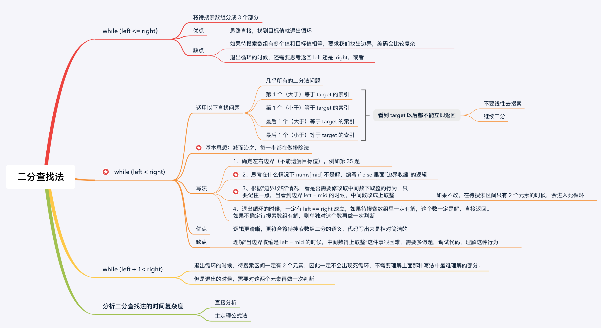

## 学习笔记 Week03

---
[TOC]

### 1. 基础知识

1. 递归

   - 找到最近最简方法，拆解成可重复解决的问题
   - 数学归纳法

   ```java
   //代码模板
   public void recur(int level,int param){
     //terminator
     if(level>Max_Level){
       //some process
       return;
     }
     //process this level
     process(level,param);
     
     
     recur(level+1,param);
     
   
     return;
   }
   ```


2. 分治

   递归的一种

   找重复性：最近重复性、最优重复性

   分解问题&组合子问题结果

   ```java
   public void divide_conquer(problem,para...){
     //terminator
     if(){
       return;
     }
     
     //seperate big problem
     subpro[] subproblems=split_problem(problem,para...);
     //conquer subproblem
     subresult1=divide_conquer(subpro[0],para..);
     subresult2=divide_conquer(subpro[1],para...);
     //...
     //drill down：subproblem 
     //you can process subresult
     result=process_result(subresult1,subresult2...);
    
       //reverse states
     return;
   }
   ```

   

3. 回溯

   试错并返回n步

   常用最简单的递归实现

   找到结果或不存在答案

   最差的情况，指数时间


4. 随堂算法题

  1.  [70. 爬楼梯](https://leetcode-cn.com/problems/climbing-stairs/)
      - 暴力法：直接递归，超时，时间复杂度`O(2^n)`
      - 优化暴力：保存中间结果，0，100； 36.3，5.66，时间复杂度`O(n)`
      - 动态规划：观察发现，`f(n)=f(n-1)+f(n-2)`，具有动态规划的特性,时间复杂度`O(n)`
      - 优化动态规划or斐波那契：`f(n)`只与前两个数有关，就不用数组保存，只要两个变量即可,时间复杂度`O(n)`
      - 另外还有一些数学方法，时间复杂度`O(logn)`，这里就不做说明，[详见链接](https://leetcode-cn.com/problems/climbing-stairs/solution/pa-lou-ti-by-leetcode/)

  2.  [22. 括号生成](https://leetcode-cn.com/problems/generate-parentheses/)

      - 在只有一种括号的情况下，左括号可以随便添加，右括号添加完后，只要数量<=左括号的数量就是可行的。
      - 基础的递归，列举出所有可能的组合后再isValid判断，2,53.71; 40.6,5.26
      - 优化的递归，每次添加括号前检查可行性，可以在this process计算左右括号数量，也可以作为将左右括号数量作为参数，0,100; 40.1,5.26

  3.  [226. 翻转二叉树](https://leetcode-cn.com/problems/invert-binary-tree/)

      - 比较典型的递归

        ```java
                TreeNode left=root.left;
                root.left=invertTree(root.right);
                root.right=invertTree(left);
        ```

        

  4.  [98. 验证二叉搜索树](https://leetcode-cn.com/problems/validate-binary-search-tree/)

      - 第一想法是使用递归，对每个节点进行验证，验证左节点、root、右节点的值，但是没考虑到隔代比较；所以需要记录上下界，上下边界使用参数传入，对于不同的点，其边界是不同的；0,100; 39,49.27
      - 比较巧妙的方法是借助二叉搜索树的一个性质，即中序得到的结果是有序的；使用LinkedList2,38.76; 39.6,5.8

  5.  [104. 二叉树的最大深度](https://leetcode-cn.com/problems/maximum-depth-of-binary-tree/)：DFS

  6.  [111. 二叉树的最小深度](https://leetcode-cn.com/problems/minimum-depth-of-binary-tree/)：第二周已解决，推荐使用BFS找第一个叶子节点的深度，注意是叶子节点，如果根节点的left或right为null，不能直接返回最小深度为1。

  7. [297. 二叉树的序列化与反序列化](https://leetcode-cn.com/problems/serialize-and-deserialize-binary-tree/)：[每日一题4-30.3](#2.4 4-30)

  8. [50. Pow(x, n)](https://leetcode-cn.com/problems/powx-n/)

     - 直接进行n次连乘，时间复杂度`O(n)`

     - 分治，将x^n^=x^n/2^ * x^n/2^,若n为奇数，再*x即可，这种方式复杂度再`O(logn)`

     - 第一次做的时候没有考虑到n为负数的情况

     - 唉，这题坑太多了

     - 还有n是int表示临界值的情况，比如-2147483648和2147483647，前者变为相反数直接超出int表示范围

       ```java
       //1，95.12；  37.2，5.88
       class Solution {
           private double fastPow(double x, long n) {
               if (n == 0) {
                   return 1.0;
               }
               double half = fastPow(x, n / 2);
               if (n % 2 == 0) {
                   return half * half;
               } else {
                   return half * half * x;
               }
           }
           public double myPow(double x, int n) {
               long N = n;
               if (N < 0) {
                   x = 1 / x;
                   N = -N;
               }
       
               return fastPow(x, N);
           }
       }
       
       
           //暴力法直接互乘试试
           //果然超时了
           //但是题解就没有超时
       //     public double myPow(double x,int n){
       //         //n为负
       //         if(n<0){
       //             x=1.0/x;
       //             n=-n;
       //             return myPow(x,n);
       //         }
       //         //terminator
       //         if(n==0){
       //             return 1;
       //         }
       //         //如果不用数组会有许多重复计算
       //         //用保存中间结果的方式避免重复计算
       //         //当n=-2147483648栈溢出
       					 //栈溢出的原因是二进制表示为100000...00,转为相反数也是这个，就一直卡在这里
       //         double half=myPow(x,n/2);
       //         if(n%2==0){
       //             return half*half;
       //         }else{
       //             return half*half*x;
       //         }
       //     }
       // }
       
       
       ```
       
     - 还有一个快速幂计算方法，本质上的计算过程也是一样的
     
       ```java
       class Solution {
           public double myPow(double x, int n) {
               long N = n;
               if (N < 0) {
                   x = 1 / x;
                   N = -N;
               }
               double ans = 1;
               double current_product = x;
               for (long i = N; i > 0; i /= 2) {
                   if ((i % 2) == 1) {
                       ans = ans * current_product;
                   }
                   current_product = current_product * current_product;
               }
               return ans;
           }
       }
       ```
       
       
  
  9. [78. 子集](https://leetcode-cn.com/problems/subsets/)
  
     - 想麻烦了，想着怎么控制生成的list，可以在从0～length都添加到res，但实际上只要执行一次递归就把list添加到res就可以了；但是边界条件，尤其是调用递归函数时传入的层参数很容易写错；
  
       ```java
       class Solution {
           public List<List<Integer>> subsets(int[] nums) {
               List<List<Integer>> res=new ArrayList<>();
               if(nums==null){
                   return res;
               }
               subset(res,new ArrayList<Integer>(),0,nums);
               return res;
           }
       
           private void subset(List<List<Integer>> res,ArrayList<Integer> list,int level,int[] nums){
               res.add(new ArrayList<Integer>(list));
               for(int i=level;i<nums.length;i++){
                   list.add(nums[i]);
                   // subset(res,list,level+1,nums);
                   //[[],[1],[1,2],[1,2,3],[1,3],[1,3,3],[2],[2,2],[2,2,3],[2,3],[2,3,3],[3],[3,2],[3,2,3],[3,3],[3,3,3]]
                   subset(res,list,i+1,nums);
                   list.remove(list.size()-1);
               }
           }
       }
       ```
  
       


---

### 2. 每日一题

#### 2.1 4-27

1. 33-搜索旋转排序数组：在数组中查找特定的元素，时间复杂度`O(logn)`的就是使用二分查找，这系列问题的本质是查找指定元素，可以看作二分查找的变形。[sweetie](https://leetcode-cn.com/problems/search-in-rotated-sorted-array/solution/duo-si-lu-wan-quan-gong-lue-bi-xu-miao-dong-by-swe/)
- 最简单的做法, 先找到最值将旋转数组分成两段有序数组，接下来在有序数组中找目标值就轻车熟路了

- 先比较target与nums[0]的大小关系直接决定找左还是右；

- 先根据 nums[mid] 与 nums[lo] 的关系判断 mid 是在左段还是右段，接下来再判断 target 是在 mid 的左边还是右边，从而来调整左右边界 lo 和 hi。

  ```java
  public int search(int[] nums, int target) {
      int lo = 0, hi = nums.length - 1, mid = 0;
      while (lo <= hi) {
          mid = lo + (hi - lo) / 2;
          if (nums[mid] == target) {
              return mid;
          }
          // 先根据 nums[mid] 与 nums[lo] 的关系判断 mid 是在左段还是右段 
          if (nums[mid] >= nums[lo]) {
              // 再判断 target 是在 mid 的左边还是右边，从而调整左右边界 lo 和 hi
              if (target >= nums[lo] && target < nums[mid]) {
                  hi = mid - 1;
              } else {
                  lo = mid + 1;
              }
          } else {
              if (target > nums[mid] && target <= nums[hi]) {
                  lo = mid + 1;
              } else {
                  hi = mid - 1;
              }
          }
      }
      return -1;
  }
  ```

  
2. 189-旋转数组

- 暴力法：双重循环，外层k，内层N，每次内循环向后移动一位；时间复杂度`O(Nk)`，空间复杂度`O(1)`

- 使用额外数组，时间复杂度`O(N)`，空间复杂度`O(N)`;

- 环形替换：时间复杂度`O(N)`，空间复杂度`O(1)`

  
  
  ```java
  class Solution {
      public void rotate(int[] nums, int k) {
          //环形替换
          int count=0;
          int length=nums.length;
          k%=length;
          for(int start=0;count<length;start++){
              int current=start;
              int pre=nums[start];
              do{
                  int next=(current+k)%length;
                  int tmp=nums[next];
                  nums[next]=pre;
                  pre=tmp;
                  current=next;
                  count++;
              }while(current!=start);
          }
      }
  }
  ```
  
- 局部反转：利用的是特殊性质

  ```java
  原始数组                  : 1 2 3 4 5 6 7
  反转所有数字后             : 7 6 5 4 3 2 1
  反转前 k 个数字后          : 5 6 7 4 3 2 1
  反转后 n-k 个数字后        : 5 6 7 1 2 3 4 --> 结果
  ```
3. 153-寻找旋转排序数组中的最小值

   ```java
   class Solution {
       public int findMin(int[] nums) {
           int left = 0;
           int right = nums.length - 1;
           while(left < right) {
               int mid = left + (right - left) / 2;
               //注意这里不能用nums[mid]>nums[left]来判断
               if(nums[mid] < nums[right]) {
                   right = mid;
               } else {
                   left = mid + 1;
               }
           }
           return nums[left];
       }
   }
   ```

   

4. 1095-山脉数组中查找目标值

5. 852-山脉数组的峰顶索引

- 直观解法：一直遍历到不再增加，时间复杂度`O(N)`

  ```java
  while(A[i]<A[i+1]) i++;
  ```

- 二分查找：时间复杂度`O(logN)`

  ```java
      public int peakIndexInMountainArray(int[] A) {
          int left=0;
          int right=A.length-1;
          while(left<right){
              int mid=left+(right-left)/2;
              if(A[mid]<A[mid+1]){
                  //递增
                  left=mid+1;
              }else{
                  right=mid;
              }
          }
          return left;
      }
  ```

  


6. 15-三数之和:[比较全面的整理](https://leetcode-cn.com/problems/3sum/solution/san-shu-zhi-he-javajian-ji-ti-jie-by-wang-zi-hao-z/)
- 完全暴力，三重循环，`O(N^3)`，这种方法还需要去重；以下方法通过使用Set完成了去重；另外学到的新方法是`Collections.emptyList()`和`Arrays.asList(T...)`和`new ArrayList<>(Collection)`

  ```java
  private List<List<Integer>> directlySolution(int[] nums) {
      if (nums == null || nums.length <= 2) {
          return Collections.emptyList();
      }
      Arrays.sort(nums);
      Set<List<Integer>> result = new LinkedHashSet<>();
      for (int i = 0; i < nums.length; i++) {
          for (int j = i+1; j < nums.length; j++) {
              for (int k = j+1; k < nums.length; k++) {
                  if (nums[i] + nums[j] + nums[k] == 0) {
                      List<Integer> value = Arrays.asList(nums[i], nums[j], nums[k]);
                      result.add(value);
                  }
              }
          }
      }
  
      return new ArrayList<>(result);
  }
  ```

  

- twosum的进阶，也是查找问题，可以使用HashMap

- 也可以使用排序+双指针的方法，26，70.83； 43.7，98.7；

  ```java
  class Solution{
      public static List<List<Integer>> threeSum(int[] nums){
          List<List<Integer>> res=new ArrayList<>();
          int length=nums.length;
          if(nums==null || length<3) return res;
          //sort
          Arrays.sort(nums);
          for(int i=0;i<length-2;i++){
              if(nums[i]>0) break;
              //这样不行
              // if(nums[i]==nums[i+1]) continue;
              if(i>0 && nums[i]==nums[i-1]) continue;
              int left=i+1;
              int right=length-1;
              while(left<right){
                  int sum=nums[i]+nums[left]+nums[right];
                  if(sum==0){
                      res.add(Arrays.asList(nums[i],nums[left++],nums[right--]));
                      while(left<right && nums[left]==nums[left-1]) left++;
                      while(left<right && nums[right]==nums[right+1]) right--;
                  }else if(sum>0){
                      right--;
                      while(left<right && nums[right]==nums[right+1]) right--;
                  }else {
                      left++;
                      while(left<right && nums[left]==nums[left-1]) left++;
                  }
              }
          }
          return res;
      }
  }
  ```


#### 2.2 4-28

1. [面试题56 - I. 数组中数字出现的次数](https://leetcode-cn.com/problems/shu-zu-zhong-shu-zi-chu-xian-de-ci-shu-lcof/)
- 位运算的运用，基于136题，该题目只要找出一种方法，该方法能将数组分成两类/组，每个只出现一次数各在其中一类/组就可以，目标就是找到这个方法。

  ```java
  //a就是两个只出现一次的数字异或的结果，a的bit位为1的就是两个数字不同的bit位，找到最低的这一位就可以用mask分类
  //2，95.47；   41.5，100
  class Solution {
      public int[] singleNumbers(int[] nums) {
          int a = 0;
          for (int num : nums) {
              a ^= num;
          }
          int mask = a & (-a);
          int[] res = new int[2];
          for (int num : nums) {
              if ((num & mask) == 0) {
                  res[0] ^= num;
              } else {
                  res[1] ^= num;
              } 
          }
          return res;
      }
  }
  
  
  // 作者：sweetiee
  //使用二分法查找r，使a<=r && b>r
  //3,37.01;  41.6,100
  class Solution {
      public int[] singleNumbers(int[] nums) {
          int sum = 0, min = Integer.MAX_VALUE, max = Integer.MIN_VALUE, zeroCount = 0;
          for (int num : nums) {
              if (num == 0) {
                  zeroCount += 1;
              }
              min = Math.min(min, num);
              max = Math.max(max, num);
              sum ^= num;
          }
          // 需要特判一下某个数是0的情况。
          if (zeroCount == 1) {
              return new int[]{sum, 0};
          }
          int lo = min, hi = max;
          while (lo <= hi) {
              // 根据 lo 的正负性来判断二分位置怎么写，防止越界。
              int mid = lo < 0 ? lo + hi >> 1 : lo + (hi - lo) / 2;
              int loSum = 0, hiSum = 0;
              for (int num : nums) {
                  if (num <= mid) {
                      loSum ^= num;
                  } else {
                      hiSum ^= num;
                  }
              }
              if (loSum != 0 && hiSum != 0) {
                  // 两个都不为0，说明 p 和 q 分别落到2个数组里了。
                  return new int[]{loSum, hiSum};
              }
              if (loSum == 0) {
                  // 说明 p 和 q 都比 mid 大，所以比 mid 小的数的异或和变为0了。
                  lo = mid;
              } else {
                  // 说明 p 和 q 都不超过 mid
                  hi = mid;
              }
          }
          // 其实如果输入是符合要求的，程序不会执行到这里，为了防止compile error加一下
          return null;
      }
  }
  ```


2. 136-只出现一次的数字

- 由于其他数字都出现两次，所以全部的数字进行异或运算后，相同的两个数字异或为0，一个数异或0为其自身，就得到了只出现一次的数。
- 使用HashMap，遍历一遍保存到map中，key为数字，val为次数，之后遍历map，时间复杂度。时间复杂度`O(N)`，空间复杂度`O(N)`
- `2∗(a+b+c)−(a+a+b+b+c)=c`使用Set计算出所有出现的数，再利用如前所述公式计算得到。时间复杂度`O(N)`，空间复杂度`O(N)`，注意有可能溢出。
- 也可以用链表，第一次出现就保存，再次出现就删除，时间复杂度`O(N^2)`，空间复杂度`O(N)`

3. 415-字符串相加

- 与问题445-两数相加II是同类型题目，相同点都是不确定位数的相加，范围亦未知，则不能将整个结构转为整数后相加，同时要逆序遍历

  这题因为可以转为数组所以可以直接通过索引逆序遍历；使用StringBuilder保存结果，最后需要reverse；

  445是链表，无法直接逆序遍历，采用的方法是保存到栈中，然后依次取出；因为保存到链表，所以结果可以直接头插；

  两个问题采用的相同技巧是：`int add1=index1<0?0:num1arr[index1]-'0';`
  
  ```java
  public String addStrings(String num1,String num2){
    char[] num1arr=num1.toCharArray();
    char[] num2arr=num2.toCharArray();
    int index1=num1arr.length-1;
    int index2=num2arr.length-1;
    int carry=0;
    StringBuilder sb=new StringBuilder();
    
    while(index1>=0 || index2>=0 || carry>0){
      if(index1>=0){
        carry+=num1arr[index1--]-'0';
      }
      if(index2>=0){
        carry+=num2arr[index2--]-'0';
      }
      sb.append(carry%10);
      carry/=10;
    }
    return sb.reverse().toString();
  }
  ```
  
  


4.  [1276-不浪费原料的汉堡制作方案](https://leetcode-cn.com/problems/number-of-burgers-with-no-waste-of-ingredients/)
- 二元一次方程？

  ```java
  return t % 2 == 0 && c * 2 <= t && t <= c * 4 ? Arrays.asList(t / 2 - c, c * 2 - t / 2) :  new ArrayList();
  ```

  


5.  [54-螺旋矩阵](https://leetcode-cn.com/problems/spiral-matrix/)

- 直接构造一个螺旋遍历，时间复杂度`O(N)`，空间复杂度`O(N)`，包含结果res和visited两部分。0,100; 37.8,5.72

  ```java
  class Solution {
      public List<Integer> spiralOrder(int[][] matrix) {
          List ans = new ArrayList();
          if (matrix.length == 0) return ans;
          int R = matrix.length, C = matrix[0].length;
          boolean[][] seen = new boolean[R][C];
          int[] dr = {0, 1, 0, -1};
          int[] dc = {1, 0, -1, 0};
          int r = 0, c = 0, di = 0;
          for (int i = 0; i < R * C; i++) {
              ans.add(matrix[r][c]);
              seen[r][c] = true;
              int cr = r + dr[di];
              int cc = c + dc[di];
              if (0 <= cr && cr < R && 0 <= cc && cc < C && !seen[cr][cc]){
                  r = cr;
                  c = cc;
              } else {
                  di = (di + 1) % 4;
                  r += dr[di];
                  c += dc[di];
              }
          }
          return ans;
      }
  }
  ```

  

- 按层模拟，时间复杂度`O(N)`，空间复杂度`O(N)`，仅包含res。0,100; 37.8,5.72

  ```java
  class Solution {
      public List < Integer > spiralOrder(int[][] matrix) {
          List ans = new ArrayList();
          if (matrix.length == 0)
              return ans;
          int r1 = 0, r2 = matrix.length - 1;
          int c1 = 0, c2 = matrix[0].length - 1;
          while (r1 <= r2 && c1 <= c2) {
              for (int c = c1; c <= c2; c++) ans.add(matrix[r1][c]);
              for (int r = r1 + 1; r <= r2; r++) ans.add(matrix[r][c2]);
              if (r1 < r2 && c1 < c2) {
                  for (int c = c2 - 1; c > c1; c--) ans.add(matrix[r2][c]);
                  for (int r = r2; r > r1; r--) ans.add(matrix[r][c1]);
              }
              r1++;
              r2--;
              c1++;
              c2--;
          }
          return ans;
      }
  }
  ```

  

#### 2.3 4-29

1. [面试题05. 替换空格](https://leetcode-cn.com/problems/ti-huan-kong-ge-lcof/)

- 历替换即可

2. [面试题06. 从尾到头打印链表](https://leetcode-cn.com/problems/cong-wei-dao-tou-da-yin-lian-biao-lcof/)
- 碰到逆序用stack,2,57.73;  40,100
- 使用递归，因为递归可以先递归再处理,1,80.31;  41.7,100
- 最直接的，迭代到链表最后得到size，再从head反向填充到int[] res.0,100;  40.5,100
- 使用现有的容器的时间开销都比较大
- 不能直接使用list.toArray()，Object[]可以转为Integer[],但不能转为int[]
3. [面试题68 - II. 二叉树的最近公共祖先](https://leetcode-cn.com/problems/er-cha-shu-de-zui-jin-gong-gong-zu-xian-lcof/)
- 主要是找到每个节点的所有父节点和祖先节点，然而并不是

- 既然要找节点，那肯定要进行遍历，遍历就从根节点开始，如果root是两者之一，直接返回；否则在左右两个子树中找这两个节点，如果在该子树中没有找到两者任一，肯定会返回null，那么两者肯定在另一棵子树，那只要找到其中任一即可返回，另一个一定是该节点的子孙节点；如果搜索两棵子树都有返回值，那就说明最近祖先一定是当前节点，返回该节点即可。使用递归确实是出乎意料的简单。

  ```java
  class Solution {
      public TreeNode lowestCommonAncestor(TreeNode root, TreeNode p, TreeNode q) {
          if(root==null || root==p || root==q){
              return root;
          }
          TreeNode leftnode=lowestCommonAncestor(root.left,p,q);
          TreeNode rightnode=lowestCommonAncestor(root.right,p,q);
          if(leftnode==null){
              return rightnode;
          }
          if(rightnode==null){
              return leftnode;
          }
          return root;
      }
  }
  ```

  


#### 2.4 4-30

1.  [202. 快乐数](https://leetcode-cn.com/problems/happy-number/)
- 使用Set

- 快慢指针：不断循环得到的是一个隐式链表，判断是否有环

  ```java
      public boolean isHappy(int n) {
          //双指针
          int slow=getNext(n);
          int fast=getNext(getNext(n));
          while(fast!=1 && slow!=fast){
              slow=getNext(slow);
              fast=getNext(getNext(fast));
          }
          return fast==1;
      }
  ```

- 数学是真理

2. [287. 寻找重复数](https://leetcode-cn.com/problems/find-the-duplicate-number/)
- 一般重复元素肯定直接想到Hash；

- 可以排序后与相邻元素比较；

- 题目要求空间复杂度`O(1)`，所以不能遍历整个数组；另外时间复杂度`O(N^2)`，有重复元素表示肯定存在环，可以使用快慢指针；

  ```java
  public int findDuplicate(int[] nums) {
          //数组的index和值之间构成链表
          //由于有重复元素，说明肯定有两个index的值是相同的，即next相同，所以肯定有环
          //快慢指针，基本用途是证明有环
          //进阶问题是找到入口点，这个问题有对应的问题，142
          //先找到交点，再找入口
          //不能这样赋值，要保证二者再同一起点
          // int slow=nums[0];
          // int fast=nums[nums[0]];
          // while(slow!=fast){
          //     slow=nums[slow];
          //     fast=nums[nums[fast]];
          // }
          int slow=nums[0];
          int fast=nums[0];
          do{
              slow=nums[slow];
              fast=nums[nums[fast]];
          }while(slow!=fast);
          //找到入口点slow or fast   
          //二者其一回到起点
          fast=nums[0];
          while(fast!=slow){
              fast=nums[fast];
              slow=nums[slow];
          }
          return fast;
      }
  ```
3. [297. 二叉树的序列化与反序列化](https://leetcode-cn.com/problems/serialize-and-deserialize-binary-tree/)
- 序列化基本是遍历并保存，反序列化就是从保存的结果生成树

  ```java
  public class Codec {
      // Encodes a tree to a single string.
      public String serialize(TreeNode root) {
          return serial(root,new StringBuilder()).toString();
      }
  
      private StringBuilder serial(TreeNode root,StringBuilder sb){
          if(root==null){
              return sb.append("#");
          }
          sb.append(root.val).append(",");
          serial(root.left,sb).append(",");
          serial(root.right,sb);
          return sb;
      }
      
      // Decodes your encoded data to tree.
      public TreeNode deserialize(String data) {
          //split返回的是字符串数组
          return deserial(new LinkedList<String>(Arrays.asList(data.split(","))));
      }
      private TreeNode deserial(Queue<String> queue){
          String s=queue.poll();
          if(s.equals("#")){
              return null;
          }
          TreeNode root=new TreeNode(Integer.valueOf(s));
          root.left=deserial(queue);
          root.right=deserial(queue);
          return root;
      }
      
  }
  ```


#### 2.5 5-1

1. [34. 在排序数组中查找元素的第一个和最后一个位置](https://leetcode-cn.com/problems/find-first-and-last-position-of-element-in-sorted-array/)
- 二分查找中查找左右边界的问题

- 基础解法是分别找到左边界和右边界

  ```java
  class Solution {
      public int[] searchRange(int[] nums, int target) {
          int left=findleftbound(nums,target);
          int right=findrightbound(nums,target);
          return new int[]{left,right};
      }
  
      private int findleftbound(int[] nums,int target){
          //二分中比较麻烦的找边界
          //先试着写写左边界代码，还是有点害怕
          int length=nums.length;
          if(nums==null || length==0){
              return -1;
          }
          int left=0;
          int right=length-1;
          //找左边界，要不要加=？
          //先不加试试,退出条件left==right
          //还是要加的
          while(left<=right){
              int mid=left+(right-left)/2;
              if(nums[mid]==target){
                  //相等时，不确定是不是第一个，但是肯定要缩减right
                  right=mid-1;
              }else if(nums[mid]<target){
                  //<,left
                  left=mid+1;
              }else{
                  //>,right
                  right=mid-1;
              }
          }
          //最后退出循环时left=right+1,并且right指向的是小于target的第一个元素，所以判断left是否是target
          //同时如果target大于所有元素，left超出了边界，需要判断
          if(left==length || nums[left]!=target){
              return -1;
          }
          return left;
      }
  
      private int findrightbound(int[] nums,int target){
          int length=nums.length;
          if(nums==null || length==0){
              return -1;
          }
  
          //在right闭的情况下，找右边界
          int left=0;
          int right=length-1;
          //右闭时找确定元素，有=
          while(left<=right){
              int mid=left+(right-left)/2;
              if(nums[mid]==target){
                  //=,left
                  left=mid+1;
              }else if(nums[mid]>target){
                  //>,right
                  right=mid-1;
              }else{
                  //<,left
                  left=mid+1;
              }
          }
          //由于退出是left=right+1
          //检测right是否是target
          if(right<0 || nums[right]!=target){
              return -1;
          }
          return right;
      }
  }
  
  
  //这个方法虽然简洁但是不好理解，尤其是firstxxx中返回left和right
  class Solution{
      public int[] searchRange(int[] nums, int target){
          int length=nums.length;
          if(nums==null || length==0){
              return new int[]{-1,-1};
          }
          int leftbound=firstGreaterOrEqual(nums,target);
          //这一步判断nums[leftbound]!=target是因为如果firstxxx没找到左边界会返回right，就！=
          //如果返回的是left，就=，存在左边界，不存在左边界肯定也没有右边界
          if(leftbound <0 || leftbound==length || nums[leftbound]!=target){
              return new int[]{-1,-1};
          }
          //找target+1，如果存在这个数，firstxxx会返回left，那么left-1就是右边界，因为left是target+1的左边界
          //如果没找到target+1，返回的就是right，这个right就是小于target+1的最大数，就是target
          //所以要判断rightbound是不是target
          int rightbound=firstGreaterOrEqual(nums,target+1);
          if(nums[rightbound]==target+1){
              //找到了target+1，-1就是target
              rightbound=rightbound-1;
          }
          return new int[]{leftbound,rightbound};
  
      }
  
      //总得来说，这种while判断条件要做的边界判断比较多，下面的更简单一些
      //但是现在对左右边界问题还不太熟练，先分别找左边界和右边界好了
      private int firstGreaterOrEqual(int[] nums,int target){
          //找第一个等于的，也就是左边界
          //也可以找第一个大于target的，取target=target+1即可
          //开始写左边界
          int length=nums.length;
          if(nums==null || length==0){
              return -1;
          }
  
          int left=0;
          int right=length-1;
          //取=，left=right+1 quit
          while(left<=right){
              int mid=left+(right-left)/2;
              if(nums[mid]==target){
                  //=,search left bound,right change
                  right=mid-1;
              }else if(nums[mid]<target){
                  left=mid+1;
              }else{
                  right=mid-1;
              }
          }
          //left=right+1
          //先直接返回，是否出界再做判断
          //这里要left范围判断
          if(left<length && nums[left]==target){
              return left;
          }
  
          //用于找first greater时，返回该数表示右边界
          return right;
      }
  }
  
  
  
  public class Solution {
      public int[] searchRange(int[] A, int target) {
          if (A == null || A.length == 0)     return new int[]{-1, -1};
          int start = firstGreaterOrEqual(A, target);
          if (start == A.length || A[start] != target) {
              return new int[]{-1, -1};
          }
          int end = firstGreaterOrEqual(A, target + 1);
          return new int[]{start, A[end] == target? end: end-1};
      }
  
      public int firstGreaterOrEqual(int[] A, int target) {
          int low = 0, high = A.length - 1;
          while (low + 1 < high) {
              int mid = low + (high - low) / 2;
              if (A[mid] < target) {
                  low = mid;
              } else {
                  high = mid;
              }
          }
          if (A[low] == target)   return low;
          return high;
      }
  }
  ```
- 简化解法可以找左边界和target+1的index，或者右边界和target-1的index

2.  [21. 合并两个有序链表](https://leetcode-cn.com/problems/merge-two-sorted-lists/)
3. [200. 岛屿数量](https://leetcode-cn.com/problems/number-of-islands/)：BFS
#### 2.6 5-2

1. [3. 无重复字符的最长子串](https://leetcode-cn.com/problems/longest-substring-without-repeating-characters/）
- 滑窗，每次更新left都要保证不会发生回退；
- [总结](https://leetcode-cn.com/problems/longest-substring-without-repeating-characters/solution/hua-dong-chuang-kou-by-powcai/)
- 可不可以使用dp做呢？

2. [15. 三数之和](https://leetcode-cn.com/problems/3sum/)
- 两数之和的进阶，一点区别是返回元素组合而不是元素索引组合

- 暴力解法是3轮循环，时间复杂度`O(n^3)`，需要注意的问题是要去重，可以先对可行结果进行排序后添加到set中；

- 使用Hash，要解决的问题是如何保证hash找到的目标值不是nums[i]和nums[j]，这个就要在每次第一重循环中重新new一个hash，因为不要索引，所以HashSet就可以。

  ```java
  public List<List<Integer>> threeSum(int[] nums) {
          //??超时
          //肯定是可行的，超时的原因，而map没有超时，可能是set在map上的进一步封装所以时间会长
          if (nums == null || nums.length <= 2) {
              return Collections.emptyList();
          }
          Set<List<Integer>> result = new LinkedHashSet<>();
  
          for (int i = 0; i < nums.length - 2; i++) {
              int target = -nums[i];
              //接下来就相当于twoSum==target
              HashSet<Integer> set = new HashSet<>();
              for (int j = i + 1; j < nums.length; j++) {
                  int v = target - nums[j];
                  if (set.contains(v)) {
                      List<Integer> list = Arrays.asList(nums[i], nums[j],v);
                      list.sort(Comparator.naturalOrder());
                      result.add(list);
                  } else {
                      set.add(nums[j]);
                  }
              }
          }
          return new ArrayList<>(result);
  
          //1462ms，44.9M
          // if (nums == null || nums.length <= 2) {
          //     return Collections.emptyList();
          // }
          // Set<List<Integer>> result = new LinkedHashSet<>();
          // for (int i = 0; i < nums.length - 2; i++) {
          //     int target = -nums[i];
          //     Map<Integer, Integer> hashMap = new HashMap<>(nums.length - i);
          //     for (int j = i + 1; j < nums.length; j++) {
          //         int v = target - nums[j];
          //         Integer exist = hashMap.get(v);
          //         if (exist != null) {
          //             List<Integer> list = Arrays.asList(nums[i], exist, nums[j]);
          //             list.sort(Comparator.naturalOrder());
          //             result.add(list);
          //         } else {
          //             hashMap.put(nums[j], nums[j]);
          //         }
          //     }
          // }
          // return new ArrayList<>(result);
      }
  ```

  

- 双指针：外层循环只要一层就可以，剩下的两个数字使用left和right两个指针寻找，前提是数组有序

  另外可以进行的优化，去重，在当前值和前一个相同时直接跳过，不然得到的也是重复组合；

  ```java
  //25，73.55；  43.9，98.11
  //从结果来看，去掉两个else的while可以把时间提高到20ms
  //但是仍然觉得加上比较好
  class Solution{
      public static List<List<Integer>> threeSum(int[] nums){
          List<List<Integer>> res=new ArrayList<>();
          int length=nums.length;
          if(nums==null || length<3) return res;
          //return Collections.emptyList();  //也可以
          //sort
          Arrays.sort(nums);
          for(int i=0;i<length-2;i++){
              if(nums[i]>0) break;
              if(i>0 && nums[i]==nums[i-1]) continue;
              int left=i+1;
              int right=length-1;
              while(left<right){
                  int sum=nums[i]+nums[left]+nums[right];
                  if(sum==0){
                      res.add(Arrays.asList(nums[i],nums[left++],nums[right--]));
                      while(left<right && nums[left]==nums[left-1]) left++;
                      while(left<right && nums[right]==nums[right+1]) right--;
                  }else if(sum>0){
                      right--;
                      while(left<right && nums[right]==nums[right+1]) right--;
                  }else {
                      left++;
                      while(left<right && nums[left]==nums[left-1]) left++;
                  }
              }
          }
          return res;
      }
  }
  ```

  

#### 2.7 5-3

1. [53. 最大子序和](https://leetcode-cn.com/problems/maximum-subarray/)：[总结](https://leetcode-cn.com/problems/maximum-subarray/solution/zheng-li-yi-xia-kan-de-dong-de-da-an-by-lizhiqiang/)

- 最直接的就是动态规划，`O(n)`,空间复杂度`O(1)`

- 也可以使用分治，渐进时间复杂度`O(logn)`，空间复杂度`O(logn)`

  这个分治方法类似于「线段树求解 LCIS 问题」的 pushUp 操作。 也许读者还没有接触过线段树，没有关系，方法二的内容假设你没有任何线段树的基础。当然，如果读者有兴趣的话，推荐看一看线段树区间合并法解决 多次询问 的「区间最长连续上升序列问题」和「区间最大子段和问题」，还是非常有趣的。1,95.72; 39.2,41.57

  ```java
  class Solution{
      public int maxSubArray(int[] nums){
          return mergeDivide(nums,0,nums.length-1);
      }
  
      private int mergeDivide(int[] nums,int start,int end){
          //terminator
          if(start==end){
              return nums[start];
          }
          int mid=start+(end-start)/2;
          //找左半最大值
          int leftmax=mergeDivide(nums,start,mid);
          //找右半最大值
          int rightmax=mergeDivide(nums,mid+1,end);
          //因为最大值并不一定在左半或右半，如[1,2],所以必须计算包含中间的
          //找包含中间的最大值，即必须有mid和mid+1的分组
          int midmax=crossmid(nums,start,end,mid);
          //合并结果
          return Math.max(midmax,Math.max(leftmax,rightmax));
      }
  
      private int crossmid(int[] nums,int start,int end,int mid){
          int leftmax=nums[mid];
          int rightmax=nums[mid+1];
          //找左半的最大值
          int sum=0;
          for(int i=mid;i>=start;i--){
              sum+=nums[i];
              leftmax=Math.max(leftmax,sum);
          }
  
          //找右半的最大值
          sum=0;
          for(int i=mid+1;i<=end;i++){
              sum+=nums[i];
              rightmax=Math.max(rightmax,sum);
          }
          return leftmax+rightmax;
      }
  }
  ```

  

- 「方法二」相较于「方法一」来说，时间复杂度相同，但是因为使用了递归，并且维护了四个信息的结构体，运行的时间略长，空间复杂度也不如方法一优秀，而且难以理解。那么这种方法存在的意义是什么呢？

  对于这道题而言，确实是如此的。但是仔细观察「方法二」，它不仅可以解决区间$[0,n-1]$，还可以用于解决任意的子区间$[l,r]$ 的问题。如果我们把 $[0, n - 1]$ 分治下去出现的所有子区间的信息都用堆式存储的方式记忆化下来，即建成一颗真正的树之后，我们就可以在 `O(logn)​` 的时间内求到任意区间内的答案，我们甚至可以修改序列中的值，做一些简单的维护，之后仍然可以在 `O(logn) `的时间内求到任意区间内的答案，对于大规模查询的情况下，这种方法的优势便体现了出来。这棵树就是上文提及的一种神奇的数据结构——线段树。by [leetcode](https://leetcode-cn.com/problems/maximum-subarray/solution/zui-da-zi-xu-he-by-leetcode-solution/)


2. [91. 解码方法](https://leetcode-cn.com/problems/decode-ways/)：[从递归到dp](https://leetcode.com/problems/decode-ways/discuss/30451/Evolve-from-recursion-to-dp) 
- 这里先记录暴力递归，

  ```java
  //1341,5.01;  38.4,7.69
  class Solution{
      public int numDecodings(String s) {
          return s.length()==0 ? 0: numDecodings(0,s);    
      }
      private int numDecodings(int p, String s) {
          int n = s.length();
          if(p == n) return 1;
          if(s.charAt(p) == '0') return 0;
          int res = numDecodings(p+1,s);
          if( p < n-1 && (s.charAt(p)=='1'|| (s.charAt(p)=='2'&& s.charAt(p+1)<'7'))) res += numDecodings(p+2,s);
          return res;
      }
  }
  ```

  

3. [62. 不同路径](https://leetcode-cn.com/problems/unique-paths/)
- 类似爬楼梯等，可以用递归，`dp[i][j] = dp[i-1][j] + dp[i][j-1]`
- 使用二维数组保存中间结果，可以将时间复杂度将为`O(m+n)`，空间复杂度也是这个；
- 根据递推式可以看出可以使用[dp](https://leetcode-cn.com/problems/unique-paths/solution/dong-tai-gui-hua-by-powcai-2/)。


#### 2.8 5-4

1. [45. 跳跃游戏 II](https://leetcode-cn.com/problems/jump-game-ii/)
- 贪心算法，目前看[解法](https://leetcode-cn.com/problems/jump-game-ii/solution/tiao-yue-you-xi-ii-by-leetcode-solution/)还是不太明白

- 可以先从头开始遍历找可以从该位置直接跳到最后的这个pos，再从头找可以跳到pos的新pos，最终pos为起始位置；时间复杂度`O(n^2)`，空间复杂度`O(1)`

  ```java
  //一遍遍的从开头更新pos，直到pos==0
  //297,14.35;  41.9,5
  class Solution {
      public int jump(int[] nums) {
          int target=nums.length-1;
          int start=0;
          int steps=0;
          while(target!=0){
              for(int i=0;i<target;i++){
                  if(i+nums[i]>=target){
                      target=i;
                      steps++;
                      break;
                  }
              }
          }
          return steps;
      }
  }
  ```

  

- 也可以从头开始迭代，这个只需要遍历一遍数组，`O(n)`，空间复杂度`O(1)`

  ```java
  //遍历一遍，更新maxpos
  //2，94.93；  41.2，5
  class Solution{
      public int jump(int[] nums){
          int maxpos=0;
          int steps=0;
          int end=0;
          //end记录上一个step可以到达的最远位置
          //因为最后一个位置就是目标位置，所以不需要遍历最后一个位置
          for(int i=0;i<nums.length-1;i++){
          // for(int i=0;i<nums.length;i++){
              maxpos=Math.max(maxpos,i+nums[i]);
              //到达了上一个step的最远
              //只要在i还没到end，就不需要steps++；因为都在上一跳范围内，没有确保找到上个step的最远距离
              if(i==end){
                  end=maxpos;
                  steps++;
                  if(end>=nums.length-1){
                      return steps;
                  }
              }
          }
          return 0;
      }
  }
  ```
  


#### 2.9 5-5

1. [433. 最小基因变化](https://leetcode-cn.com/problems/minimum-genetic-mutation/)
- 自己的想法是直观的，找出start和end的差异index，先变其中一个，具体是哪个要从头遍历，找到变了一个之后存在于bank中的，进入下一层递归，再找一位进行变化，直到start与end相同，更新minstep。不过这种方法在改变start等会有一些麻烦；贴一下没有完成的代码

  ```java
  class Solution {
      private int minstep=-1;
      public int minMutation(String start, String end, String[] bank) {
          if(start.length()!=end.length()){
              return -1;
          }
          HashSet<String> set=new HashSet<>(bank);
          HashMap<Integer,Boolean> map=new HashMap<>();
          for(int i=0;i<start.length;i++){
              if(start.charAt(i)!=end.charAt(i)){
                  map.put(i,false);
              }
          }
          mutation(bank,start,end,0,map);
          return minstep;
      }
  
      private void mutation(HashSet<String> bank,
                            String start,
                            String end,
                            int steps,
                            HashMap<Integer,Boolean> map){
          if(start.equals(end)){
              minstep=Math.min(minstep,steps);
              return;
          }
          for(int key:map.keySet()){
              //获取还没有改变的index，false表示还没有改变
              if(!map.get(key)){
                  if(set.contains())
              }
          }
      }
  }
  ```

  

- 另一个思路，既然变化的每一步和end都在bank中，那直接从start开始每次递归寻找只相差一位的那个string作为下一个的start，看最后找到的那个与end是否相同即可；

  ```java
  class Solution{
      private int minstep=Integer.MAX_VALUE;
      public int minMutation(String start, String end, String[] bank) {
          if(start.length()!=end.length()) return -1;
          HashSet<String> set=new HashSet<>();
          mutation(start,end,bank,set,0);
          return minstep==Integer.MAX_VALUE?-1:minstep;
      }
  
      private void mutation(String start, 
                            String end, 
                            String[] bank,
                            HashSet<String> set,
                            int steps){
          if(start.equals(end)){
              minstep=Math.min(minstep,steps);
              return;
          }
          for(String s:bank){
              int diff=0;
              //只遍历没遍历过的
              if(!set.contains(s)){
                  for(int i=0;i<s.length();i++){
                      if(s.charAt(i)!=start.charAt(i)){
                          diff++;
                      }
                  }
                  //如果不同之处超过1处，查看下一个s
                  if(diff!=1) continue;
                  //找到不同之处只有一处的s,将其作为下一个start
                  set.add(s);
                  mutation(s,end,bank,set,steps+1);
                  set.remove(s);
              }
          }
      }
  }
  ```

- 另一个思路，BFS，

  ```java
  //bfs，对当前string，用4种char遍历替换所有位，并查看visited和bankset，
  //1，71.80；37.7，20
  public class Solution {
      public int minMutation(String start, String end, String[] bank) {
          if(start.equals(end)) return 0;
          
          Set<String> bankSet = new HashSet<>();
          for(String b: bank) bankSet.add(b);
          
          char[] charSet = new char[]{'A', 'C', 'G', 'T'};
          
          int level = 0;
          Set<String> visited = new HashSet<>();
          Queue<String> queue = new LinkedList<>();
          queue.offer(start);
          visited.add(start);
          
          while(!queue.isEmpty()) {
              int size = queue.size();
              while(size-- > 0) {
                  String curr = queue.poll();
                  if(curr.equals(end)) return level;
                  
                  char[] currArray = curr.toCharArray();
                  for(int i = 0; i < currArray.length; i++) {
                      char old = currArray[i];
                      for(char c: charSet) {
                          currArray[i] = c;
                          String next = new String(currArray);
                          if(!visited.contains(next) && bankSet.contains(next)) {
                              visited.add(next);
                              queue.offer(next);
                          }
                      }
                      currArray[i] = old;
                  }
              }
              level++;
          }
          return -1;
      }
  }		
  ```
  
  
  


#### 2.10 5-6

1. [983. 最低票价](https://leetcode-cn.com/problems/minimum-cost-for-tickets/)
- 动态规划，从后往前迭代比较简单，但是有点难想；

- 时间复杂度：O(N)O(N)，其中 NN 是出行日期的数量，我们需要计算 NN 个解，而计算每个解的过程中最多将指针挪动 3030 步，计算量为 O(30 * N)=O(N)O(30∗N)=O(N)。

  空间复杂度：O(N)O(N)，我们需要长度为 O(N)O(N) 的数组来存储所有的解。

  ```java
  //1,97,72;  38.2,100
  class Solution{
  
      private int[] days;
      private int[] costs;
      private Integer[] res;
      private int[] duration=new int[]{1,7,30};
  
      //dp(i)表示从days[i]到最后一天的最少花费
      public int mincostTickets(int[] days, int[] costs) {
          this.days=days;
          this.costs=costs;
          res=new Integer[days.length];
          return dp(0);
      }
  
      private int dp(int index){
          if(index>=days.length){
              return 0;
          }
          if(res[index]!=null){
              return res[index];
          }
          //开始循环找出res[index]
          res[index]=Integer.MAX_VALUE;
          int curindex=index;
          //遍历3种可能
          for(int i=0;i<3;i++){
              //比如向前走duration[0]=1天，curindex=index+1，就求出这种走法，走到最后需要的花费dp(curindex)+costs[i]，
            //for循环的3次，就得到了在当前index下，3种走法的最少花费，是3种走法之一；3种走法的curindex都不同，再分别加上对应的花费，就分别是这种走法走到最后的总花费
              while(curindex<days.length && days[index]+duration[i]>days[curindex]){
                  curindex++;
              }
              res[index]=Math.min(res[index],dp(curindex)+costs[i]);
          }
          return res[index];
      }
  }
  ```

- 典型的dp的做法，[从前往后](https://leetcode-cn.com/problems/minimum-cost-for-tickets/solution/xiong-mao-shua-ti-python3-dong-tai-gui-hua-yi-do-2/)，找出到第i天的所有3种方法的最小开销，即为到达最后一天的最小开销，所以从前向后依次得到第i天的最小开销，直到最后一天，妙,  1,97,72; 37.5,100

  ```java
  public int mincostTickets(int[] days, int[] costs) {
          int len = days.length;
          int[] dp = new int[days[len - 1] + 1];
          int day_index = 0;
          for (int i = 1; i < dp.length; i++) {
              if (i == days[day_index]) {
                  dp[i] = min(
                          dp[Math.max(0, i - 1)] + costs[0],
                          dp[Math.max(0, i - 7)] + costs[1],
                          dp[Math.max(0, i - 30)] + costs[2]
  
                  );
                  day_index++;
              } else {
                  dp[i] = dp[i - 1];
              }
          }
          return dp[dp.length - 1];
      }
  
      public int min(int a, int b, int c) {
          return Math.min(a, Math.min(b, c));
      }
  ```

  

- 这个是从后往前，思路和上一个是完全相同的，上一个以0为起始点，值为0；这一个以最后一天为起始点，最后一天以后的值全为0；两个的区别只是索引，除此之外完全相同；

  ```java
  class Solution {
      public int mincostTickets(int[] days, int[] costs) {
          int len = days.length, maxDay = days[len - 1], minDay = days[0];
          int[] dp = new int[maxDay + 31]; // 多扩几天，省得判断 365 的限制
          // 只需看 maxDay -> minDay，此区间外都不需要出门，不会增加费用
          for (int d = maxDay, i = len - 1; d >= minDay; d--) {
              // i 表示 days 的索引
              // 也可提前将所有 days 放入 Set，再通过 set.contains() 判断
              if (d == days[i]) {
                  dp[d] = Math.min(dp[d + 1] + costs[0], dp[d + 7] + costs[1]);
                  dp[d] = Math.min(dp[d], dp[d + 30] + costs[2]);
                  i--; // 别忘了递减一天
              } else dp[d] = dp[d + 1]; // 不需要出门
          }
          return dp[minDay]; // 从后向前遍历，返回最前的 minDay
      }
  }
  
  作者：lzhlyle
  链接：https://leetcode-cn.com/problems/minimum-cost-for-tickets/solution/java-dong-tai-gui-hua-si-lu-bu-zou-cong-hou-xiang-/
  ```

  

2. [529. 扫雷游戏](https://leetcode-cn.com/problems/minesweeper/)

- DFS，分为地雷、空白-数组、空白-空块3种情况，其中最后一种需要dfs

---

### 3. 作业算法题

1. [236. 二叉树的最近公共祖先](https://leetcode-cn.com/problems/lowest-common-ancestor-of-a-binary-tree/)：[每日一题](# 2.3 4-29)
2. [105. 从前序与中序遍历序列构造二叉树](https://leetcode-cn.com/problems/construct-binary-tree-from-preorder-and-inorder-traversal/)
- 基本操作就是将手动生成树的操作用递归实现，根据preorder找到当前子树的root，将inorder划分成左子树、root、右子树三部分；
- 做的时候思路是对的，遇到的问题如何更新build函数的preorder数组，采取了很多操作打补丁，但实际上只用长度就可以了。4,64.20;  40,70
- 另外在inorder中寻找root可以用HashMap节省查找时间,2,97.98;  40.4,63.33
3. [77. 组合](https://leetcode-cn.com/problems/combinations/)
- 递归，以及一些优化的点

  ```java
  //优化的递归，
  //2，99.13；  43.1，7.41
  //主要优化点在如何处理list赋值是引用的问题以及如何保存for中list的状态以及减少for循环的次数
  class Solution{
      public List<List<Integer>> combine(int n, int k){
          List<List<Integer>> res=new LinkedList<>();
          combination(res,new LinkedList<Integer>(), n, k, 1); 
          return res;
      }
  
      //使用k做层次标识
      private void combination(List<List<Integer>> res,
                               LinkedList<Integer> comb,
                               int n,
                               int k,
                               int start){
          if(k==0){
              //这里注意是创建一个新的list，如果直接add(list),就是添加了引用
              res.add(new LinkedList<>(comb));
              return;
          }
          //这里不需要用tmp保存状态
          //并且起点直接使用参数，不用重新获取
          //这里将最后一个添加的i，n-k+1，比如n=4，k=2，第一层只能添加1、2、3，4不能添加到第一层，因为第二层要加下一个数，而4是最后一个
          for(int i=start; i<=n-k+1; i++){
              comb.add(i);
              //注意这里的start不是start+1，因为本层的start一直是1，而每次循环的start要根据i变化
              // combination(res,comb,n,k-1,start+1);
              combination(res,comb,n,k-1,i+1);
              //这里通过删除上两步add的数字实现状态返回，也就是回溯
              comb.removeLast();
          }
      }
  }
  ```

  

4. [46. 全排列](https://leetcode-cn.com/problems/permutations/)
- 基本的递归想法是，每层add一个，递归下一层增加一个还没有使用的数，重点在怎么标识数组中的数字是否在上几层已经使用过。鉴于是有限的数组并且需要全部访问，所以使用boolean数组。
- 这个题是经典的回溯。
- tips：分别使用ArrayList和LinkedList，前者会快一点
5. [47. 全排列 II](https://leetcode-cn.com/problems/permutations-ii/)
- 相比46题，要额外做的工作是排除由于重复元素增加的重复排列。
- 首先想到的是使用set进行去重后new 到list中；程序与46一致；33,18.49; 40.8,12.5
- swap的做法：
6. [169. 多数元素](https://leetcode-cn.com/problems/majority-element/)：之前做过，可以使用HashMap保存、排序后取中位、Floyd投票、位运算等方法。
7. [17. 电话号码的字母组合](https://leetcode-cn.com/problems/letter-combinations-of-a-phone-number/)
- 递归之回溯：使用StringBuilder，因为传递的过程中是对同一个sb的引用，所以使用回溯控制，返回之前的状态；0,100; 38.8,5.17

  ```java
  		private void combination(String digits,int level,StringBuilder sb){
          if(level==digits.length()){
              res.add(sb.toString());
              return;
          }
  
          String thisstring=store[digits.charAt(level)-'0'];
          for(int i=0;i<thisstring.length();i++){
              sb.append(thisstring.charAt(i));
              combination(digits,level+1,sb);
              sb.deleteCharAt(sb.length()-1);
          }
      }
  ```

- 递归之不回溯：使用String，使用+连接产生的字符串是新的引用，不需要回溯，6,39.14; 40.3,5.17，显然使用String拼接比较慢；

  ```java
  		private void combination(String digits,int level,String s){
          if(s.length()==digits.length()){
              res.add(s);
              return;
          }
  
          String thisstring=store[digits.charAt(level)-'0'];
          for(int i=0;i<thisstring.length();i++){
              combination(digits,level+1,s+thisstring.charAt(i));
          }
      }
  ```

- 非递归，每次循环只添加对应的数字对应的字符，这里还利用了String的一个特性，使用+产生的新字符串与原字符串不是同一个引用，""->a,b,c->ad,ae,af,bd,be,bf,cd,ce,cf，8，15.97； 39.9，5.17

  ```java
  class Solution{
      public List<String> letterCombinations(String digits){
          String[] store={"","","abc","def","ghi","jkl","mno","pqrs","tuv","wxyz"};
          List<String> res=new LinkedList<>();
          if(digits==null || digits.length()==0){
              return res;
          }
          res.add("");
          //每次循环增加一个字符
          for(int i=0;i<digits.length();i++){
              int size=res.size();
              for(int j=0;j<size;j++){
                  String last=res.remove(0);
                  for(char c:store[digits.charAt(i)-'0'].toCharArray()){
                      res.add(last+c);
                  }
              }
          }
          return res;
      }
  }
  ```

  
8. [51. N皇后](https://leetcode-cn.com/problems/n-queens/)
- 也是典型的回溯算法应用，但是过程中状态的保存和合法性判断会相对麻烦一点，可以使用set、boolean数组和位图。
- 判断撇和捺的合法性，在同一撇上时，x+y为常数；在同一捺上时，x-y为常数；在递归程序中，row即为x，for循环的i即为y。

---

### 4. 其他作业

本周无

---

### 5. other tips

1. 输出打印十六进制符号

   `Integer.toHexString(int a)`，a=10输出‘a’

   同理还可以输出其他进制表示，如`Integer.toBinaryString(int a)`

2. 保留一个整形数字二进制表示时，bit位为 1的最低位，其他位置0，如int a：

   `a & (-a)`

3. BST的中序遍历是递增的；

4. 有关取相反数的事：比如int x=-2147483648，其二进制表示为1000...000，取相反数用全0减去它，结果还是1000...000，也就是还是它本身。

5. 对链表排序

   ```java
   List<Integer> list = Arrays.asList(nums[i], nums[j],nums[k]);
   list.sort(Comparator.naturalOrder());
   ```

---

### 6. 总结帖

1. [二分查找](https://leetcode-cn.com/problems/search-insert-position/solution/te-bie-hao-yong-de-er-fen-cha-fa-fa-mo-ban-python-/)

   二分的要点是：在这里都将right作为闭区间

   - 第一点是：确定while是否需要=，不确定查找某个数值一般不需要，比如查找峰顶；需要精确一般有=，比如二分；
   - 不加=，退出条件是left==right；加了=，退出条件是left=right+1；
   - 第二点是：while体中if/else if/else，明确判断条件来更新left和right，视条件决定是mid还是mid加减1；
   - 在找相同数字的左右边界时，比较复杂，主要是定义好 返回的index含义，可以复习labuladong算法小抄二分查找详解。

   

2. [回溯算法](https://leetcode-cn.com/problems/n-queens/solution/hui-su-suan-fa-xiang-jie-by-labuladong/)

3. 使用二分查找找target的左右边界

   ```java
   public class Solution {
       public int[] searchRange(int[] A, int target) {
           if (A == null || A.length == 0)     return new int[]{-1, -1};
           int start = firstGreaterOrEqual(A, target);
           if (start == A.length || A[start] != target) {
               return new int[]{-1, -1};
           }
           int end = firstGreaterOrEqual(A, target + 1);
           return new int[]{start, A[end] == target? end: end-1};
       }
       private int firstGreaterOrEqual(int[] A,int target){
           int left=0;
           int right=A.length-1;
           while(left<right){
               //退出条件，left==right-1;此时结果只能是[target,target]或者[lastless,targetOrFirstGreater]
               int mid=left+(right-left)/2;
               // if(A[mid] == target){
               //     //存在==，说明存在target
               //     right=mid;
               // }else if(A[mid]<target){
               //     left=mid+1;
               // }else{
             	//	
               //     right=mid;
               // }
               //将>=的情况合并
               if(A[mid] >= target){
                   //存在==，说明存在target
                   right=mid;
               }else{
                   //A[mid] < target,无论是找target还是firstGreater，此index肯定不是要返回的，直接+1
                   left=mid+1;
               }
           }
           //与leftBound的区别就是直接返回left，不需要判断是否相等，因为找的是第一个相等或大于的，不一定相等
           return left;
       }
   }
   
   class Solution{
       public int[] searchRange(int[] A, int target) {
           int left=findLeftBound(A,target);
           int right=findRightBound(A,target);
           return new int[]{left,right};
       }
   
       private int findLeftBound(int[] A,int target){
           if(A==null || A.length==0){
               return -1;
           }
           int left=0;
           int right=A.length-1;
           while(left<right){
               //退出条件时left==right
               int mid=left+(right-left)/2;
               if(A[mid]==target){
                   //因为没有left==right，所以A[mid]==target时,也是更新边界而不是返回
                   //不能确定这个是不是左边界，但是肯定更新right
                   right=mid;
               }else if(A[mid]<target){
                   left=mid+1;
               }else{
                   right=mid-1;
               }
           }
           return A[left]==target?left:-1;
       }
   
       private int findRightBound(int[] A,int target){
           if(A==null || A.length==0){
               return -1;
           }
           int left=0;
           int right=A.length-1;
           while(left<right){
               //这种mid更新方式可以避免如[1,2],target=1,死循环的问题
               //原因在于死循环的原因是left==mid，而相等时又一直更新left
               //如果让left不会==mid，就不会死循环了
               //这种更新方式用在寻找右边界，常规更新方式用于寻找左边界
               int mid=left+(right-left)/2+1;
               if(A[mid]==target){
                 	//因为不确定mid是不是目标点，有可能是，所以不跳过
                   left=mid;
               }else if(A[mid]<target){
                   left=mid+1;
               }else{
                   right=mid-1;
               }
           }
           //A[left]判断也可以
           return A[right]==target?right:-1;
       }
   }
   ```


4. 记录一些二分的题目

   1. [33. 搜索旋转排序数组](https://leetcode-cn.com/problems/search-in-rotated-sorted-array/)

      - [4，5，6，7，0，1，2，3]，左半指[4，5，6，7]，右半指[0，1，2，3]；

      - 旋转数组相比一般的升序数组最大的显而易见是分段升序，并且第二段都小于第一段，这是一个重要特征，根据nums[mid]和mid[right]的比较判断mid在左半还是右半；

      - 这个题目是寻找有没有目标值，没有时返回-1，那么while的最后界限就是left==right时判断是不是目标值，所以可以将left\==right，放在while中；若不是目标值，会更新left或right从而不满足while，退出while后返回-1；

      - 二分查找的重点是在nums[mid]!=target后，更新left和right，要以如何更新二者入手，接下来举例说明

        1. nums1=[7，8，0，1，2，3，4，5，6]

        2. nums2=[3，4，5，6，7，8，0，1，2]

           - nums1[mid]=2，此时该更新left还是right？

           - nums2[mid]=7，此时更新left还是right？

             假如target都是8，nums1应该更新right，nums2应该更新left；

             假如target都是1，nums1该更新right，nums2该更新left；

             显然同样是nums[mid]和target关系，当mid在左半还是右半，更新left还是right是不同的；

             所以当nums[mid]!=target时，首先要区分mid在左半还是右半；

             如何区分呢？之前说过，旋转数组的特征之一是左半都大于右半，右半中right是最大的，所以比较nums[mid]和nums[right]即可；这样就区分了是在左半还是右半；

           - 明确了在左半还是右半，接下来应该根据target和nums[mid]的关系，来确定该更新left还是right，该更新哪个，理由很简单，判断target在mid左边还是右边

             接下来以nums1为例，当target=1以及target=8时，更新的都是right；而当target=3时，更新的是left，说明不能简单的以nums[mid]和target的大小关系作为更新标准，那该以什么标准呢？

             回想标准二分，如[0,1,2,3,4,5]，nums[mid]=2，target=4，更新`left=mid+1`的原因是target>nums[mid]，但这个原因产生的结果是让我们知道target在区间[3,4,5]中，所以根本原因是target在该区间中，而不是与nums[mid]的大小关系，我们是借助二者的大小关系确定在哪个区间；
             
             回到问题，更新left还是right，实质上是判断target在区间`[left,...,mid-1]`还是`[mid+1,...,right]`，进一步就是通过一定的判断区分这两个区间，就要抓住两个区间的区别
             
             以nums1为例，两个区间分别是[7，8，0，1]和[3，4，5，6]，target可以是两个区间中的任意一个数，[3，4，5，6]的特征是`target>nums[mid] && target<=nums[right]`或者`target>nums[mid] && target<nums[left]`；[7，8，0，1]的特征是`target<nums[mid] || target > nums[right]`或者`target<nums[mid] || target >= nums[left]`，之所以会有两个，是因为nums[left]和nums[right]原本是相邻的。
             
             ```java
             //这里将前者写在if
             else if(nums[mid] <= nums[right]){
               if(nums[mid] < target && target <= nums[right]){
                 left = mid+1;
               }else{
                 right = mid-1;
               }
             }
             ```
             
             同理对nums2，更新left还是right也是区分两个区间，[3，4，5，6]的特征是`target<nums[mid] && target>nums[right]`或者`target<nums[mid] && target>=nums[left]`  ，  [8，0，1，2]的特征是`target>nums[mid] || target<=nums[right]`或`target>nums[mid] || target<nums[left]`。
             
           - 明确了更新left还是right，二分基本也就写好了。
           
          ```java
             public int search(int[] nums, int target) {
               if(nums==null || nums.length==0) return -1;
               int left=0;
               int right=nums.length-1;
               while(left <= right){
                 int mid=left+(right-left)/2;
                 if(nums[mid]==target){
                   return mid;
                 }else if(nums[mid] <= nums[right]){
                   //右半
                   if(nums[mid] < target && target <= nums[right]){
                     left = mid+1;
                   }else{
                     right = mid-1;
                   }
                 }else{
                   //左半
                   if(nums[mid] > target && target >= nums[left]){
                     right = mid-1; 
                   }else{
                     left = mid+1;
                   }
                 }
               }
               return -1;
             }
          ```
        
           - 以上说的都是总区间不是单调的，当随着迭代，区间一定会缩减成单调的，这个时候一定有`nums[mid] <= nums[right]`，就是普通的二分查找更新left和right了。
        
           总结一下，二分的重点就是通过区分两个区间来更新left和right；是否要+-1要根据mid是否有可能是解，是的话就要保留，不能+-1；while是否有left==right，要根据是否查找一个给定值target，是的话保留\==。
        
           
        
        ​     
        
   
5. 使用了前缀和的题目：可以使用前缀和的原因是，要求某个子区间[i,j]，子区间的某个性质可以通过[0,j]-[0,i]得到

   1. [1248. 统计「优美子数组」](https://leetcode-cn.com/problems/count-number-of-nice-subarrays/)
   2. [1371. 每个元音包含偶数次的最长子字符串](https://leetcode-cn.com/problems/find-the-longest-substring-containing-vowels-in-even-counts/)
   3. [560. 和为K的子数组](https://leetcode-cn.com/problems/subarray-sum-equals-k/)