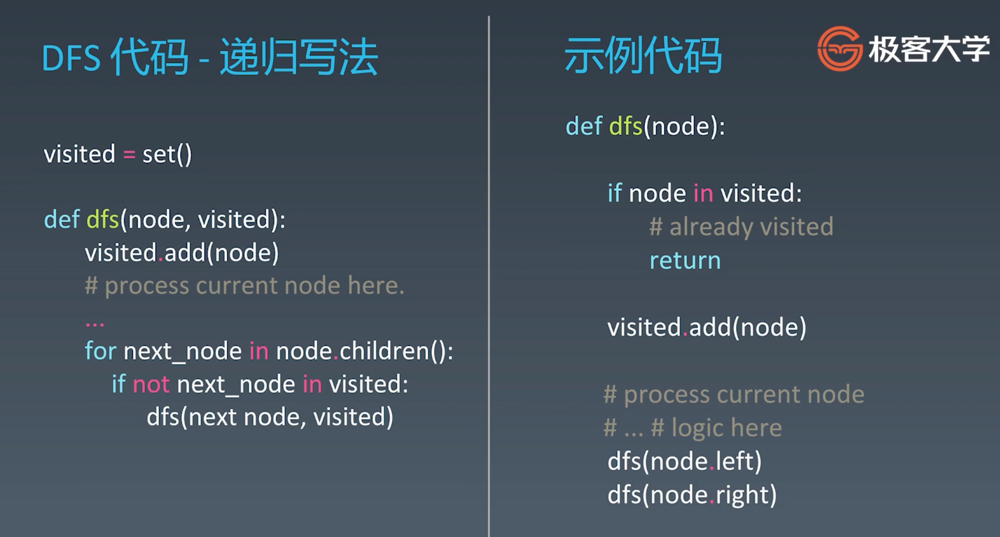
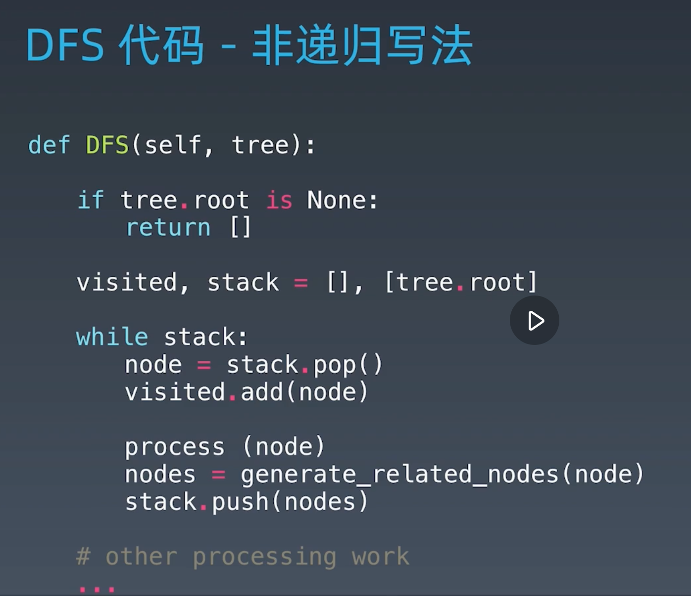
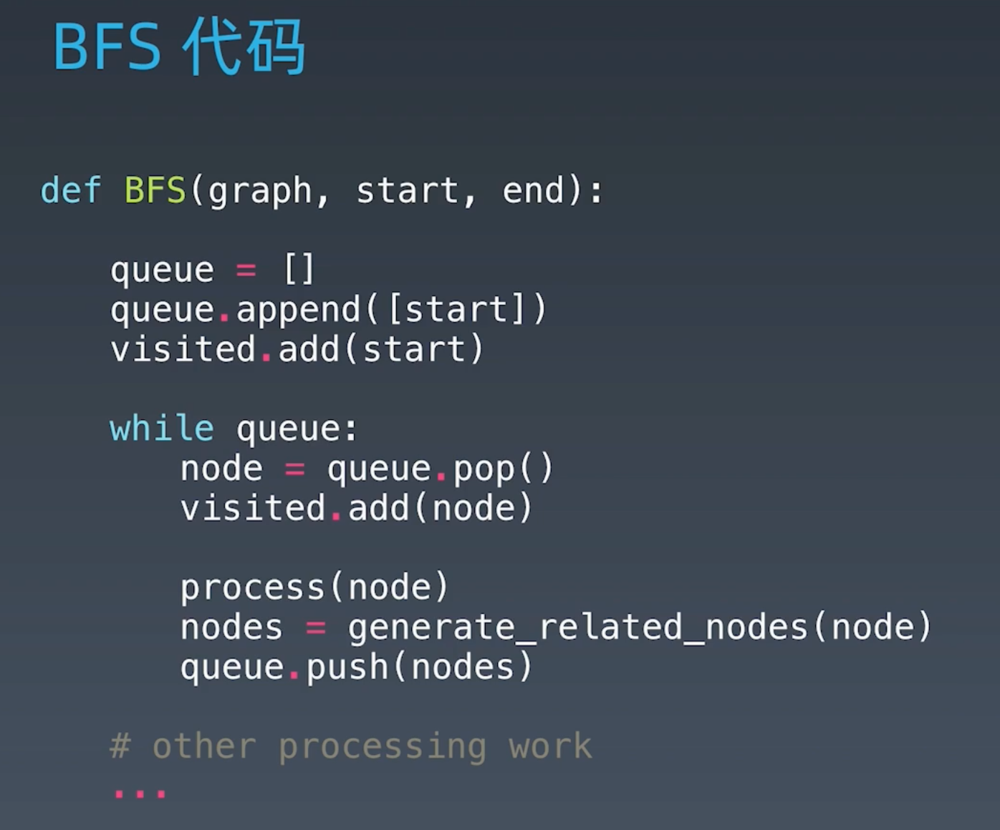
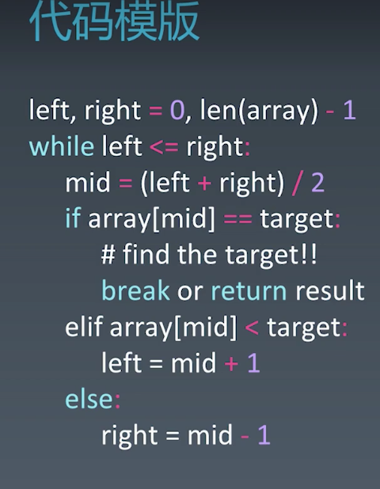

## 学习笔记 Week04

[TOC]

### 1. 基础知识

#### 1. DFS和BFS和优先级优先

DFS和BFS是数据结构没有明显的特征，只是简单的结构，需要遍历全部才能达到目标；

DFS和BFS对树或者图这种多分枝的数据结构是通用的，树因为不连通可以一层层递归，图为了不重复遍历需要使用已访问列表保存是否已访问。

现实中更多的是优先级优先，比如各种推荐算法和高级搜索算法，





 

#### 2. 贪心算法

1. 在每一步都选择当前状态下最好或最优

2. 与dp的区别是，贪心对每个子问题都做出当前最优选择，并且不能回退；

   dp会保存以前运算的结果，根据以前的结果对当前进行选择，可以回退

   贪心算法经常用来解决一些最优化问题，比如求图的最小生成树、哈夫曼编码、Dijkstra中等；但是对于一些工程或生活中的问题，贪心法一般不能得到全局最优；

   一旦一个问题可以通过贪心算法解决，那么贪心算法一定是解决这个问题的最好办法；

3. 贪心算法具有高效性并且得到的结果比较接近最优结果，所以常用来用作辅助算法或解决不要求结果是全局最优只要接近最优即可的问题；

4. 适合使用贪心算法的场景：
  
   - 问题可以分解为子问题，子问题的最优解可以递推到最终问题的最优解，子问题称为最优子结构；
5. 贪心法的难处在于如何证明贪心法是最优解以及如何贪心计算，是否需要转换问题等，有时候从前向后，有时候是从后往前；  


#### 3. 二分查找
1. 前提

   - 目标函数单调性
   - 存在上下界
   - 能够通过索引访问（单纯的链表不适合，但是改造成跳表等就可以使用了）

   PS:在面试中，最好表现出自己的思考过程，比如先叙述考虑满足以上三个条件，再写代码；

2. 代码模板

   

3. [二分查找总结](https://leetcode-cn.com/problems/search-insert-position/solution/te-bie-hao-yong-de-er-fen-cha-fa-fa-mo-ban-python-/)

4. 二分的重点就是判断目标在左半还是右半，然后缩小查找空间；难点在while何时取=，以及if比较是否取=。 


#### 4. 相关题目

##### 4.1 DFS&BFS

1. [102. 二叉树的层序遍历](https://leetcode-cn.com/problems/binary-tree-level-order-traversal/)
- 除了BFS，还可以使用DFS，但是要记住每一个节点所在的层
2. [433. 最小基因变化](https://leetcode-cn.com/problems/minimum-genetic-mutation)
- 自己做的时候算是用DFS+回溯，广度优先还是要看一下
3. [22. 括号生成](https://leetcode-cn.com/problems/generate-parentheses/)
- 当时讲的是递归回溯，实际上就是深度优先，可以理解为每增加一个括号就是增加了一个分支，生成一个结果的过程是逐步向下的过程；
- 尝试使用广度优先：将每增加一个括号的合法的结果保存在队列中，然后每层每次迭代一层，增加新的括号，这个过程中要有合法性判断；

4. [515. 在每个树行中找最大值](https://leetcode-cn.com/problems/find-largest-value-in-each-tree-row/)
- 相当于进行层序遍历

##### 4.2 贪心算法

1. [322. 零钱兑换](https://leetcode-cn.com/problems/coin-change/)
- 这个题目给出的硬币是有倍数关系的，可以证明贪心法是最优解；
- 否则的话，贪心算法往往不是最优的；

##### 4.3 二分查找

1. [69. x 的平方根](https://leetcode-cn.com/problems/sqrtx/)
- 二分找到平方小于目标值的；1，100； 36.6，5.55，时间复杂度`O(logn)`

  ```java
  class Solution{
      public int mySqrt(int x){
          int left=0;
          int right=x;
          int ans=-1;
          while(left<=right){
              int mid=left+(right-left)/2;
              if((long)mid*mid<=x){
                  ans=mid;
                  left=mid+1;
              }else{
                  right=mid-1;
              }
          }
          return ans;
      }
  }
  ```

- 牛顿迭代：时间复杂度`O(logn)`

  ```java
  //2,71.38;36.9,5,55
  public class Solution {
      public int mySqrt(int x) {
          long res = x;
          while (res * res > x) {
              res = (res + x / res) / 2;
          }
          return (int) res;
      }
  }
  ```
2. [367. 有效的完全平方数](https://leetcode-cn.com/problems/valid-perfect-square/)
- 基本思路：二分查找，需要注意的是，测试用例中有越界的情况，所以最好将所有使用到的局部变量都声明为long

- 数学

  ```java
  //解法三：数学定理(1 + 3 + 5 + ... + (2n - 1) = n ^ 2)
          int i = 1;
          while(num > 0) {
              num -= i;
              i += 2;
          }
          return num == 0;
          
          //解法四：牛顿迭代法
          if(num == 1) return true;
          int i = num / 2;
          while((double)i * i > num){
              i = (i + num / i) / 2;
          }
          return i * i == num;
  ```

  

---

### 2. 每日一题

#### 2.1 5-7

1. [572. 另一个树的子树](https://leetcode-cn.com/problems/subtree-of-another-tree/)
- 思路：DFS遍历找到与目标树根节点相同的节点，再比较两棵子树是否相同；可能想到的问题是与目标树根节点相同的节点可能不止一个，所需需要遍历完整棵树；7,93.76;  39.3,100

  过程中，遇到的问题是，抛出NullPointException，检查了几遍没有发现；后来调试发现，遍历s的子树，在s==null && t！=null时，sameTree退出了，然后会执行isSubtree，会执行s.left，s\==null，调用其left自然会空指针，应该在s\==null时，即到达了叶子节点后，退出该子树的遍历判断，加一个s!=null判断，保证在到达了叶子节点后退出。

  ```java
  class Solution {
      public boolean isSubtree(TreeNode s, TreeNode t) {
          //使用前序遍历
          return sameTree(s,t) || (s!=null && isSubtree(s.left,t)) || (s!=null && isSubtree(s.right,t));
      }
  
      private boolean sameTree(TreeNode s,TreeNode t){
          if(s==null && t==null){
              //二者同时到达叶子节点，说明该子树相同，递归中止
              return true;
          }else if(s==null || t==null || s.val!=t.val){
              //两个节点不同，也可以退出判断
              return false;
          }else{
              //两个的根节点相同
              return sameTree(s.left,t.left) && sameTree(s.right,t.right);
          }
      }
  }
  ```

- 当然这个题的解法有很多解法，可以扩展到很多知识点：比如将整棵树遍历成一个字符串，查看t是否是s的子串；也可以使用Hash将s的每棵子树映射成一个值，判断t的hash是否在s中；[具体查看](https://leetcode-cn.com/problems/subtree-of-another-tree/solution/ling-yi-ge-shu-de-zi-shu-by-leetcode-solution/)


####2.2 5-8 

1. [221. 最大正方形](https://leetcode-cn.com/problems/maximal-square/)

- 原本是想使用层序遍历，但是每个节点怎么样算是在正方形中不好界定；

- 使用二维动态规划，看了题解觉得很容易理解，但是自己想是想不到的；

  ```java
  //7,46.26;  42.9,50
  class Solution {
      public int maximalSquare(char[][] matrix) {
          if(matrix==null || matrix.length==0){
              return 0;
          }
          //使用二维数组保存每个位置作为正方形右下角时正方形的边长
          int[][] res=new int[matrix.length][matrix[0].length];
          int maxlen=0;
          for(int i=0;i<matrix.length;i++){
              for(int j=0;j<matrix[0].length;j++){
                  if(matrix[i][j]=='1'){
                      // int leftup=((i-1<0 || j-1<0)?0:res[i-1][j-1]);
                      // int left=((j-1<0)?0:res[i][j-1]);
                      // int up=((i-1<0)?0:res[i-1][j]);
                      // res[i][j]=Math.min(leftup,Math.min(left,up))+1;
                      if (i == 0 || j == 0) {
                          res[i][j] = 1;
                      } else {
                          res[i][j] = Math.min(Math.min(res[i - 1][j], res[i][j - 1]), res[i - 1][j - 1]) + 1;
                      }
                      maxlen=Math.max(maxlen,res[i][j]);
                  }
              }
          }
          return maxlen*maxlen;
      }
  }
  ```

#### 2.3 5-9

1. [69. x 的平方根](https://leetcode-cn.com/problems/sqrtx/)：[详见](#4.3 二分查找)

#### 2.4 5-10

1. [236. 二叉树的最近公共祖先](https://leetcode-cn.com/problems/lowest-common-ancestor-of-a-binary-tree/)

#### 2.5 5-11

1. [50. Pow(x, n)](https://leetcode-cn.com/problems/powx-n/)
2. [102. 二叉树的层序遍历](https://leetcode-cn.com/problems/binary-tree-level-order-traversal/)
- 这里主要想简单记录下DFS

  ```java
  class Solution{
      List<List<Integer>> res=new LinkedList<>();
      public List<List<Integer>> levelOrder(TreeNode root){
          dfs(root,0);
          return res;
      }
      
      private void dfs(TreeNode root,int level){
          if(root==null) return;
          if(res.size()<level+1)  res.add(new LinkedList<Integer>());
          List<Integer> thislevel=res.get(level);
          thislevel.add(root.val);
          dfs(root.left,level+1);
          dfs(root.right,level+1);
      }
  }
  ```

#### 2.6 5-12

1. [155. 最小栈](https://leetcode-cn.com/problems/min-stack/)
- 使用两个栈，一个普通栈，一个保存最小值
2. 

   与[189. 旋转数组](https://leetcode-cn.com/problems/rotate-array/)相同

   一种巧妙的方法：思路上不是按照旋转的思路，而是采用交换，比如[a,b,c,d,e,f,g,h]->[e,f,g,h,a,b,c,d]，将index=0与index=4交换，后3个依次，交换4次就可以；当然这是采用这种方法最优的情况，当左右两部分长度为某些值的情况下，要交换的次数量级和顺序移动k次相同；所以不同情况下最优解不同


#### 2.7 5-13

1. [102. 二叉树的层序遍历](https://leetcode-cn.com/problems/binary-tree-level-order-traversal/)

#### 2.8 5-14

1. [136. 只出现一次的数字](https://leetcode-cn.com/problems/single-number/)
- 位运算，异或
2. [33. 搜索旋转排序数组](https://leetcode-cn.com/problems/search-in-rotated-sorted-array/)

#### 2.9 5-15

1. [560. 和为K的子数组](https://leetcode-cn.com/problems/subarray-sum-equals-k/)
- 暴力解法，遍历`O(n^2)`

- 前缀和+hash：关于该方法，自己思考时的疑问是，以index=i时，以其为结尾的前缀数组，其包含的前缀和包含很多个，所以每个位置上都应该再用一个容器保存出现的前缀和。

  实际上，因为找的是子串i~j，只要sum(j)-sum(i)==k即可，要找出的是sum(i)\==sum(j)-k的前缀有几个就可以了

#### 2.10 5-16

1. [25. K 个一组翻转链表](https://leetcode-cn.com/problems/reverse-nodes-in-k-group/)
- 就是迭代，每3个一组，进行reverse，但是细节问题很多

- 也可以使用递归

  ```java
  class Solution{
      public ListNode reverseKGroup(ListNode head, int k) {
          ListNode dummy=new ListNode(0);
          dummy.next=head;
          ListNode pre=dummy;
          ListNode end=dummy;
          while(end.next!=null){
              for(int i=0;i<k && end!=null;i++){
                  end=end.next;
              }
              if(end==null) break;
              ListNode start=pre.next;
              ListNode nextstart=end.next;
              end.next=null;
              //node是本段反转后的头节点
              ListNode node=reverse(start);
              pre.next.next=nextstart;
              pre.next=node;
              pre=start;
              end=start;
          }
          return dummy.next;
      }
  
      private ListNode reverse(ListNode head){
          //递归 1，57.31；  40.2，7.32
          // if(head==null || head.next==null){
          //     return head;
          // }
          // ListNode node=reverse(head.next);
          // head.next.next=head;
          // head.next=null;
          // return node;
  
          //迭代
          //0,100;  39.7,7.32
          ListNode pre=null;
          ListNode cur=head;
          while(cur!=null){
              ListNode next=cur.next;
              cur.next=pre;
              pre=cur;
              cur=next;
          }
          return pre;
      }
  }
  ```


#### 2.11 5-17

1. [210. 课程表 II](https://leetcode-cn.com/problems/course-schedule-ii/)
- 拓扑排序，与图有关的算法问题，之前没有接触过

- 拓扑排序：将有向无环图转成线性排序

- 基本思路是BFS，层数是每节课依赖的课程数，先将层数为0的节点存入队列，更新依赖该课程的课程的层数，没次迭代将新增加的依赖数为0的课程入队，总的来说，使用的知识点是没有新的，只是BFS思想的另一种使用。

  ```java
  //本方法适用map保存每节课程依赖的其他课程数，
  //用list[]保存依赖本节课的其他课程
  //116,5.96;  41.4,93.33
  class Solution {
      public int[] findOrder(int numCourses, int[][] prerequisites) {
          List<Integer>[] lists=new List[numCourses];
          //用map保存剩余的课程和其对其他课程的依赖数
          Map<Integer,Integer> map=new HashMap<>();
          for(int[] arr:prerequisites){
              map.put(arr[0],map.getOrDefault(arr[0],0)+1);
              if(lists[arr[1]]==null){
                  lists[arr[1]]=new ArrayList<>();
              }
              lists[arr[1]].add(arr[0]);
          }
          //用queue保存当前依赖数为0的课程
          Queue<Integer> queue=new ArrayDeque<>();
          for(int i=0;i<numCourses;i++){
              if(map.get(i)==null){
                  queue.add(i);
              }
          }
          int[] res=new int[numCourses]; 
          int index=0;
          while(!queue.isEmpty()){
              int cur=queue.poll();
              res[index++]=cur;
              List<Integer> curlist=lists[cur];
              //更新课程依赖数，将依赖cur课程的课程的依赖数减1
              if(curlist!=null){
                  for(int i:curlist){
                      map.put(i,map.get(i)-1);
                  }
              }
              //将map中新的课程依赖为0的添加到队列
              Iterator<Integer> it=map.keySet().iterator();
              while(it.hasNext()){
                  int i=it.next();
                  if(map.get(i)==0){
                      queue.add(i);
                      it.remove();
                  }
              }            
          }
          return map.isEmpty()?res:new int[]{};
      }
  }
  ```


#### 2.12 5-18

1. [152. 乘积最大子数组](https://leetcode-cn.com/problems/maximum-product-subarray/)
- 典型解法：动态规划，但是不能仅仅根据dp[i-1]求dp[i]，要做另一重处理
- 因为最大值可能是由连续正数相乘，也可能由负数相乘，所以要记录每个i处的最小值，以防i+1处为负数，得到更大的结果。
- 另一种解法是根据负数是偶数个还是奇数个的性质求的最大值，[详见](https://leetcode-cn.com/problems/maximum-product-subarray/solution/xiang-xi-tong-su-de-si-lu-fen-xi-duo-jie-fa-by--36/)


#### 2.13 5-19

1. [680. 验证回文字符串 Ⅱ](https://leetcode-cn.com/problems/valid-palindrome-ii/)
- 一开始的想法是，这种跳过一个的措施只能发生一次，而判断是否是回文肯定要使用while，要是将这个措施放在while里，要是控制只进行一次，只能使用一个flag，而这个措施可以左跳也可以右跳，这两个都要执行，也就是左跳和右跳都要单独写个循环判断，想想就觉得很麻烦；

- 题解中有一个很好的办法，突破点是递归，这种方法使用一个单独的函数判断回文串，先判断总串是不是，如果不是，在while中对左跳和右跳分别进行回文判断，因为跳之前都是回文了，所以跳后也是回文，那就可以；并且二者使用了 || 连接，就很好

  ```java
  		public boolean validPalindrome(String s) {
          for(int i = 0, j = s.length()-1; i < j ; i++, j--){
              if(s.charAt(i) != s.charAt(j)){
                  //分两种情况，一是右边减一，二是左边加一
                  return isPalindrome(s,i,j-1) || isPalindrome(s, i+1, j);
              }
          }
          return true;
      }
  
      public boolean isPalindrome(String s, int i, int j) {
          while (i < j) {
              if (s.charAt(i++) != s.charAt(j--)) {
                  return false;
              }
          }
          return true;
      }
  ```

- 官方题解就是我本身的思路，区别是使用if else取代了flag，的确是好的；如果需要跳就分别左跳和右跳，并且使用|| ，总的来说，私以为上一个题解的做法是最好的。


#### 2.14 5-20

1. [1371. 每个元音包含偶数次的最长子字符串](https://leetcode-cn.com/problems/find-the-longest-substring-containing-vowels-in-even-counts/)
- 前缀和

#### 2.15 5-21

1. [5. 最长回文子串](https://leetcode-cn.com/problems/longest-palindromic-substring/)
- dp：二维，子串[i,j]是否是回文取决于子串[i+1,j-1]是不是。`O(n^2)`
- 中心扩散，`O(n^2)`
- 关于「动态规划」方法执行时间慢的说明：

  - 动态规划本质上还是「暴力解法」，因为需要枚举左右边界，有 O(N^2) 这么多；
  - 以下提供的「中心扩散法」枚举了所有可能的回文子串的中心，有 O(2N) 这么多，不在一个级别上。
  - 总的来说就是dp要检测的字符串数量多
- Manacher:了解，以中心扩散为基本点，利用已遍历过的index为中心的子串的信息。
- [总结](https://leetcode-cn.com/problems/longest-palindromic-substring/solution/zhong-xin-kuo-san-dong-tai-gui-hua-by-liweiwei1419/)


#### 2.16 5-22

1. [105. 从前序与中序遍历序列构造二叉树](https://leetcode-cn.com/problems/construct-binary-tree-from-preorder-and-inorder-traversal/)
- 之前的作业题，递归就好了

#### 2.17 5-23

1. [76. 最小覆盖子串](https://leetcode-cn.com/problems/minimum-window-substring/)
- 滑窗
- [总结](https://leetcode-cn.com/problems/minimum-window-substring/solution/hua-dong-chuang-kou-by-powcai-2/)

#### 2.18 5-24

1. [4. 寻找两个正序数组的中位数](https://leetcode-cn.com/problems/median-of-two-sorted-arrays/)
- 难点是两个数组虽然各自有序，但是整体无序，要找中位数必须整体有序，但排序需要`(m+n)log(m+n)`的时间复杂度 

- 有一个想法是，像归并排序中合并两个数组一样，找到中位数，时间复杂度`O(m+n)`，还需要额外的空间

- 时间复杂度`O(log(m+n))`的查找就二分了，但是无从下手

- 真的难，二分的细节也没搞明白，虽然总体思路是有的，但细节还是理解不到位

  ```java
  //中位数，即中间的数，对两个数组时，只要同时分割两个数组，保证左边的所有，小于等于右边的所有
  //因为两个数组自己原本有序，所以只要保证nums1[i]<=nums2[j+1] && nums2[j] <= nums1[i+1]即可
  class Solution{
      public double findMedianSortedArrays(int[] nums1,int[] nums2){
          //让nums1是较短的那一个
          if( nums1.length > nums2.length){
              int[] tmp = nums1;
              nums1 = nums2;
              nums2 = tmp;
          }
  
          int len1 = nums1.length;
          int len2 = nums2.length;
  
          //分割的规则是：偶数时，左右相等；奇数时，左边多一个
          //如何判断分好了呢：因为
          //考虑了总长度奇偶的情况下，可以将分割线左的总个数表达为
          // int totalLeft = (len1+len2+1)/2;
          int totalLeft = len1+(len2-len1+1)/2;  
  
          //因为两个数组的左总数一定，所以只分割一个数组；另一个也就确定了
          //这里分割较短的那一个，因为越短查找起来越快，用二分也是这样
          int left=0;
          int right=len1;
          while( left < right){
              int mid1=left+(right-left+1)/2;  //mid1是第1个数组分界线右边第1个
              //用mid2保证，mid2是第2个数组分界线右边第1个，即使用nums1[mid1]与nums2[mid2]比较，
              int mid2=totalLeft-mid1;
              if(nums1[mid1-1] > nums2[mid2]){
                  right=mid1-1;
              }else{
                  //因为
                  left=mid1;
              }
          }
  
          int i=left;
          int j=totalLeft-i;
  
          //一些特殊情况
          int nums1LeftMax=(i==0?Integer.MIN_VALUE:nums1[i-1]);
          int nums1RightMin=(i==len1?Integer.MAX_VALUE:nums1[i]);
          int nums2LeftMax=(j==0?Integer.MIN_VALUE:nums2[j-1]);
          int nums2RightMin=(j==len2?Integer.MAX_VALUE:nums2[j]);
  
          //返回结果分奇偶
          if((len1+len2)%2==1){
              return Math.max(nums1LeftMax,nums2LeftMax);
          }else{
              return (double)(Math.max(nums1LeftMax,nums2LeftMax)+Math.min(nums1RightMin,nums2RightMin))/2;
          }
      }
  }
  ```


#### 2.19 5-25

1. [146. LRU缓存机制](https://leetcode-cn.com/problems/lru-cache/)
- 要求put和get都是`O(1)`的时间复杂度，考虑到要移动节点，也需要这个复杂度，并且节点间有先后顺序，所以不能直接用map保存结果，所以需要使用双向链表保存所有节点，节点中的数据包括key和value；查找节点要达到`O(1)`的时间复杂度，最直接的就是使用Hash保存，将节点的key作为map的key，value是节点，这样可以根据key直接找到对应的节点，删除和移到头节点都是`O(1)`复杂度。


---

### 3. 作业算法题

1. [127. 单词接龙](https://leetcode-cn.com/problems/word-ladder/)
- 自己思考时觉得难点在不知道应该变化哪个index，并且并不是变化结果一定在bank中；

- 想起了基因突变那个题，从bank中匹配结果，应该可行；之后尝试；

- 广度优先搜索，从start到end的路径，每次变化一个

  ```java
  //写写基本思路
          //1.先对wordList做预处理，将所有编辑距离为1的分为一组
          //2.使用队列，从start开始，遍历其所有的匹配模式，将所有编辑距离为1的加入队列；
          //3.每次循环从队列中取出一个单词，先查看是否是end，否则继续执行添加编辑距离为1的单词，当然是没有被访问的；
          //4.队列为空，也没有找到end，说明wordList中没有end或没有通向end的路径，所以没有将end添加到队列中，返回0；
          //5.为了记录长度，使用string，Integer元组保存结果，使用了Pair；或者在合适的位置维护一个计数器，不过单独维护计数器很麻烦，取元组；
  
  //双向bfs
  //基本原理与单向bfs相同，不过同时从start和end进行单向操作，一旦wordList中有一个word被访问了两次就返回该单词在两个方向上的level和。不过程序太麻烦了，就不写了
  ```

  
2. [126. 单词接龙 II](https://leetcode-cn.com/problems/word-ladder-ii/)
- 承接127，需要找出所有的路径采用与第一种方法一样的思路，区别是找到第一条时不能直接返回结果，而是遍历完所有的可能才返回
- 一个疑问是，是不是所有遍历得到的路径都是长度相等的呢？肯定有不相等的路径，所以还要判断当前路径长度，只有是最小时才保存，之后如果出现更小的，就清空原list，保存新的最短路径。
- [一个比较好的解答](https://leetcode-cn.com/problems/word-ladder-ii/solution/xiang-xi-tong-su-de-si-lu-fen-xi-duo-jie-fa-by-3-3/)
3. [200. 岛屿数量](https://leetcode-cn.com/problems/number-of-islands/)
- 主要是每个位置只遍历上下左右四个点并置零
5. [529. 扫雷游戏](https://leetcode-cn.com/problems/minesweeper/)
- DFS，分为地雷、空白-数组、空白-空块3种情况，其中最后一种需要dfs

5. [860. 柠檬水找零](https://leetcode-cn.com/problems/lemonade-change/)
- 注意题目中有说明，bill只能是5，10，20，所以不需要使用map保存每种面值的货币数量
- 由于肯定不会用20找零所以只保存5和10即可；
- 说贪心的话，也就体现在如果有10先给10吧。

6. [122. 买卖股票的最佳时机 II](https://leetcode-cn.com/problems/best-time-to-buy-and-sell-stock-ii/)
- 典型的是动态规划
- 使用贪心就是，相当于可以看到未来的价格，只要后一天的价格高于前一天就获取这个利润；
7. [455. 分发饼干](https://leetcode-cn.com/problems/assign-cookies/)
- 都排序后，从胃口最小的开始分饼干

- 因为一个小朋友只能有一块，所以只要碰到第一个饼干大小小于朋友的胃口，即返回；

- 贪心表现在二者均排序后，从大到小满足朋友，饼干也是从大到小给；这样可以保证满足尽量多的朋友；

  ```java
  //按照思路最直接的实现
  //直到找到满足当前胃口的饼干才继续，
  //从程序中就可以看到可优化的地方：直接使用gindex，不需要cnt
  //sindex++在两种情况都有，不应该以其为循环
  class Solution {
      public int findContentChildren(int[] g, int[] s) {
          Arrays.sort(g);
          Arrays.sort(s);
          int cnt=0;
          int sindex=0;
          int gindex=0;
          while(sindex<s.length && gindex<g.length){
              while(sindex<s.length && s[sindex]<g[gindex]){
                  sindex++;
              }
              if(sindex>=s.length) break;
              cnt++;
              sindex++;
              gindex++;
          }
          return cnt;
      }
  }
  
  //这种方法主体上遍历的是饼干数组，当当前饼干大小不小于当前胃口，
  //才将朋友索引++，这样遍历完饼干数组后朋友的索引就是满足的总数
  public int findContentChildren(int[] grid, int[] size) {
      if (grid == null || size == null) return 0;
      Arrays.sort(grid);
      Arrays.sort(size);
      int gi = 0, si = 0;
      while (gi < grid.length && si < size.length) {
          if (grid[gi] <= size[si]) {
              gi++;
          }
          si++;
      }
      return gi;
  }
  ```

  
8. [874. 模拟行走机器人](https://leetcode-cn.com/problems/walking-robot-simulation/)
- 这个题，没太看出贪心

- 就是按照commands走完找到最大值就可以了

- 题解中比较高效的举措是，将坐标转为一个整型数，相比Pair要快很多；

  ```java
  						long ox = (long) obstacle[0] + 30000;
              long oy = (long) obstacle[1] + 30000;
              obstacleSet.add((ox << 16) + oy);
  ```

  
9. [55. 跳跃游戏](https://leetcode-cn.com/problems/jump-game/)
- 可以定义一个同长度的数组，将在步数之内的、可以到达的所有index标记为true，看最后是否为true即可；

- 可以尝试使用暴力，相当于层序遍历，每到一个点，将可以到达的index保存进队列，直到到达了最后或者队列空；这种方法和上一种本质上是相同的，都是遍历；

- 贪心：从后往前，查看当前index在index-1处是否可以到达index，逐步往前迭代，看是否可以到起点0；由于只是返回是否可以到达，所以不需要计算需要跳了几次。

  ```java
  //倒着
  //1,99.84;  41.4,15.63
  // class Solution {
  //     public boolean canJump(int[] nums) {
  //         if (nums == null || nums.length == 0) {
  //             return false;
  //         }
  //         //pos表示需要到达的位置
  //         int pos = nums.length - 1;
  //         for (int i = nums.length - 2; i >= 0; i--) {
  //             if (nums[i] + i >= pos) {
  //                 pos = i;
  //             }
  //         }
  //         return pos == 0;
  //     }
  // }
  
  //正着
  class Solution{
      public boolean canJump(int[] nums){
          //关键是更新maxpos，并比较是否>=length-1
          int target=nums.length-1;
          int maxpos=0;
          //i<target还是i<target+1,写后者是为了包括[0]这种情况，不然实际上判断到i==target-1就可以了
          //若写i<target,则return target==0?true:false;为了包含[0]这种情况
          //否则的话，如果i能走到这里，前面肯定已经可以到达了，不会i==target；
          //如果不能走到这里，i==target也不会通过if，所以也是安全的。
          for(int i=0;i<target+1;i++){
              if(i<=maxpos){
                  maxpos=Math.max(maxpos,nums[i]+i);
                  if(maxpos>=target){
                      return true;
                  }
              }
          }
          return false;
      }
  }
  ```

  
10. [45. 跳跃游戏 II](https://leetcode-cn.com/problems/jump-game-ii/)
- 注意前提是肯定可以到达，需要特殊处理的还是[0]，要注意i的范围
11. [33. 搜索旋转排序数组](https://leetcode-cn.com/problems/search-in-rotated-sorted-array/)
- 暴力：遍历
- 将数组还原为有序，在二分；还原的过程可以使用时间复杂度为`O(logn)`的算法，就是二分找最小值；
- 正解：直接使用二分查找，分为单调的两部分，
12. [74. 搜索二维矩阵](https://leetcode-cn.com/problems/search-a-2d-matrix/)
- 将二维坐标转为一维即可；
13. [153. 寻找旋转排序数组中的最小值](https://leetcode-cn.com/problems/find-minimum-in-rotated-sorted-array/)
- 旋转数组具有一定的有序性，可以使用二分；
- 查找一个确定存在的数字，while时不需要=；
- left的更新：left=mid+1;
- right的更新：right=mid;

---

### 4. 其他作业题

使用二分查找，寻找一个半有序数组 [4, 5, 6, 7, 0, 1, 2] 中间无序的地方
说明：同学们可以将自己的思路、代码写在第 4 周的学习总结中

思路：找无序的地方，因为原本是升序数组，进行了旋转，所以实际可以看作着数组中的最小值的索引；

首先数组在一定程度上是有序的，肯定是使用二分，有比较好的效率；

几处细节：

1. 使right=length-1，并且这里不需要找target值，不需要再left==right时判断nums[left]是否是target，所以while退出条件为left<right，不需要判断left\==right;
2. left和right的更新，当nums[mid]<nums[right]，因为不能判断mid处是否是最小值，但有可能是，所以这个位置不能跳过，要让right==mid；其他情况，nums[mid]>=nums[right]，至少证明mid不是最小值的位置，所以可以跳过让left\==mid+1。
3. 当退出while时，可以保证找到的是最小值。
4. 在这个过程中，nums[right]一定是小于nums[left]的，因为最小值一定在left与right之间，所以left到right肯定left到min的值都大于right。这是特定于旋转数组这个结构的性质。

---

### 5. Other Tips

 