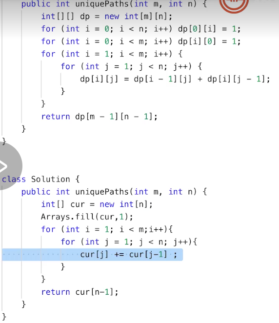
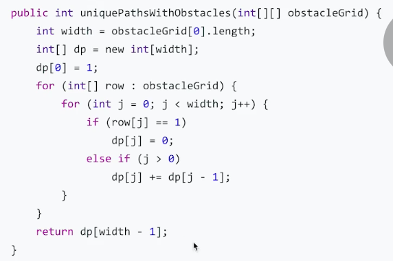

# week06学习笔记

[TOC]

### 1. 基础知识

####1 动态规划

1.  找到最近最简方法，将其拆解成可重复解决的问题；

2. 数学归纳法思维

3. 寻找重复性，迎合计算机指令集

4. 分治+最优子结构

   

5. **关键点**

   

   - 动态规划和递归或分治 没有根本上的区别，关键看有无最优子结构，dp可以通过每次得到最优子结构的解来降低复杂度；
   - 共性：找重复子问题
   - 差异性：最优子结构、中途可以淘汰次优解

6. 面试dp的难度一般在定义最优子结构，dp方程一般不太复杂；而比较难的dp是找递推方程

7. 动态规划小结

   

8.  三步：子问题、保存中间结果、递推

#### 2. 相关题目

1. [509. 斐波那契数](https://leetcode-cn.com/problems/fibonacci-number/)
  
   - 自顶向下：递推式
   - 自底向上：for循环，从n=0计算到n
   
2. [62. 不同路径](https://leetcode-cn.com/problems/unique-paths/)

   

   - 自顶向下：从起点出发，取所有可选方向的和
   - 自底向上：从终点回退，但是过程和自顶向下是一样的
   - 简化版只使用一维数组，不需要二维数组保存结果，因为每个位置的结果是右和下之和，所以从终点往前计算，用一维就可以保存需要的结果了；

3. [63. 不同路径 II](https://leetcode-cn.com/problems/unique-paths-ii/)：增加障碍物

   

4. [980. 不同路径 III](https://leetcode-cn.com/problems/unique-paths-iii/)。==暂时先不做==

5. [1143. 最长公共子序列](https://leetcode-cn.com/problems/longest-common-subsequence/)

   

   

   - 对于字符串的问题，暴力解一般都是枚举所有可能的子串或者子序列，然后在另一个串中对比，复杂度都是指数级的；
   - 可以先处理一些极端情况，比如空串，一个串是另一个的子串等；
   - 一些经验：（1）从后往前找，即从字符串的最后一个字符往前匹配；（2）转换成子问题，比如最后一个字符相同，就是比较两个串除最后一个的子串；（3）二维dp数组， 定义[i,j]是str1(0,i)和str2(0,j)的最长公共子序列

6. [70. 爬楼梯](https://leetcode-cn.com/problems/climbing-stairs/)

   - 几个变式：（1）可以1、2、3步；（2）相邻两步不能相同

7. [746. 使用最小花费爬楼梯](https://leetcode-cn.com/problems/min-cost-climbing-stairs/)

   ```java
   //dp，使用dp数组记录每一步的最小开销,dp[i]是到达第i级的最小开销
   //1,99.9;   39.4,22.22
   //以[10,15,20]为例，结果是15，就是0级-2级-4级
   //0和4是隐藏的，0是起点，4是终点，二者开销都是0
   //最后到达4的开销是0+dp[2]或0+dp[3]，所以最后返回Math.min(dp[length],dp[length-1])即可
   ```

   

8. [120. 三角形最小路径和](https://leetcode-cn.com/problems/triangle/)

   

   - 暴力递归，也可以说是DFS，枚举所有的可能，可以通过剪枝减少计算量，即如果当前已大于已知最小值，直接结束，不剪枝复杂度`O(2^n)`

   - dp：与unique path类似，因为只能向下选两个，所以递归找到这两个的较小者即可；

     PS：这里可以的话直接改变原数组的值，不许要额外使用空间

     

   - 因为下一层只能选相邻的，所以不能直接贪心找每层最小；

   - 使用dfs回溯，本来想剪枝，但是因为下一个数可能是负数使总的结果最小，但是在这一层就剪枝了，所以这种方法不行；如果不使用剪枝，就会超时

9. [53. 最大子序和](https://leetcode-cn.com/problems/maximum-subarray/)
- 不能通过经验解决问题，要提升认知能力，找到自相似的办法，重复性的办法
- 暴力`O(n^2)`，可以进行一定的优化是，起点和终点都是正数；
- DP：（1）分治，子问题；（2）状态数组定义；（3）DP方程
- 因为是和最大的连续子数组，所以求dp[i]，一定要包含nums[i]，区别是是否包含dp[i-1]，即dp[i]=nums[i]+Math.max(0,dp[i-1]);
- 即如果dp[i-1]<0,就重新开始计算，如果>0就算上之前的子数组，重点是子数组得是连续的

9. [152. 乘积最大子数组](https://leetcode-cn.com/problems/maximum-product-subarray/)
- 与最大和的区别是，需要同时保存最正和最负，因为nums[i]可能是负的，与最负相乘可能是最大

10. [322. 零钱兑换](https://leetcode-cn.com/problems/coin-change/)
- 见每日一题，2.1

11. [198. 打家劫舍](https://leetcode-cn.com/problems/house-robber/)
- 因为只用一个维度无法表示第i-1个房子有没有偷，有没有偷决定了偷不偷当前的第i个房子，即使用一维记录偷和不偷的最大值，但第i个房子无法决定偷不偷；所以要增加一个维度，标识第i-1个房子有没有偷，即a[i]表示偷和不偷的最大值

  这个时候的状态转移方程

  `a[i][0]=max(a[i-1][0],a[i-1][i])`

  `a[i][1]=a[i-1]+nums[i]`

  其中第二维的0表示不偷，1表示偷

  

- 只使用一维，定义a[i]为第i天必偷的最大值，所以dp方程

  `a[i]=max(a[i-1],nums[i]+a[i-2])`

  此外，可以看出当前值只取决与前两个，可以只使用两个变量

- 增加维度的dp是几乎是高级dp必要条件，因为限制条件在增加，即用更高的维度来表示题目中的限制条件
12. [213. 打家劫舍 II](https://leetcode-cn.com/problems/house-robber-ii/)
13. [121. 买卖股票的最佳时机](https://leetcode-cn.com/problems/best-time-to-buy-and-sell-stock/)
14. [123. 买卖股票的最佳时机 III](https://leetcode-cn.com/problems/best-time-to-buy-and-sell-stock-iii/)
15. [309. 最佳买卖股票时机含冷冻期](https://leetcode-cn.com/problems/best-time-to-buy-and-sell-stock-with-cooldown/)
16. [188. 买卖股票的最佳时机 IV](https://leetcode-cn.com/problems/best-time-to-buy-and-sell-stock-iv/)
17. [714. 买卖股票的最佳时机含手续费](https://leetcode-cn.com/problems/best-time-to-buy-and-sell-stock-with-transaction-fee/)
18. [22. 括号生成](https://leetcode-cn.com/problems/generate-parentheses/)
- 这道题的dp和下面两道差不多
19. [96. 不同的二叉搜索树](https://leetcode-cn.com/problems/unique-binary-search-trees/)
20. [95. 不同的二叉搜索树 II](https://leetcode-cn.com/problems/unique-binary-search-trees-ii/)

---

以下是高级DP

18. [279. 完全平方数](https://leetcode-cn.com/problems/perfect-squares/)
19. [72. 编辑距离](https://leetcode-cn.com/problems/edit-distance/)
20. [55. 跳跃游戏](https://leetcode-cn.com/problems/jump-game/)
21. [45. 跳跃游戏 II](https://leetcode-cn.com/problems/jump-game-ii/)
22. [62. 不同路径](https://leetcode-cn.com/problems/unique-paths/)
23. [63. 不同路径 II](https://leetcode-cn.com/problems/unique-paths-ii/)
24. [980. 不同路径 III](https://leetcode-cn.com/problems/unique-paths-iii/)
25. [322. 零钱兑换](https://leetcode-cn.com/problems/coin-change/)
26. [518. 零钱兑换 II](https://leetcode-cn.com/problems/coin-change-2/)

---

### 2. 每日一题

#### 2.1 5-26

1. [287. 寻找重复数](https://leetcode-cn.com/problems/find-the-duplicate-number/)
- 快慢指针，将nums[i]作为i的下一跳在nums中的索引，因为有重复出现的值，所以一定有大于等于2个会指向同一个索引，就出现了环；Floyd 判圈算法,时间复杂度`O(n)`

  ```java
  class Solution {
      public int findDuplicate(int[] nums) {
          int slow = 0, fast = 0;
          do {
              slow = nums[slow];
              fast = nums[nums[fast]];
          } while (slow != fast);
          slow = 0;
          while (slow != fast) {
              slow = nums[slow];
              fast = nums[fast];
          }
          return slow;
      }
  }
  ```

  

- 二分查找:这个二分不是对原数组二分，而是对数组中数字的范围[1,n]二分，主要是根据<=mid的数字总个数来更新left和right；如nums1=[1,3,4,2,2]，数字范围nums2=[1,2,3,4]，对于数字3，在nums1中<=3的共4个，而nums2中共3个，说明重复出现的数字应该是<=3的，这时候令right=mid；

  PS：保证这一点的因素主要是数组长度n+1，而数字大小[1,n]，比如数组[2,2,4,4,4]，虽然小于等于3的只有2个，但是为了凑齐数组长度，大于3的只有4，只能重复出现，所以不会出现重复出现的数字小于等于mid，而统计得到小于等于mid的数字个数小于原数组中应有个数的情况；

  PS2:因为目标数组相比原数组多出一个，对于<=mid的count，只有>mid，才能判定target一定在[left,mid]，否则就在[mid+1,right]中。

  如果小于说明重复出现的数字大于mid；

  时间复杂度`O(nlogn)`

  ```java
  class Solution{
      public int findDuplicate(int[] nums){
          int left=1;
          int right=nums.length-1;
          while(left < right){
              int mid=left+(right-left)/2;
              int count=0;
              for(int num:nums){
                  if(num <= mid) count++;
              }
              if(count > mid){
                  right = mid;
              }else{
                  left = mid+1;
              }
          }
          return left;
      }
  }
  ```

  

- 位运算：找重复数、众数都会用到位运算，位运算这种方法，觉得稍微有点问题，暂不探究了。他的想法：举例说明，原数组[1，1，2]，用二进制表示[001,001,010]，每一位上出现1的次数x是[0,1,2];因为长度为3的数组，数字范围是0～2，这种可以对应的原数组是[1,2],对应的二进制数组[001,010],每一位上出现1的次数y是[0,1,1];题目中说对于每一位，只要x>y，target在该位上就是1，那么结果应该是001,结果正确。原因是，对于重复出现的数字，如果它在某一位上是1，那么无论被替换掉的原数字该位上是0还是1，该位总的1的数量，x>=y;如果它在某一位上是0，那么无论被替换掉的原数字该位上是0还是1，该位总的1的数量，x<=y;问题就是两种情况都有=的情况，为什么只在x>y时确定该位为1呢？某些==，不也有可能是1吗？

  哦不对，数组长度n+1，数字的大小是1～n，也就说，重复出现的数字是多出来的1个，如果二进制表示时，某一位上是1，那么x一定>y，如果是0，那么一定<=，

  时间复杂度`O(nlogn)`


2. [322. 零钱兑换](https://leetcode-cn.com/problems/coin-change/)
- 典型的dp

  1. 子问题
  2. f(n)=min(f(n-k)),k取值于coins，
  3. dp方程，似上，这里可以自顶向下，也可以自底向上，单纯的自顶向下，会有许多重复计算，可以自底向上，受用memo数组

- 这里要说一下使用dfs解决，使用dfs因为剪枝的使用而很大程度的提高了算法的效率

  ```java
  // 这种做法真的太难想到了
  // 本质上是遍历所有可以的结果，但是中途会将大于已知最优的方案剪枝
  // 因为剪枝剪的很厉害所以减少很多不必要的计算，效率很高
  // 2，99.65；  37.3，5.77
  class Solution {
      int ans=Integer.MAX_VALUE;
      public int coinChange(int[] coins, int amount) {
          //这里因为要从大到小选择硬币，所以先排序
          Arrays.sort(coins);
          dfs(coins,coins.length-1,amount,0);
          return ans==Integer.MAX_VALUE?-1:ans;
      }
      public void dfs(int[] coins,int index,int amount,int cnt){
          if(index<0){
              return;
          }
          for(int c=amount/coins[index];c>=0;c--){
              //这种方法是从本层迭代的最大面值的硬币的使用数量逐渐减小到0，来进行循环的
              //比如示例1，第一层迭代c1==2，2个5元，na==1；进入dfs后，最大面值是2，c2==0，na==1，进入这一层的dfs，最大面值是1，c3==1，na==0，计算这种方法的硬币数量是3，赋值给ans；
              //得到ans后，返回到上一层，c2--，==-1，退出第二层递归，返回到第一层递归
              //c1--，c1==1，na=6，...，如此递归下去，找到当前兑换方法的结果,递归返回到第一层；
              //c1--，c1==0，.....，这种方法的第二层dfs，c2==5，所以第二层需要迭代5次，期间得到结果或者剪枝；返回到第一层递归
              //返回之后，第一层c1--，c1==-1，退出迭代，程序结束
              int na=amount-c*coins[index];
              int ncnt=cnt+c;
              if(na==0){
                  //这种方法已经兑换完了，退出即可
                  ans=Math.min(ans,ncnt);
                  //break是退出本层循环，return是退出本层递归，
                  //但是本层其他循环可能还有兑换方法，所以只退出本层循环
                  break;//剪枝1
              }
              if(ncnt+1>=ans){
                  //这种兑换方式到目前需要的硬币数量已经大于已知的最优解，直接退出
                  break; //剪枝2
              }
              //进入递归的下一层，使用面值更小的下一种硬币
              //这个递归是尾递归，应该会有内存优化
              //这里用index--，会影响接下来的迭代
              // dfs(coins,nowleft,index--,nowamount);
              dfs(coins,index-1,na,ncnt);
          }
      }
  }
  
  ```
  
- BFS：每层是已经使用硬币的个数，没层的每个节点最多有3子节点==待看==

#### 2.2 5-27

1. [974. 和可被 K 整除的子数组](https://leetcode-cn.com/problems/subarray-sums-divisible-by-k/)
- 与[560. 和为K的子数组](https://leetcode-cn.com/problems/subarray-sum-equals-k/)相似，没有第一时间想到前缀和是不应该的，得到前缀和数组，再for两层循环遍历找到所有的子数组，`O(n^2)`
- 对上面的两重循环再进行优化，利用一些数学知识，同余定理，**同余定理：如果两个整数 a, b 满足 (a-b)%K == 0，那么有 a%K == b%K**，时间复杂度`O(n)`


#### 2.3 5-28

1. [394. 字符串解码](https://leetcode-cn.com/problems/decode-string/) ==待解决==
- 栈、DFS


#### 2.4 5-29

1. [198. 打家劫舍](https://leetcode-cn.com/problems/house-robber/)->[11题](#4. 相关题目)

2. [312. 戳气球](https://leetcode-cn.com/problems/burst-balloons/)

- 当然可以先回溯，枚举每个方案，但是超时；（可以单独用一个boolean标记以戳过的气球），这个解法等同于全排列，所以时间复杂度是阶乘级别，非常高，题目说了 `nums` 的大小 `n` 最多为 500，所以回溯算法肯定是不能通过所有测试用例的。

- 动态规划，太难了，想不出来，[直接看题解](https://leetcode-cn.com/problems/burst-balloons/solution/dong-tai-gui-hua-tao-lu-jie-jue-chuo-qi-qiu-wen-ti/)

  分析一下：找到子问题；定义状态；得到状态转移关系，生成递推式；

  因为原问题是一维，所以如果求dp[i]，因为戳一个气球，结果是和左右都相关的，仅仅通过前一个结果无法可以得到i的结果；所以要得到戳一个气球得到的结果需要把这个气球放置在一个范围里，如dp[i,j]，比如放在dp[i,i+2]中，戳中间的气球的结果就是3者之积，所以dp需要二维；同时子问题也有了，就是求dp[i,j]的结果；

  那如何定义dp[i,j]的含义呢？很明显，其表示获得的分数，并且，总的目标是得到最高分数，那么dp[i,j]就表示在这个范围内可以获得的最高分数；

  那么区间是否包含i和j呢？根据题目，索引-1和n的值可以看作1，如果我们将这两个点添加到原数组，得到长度为length+2的数组，求dp[0,n+1]就是求不包含两段的范围内的最大值，所以这个范围就不包含两段；

  接下来找递推关系，这个递推关系最好包含子问题，即dp[a,b]，这样才能从解决子问题到解决整体问题，子问题就是dp[a,b]，也表示一个更小的范围，一个大的范围最少可以分成2个小范围，如果以k为分界点，分成[i,k]和[k,j]，那么不包含i和j，但是k也被排除了，相当于处理完了两个小区间，就剩k这个了，那戳掉k这个大区间就结束了，戳掉k得到的分数，因为就剩这一个了，所以k左右就是i和j，所以得到的分数就是`points[i]*points[j]*points[k]`，这个区间的总分数就是`dp[i][k] + dp[k][j] + points[i]*points[j]*points[k]`，然后对于dp[i,j]的值就是遍历所有k的可能情况得到的最大值

  另外虽然是二维表格，但是对于 i>=j的，因为区间都没有真实的气球，所以全部填0即可；

  另外每个点的值是通过其左和下的值计算得到的，所以填表顺序也要注意

  
  
  
  
  ```java
  //代码虽然不长，但是逻辑是真的流啤
  class Solution {
      public int maxCoins(int[] nums) {
          int length=nums.length;
          int[] tmp=new int[length+2];
          tmp[0]=tmp[length+1]=1;
          for(int i=0;i<length;i++){
              tmp[i+1]=nums[i];
          }
  
          int[][] dp=new int[length+2][length+2];
          for(int i=length;i>=0;i--){
              for(int j=i+1;j<length+2;j++){
                  for(int k=i+1;k<j;k++){
                      dp[i][j]=Math.max(dp[i][j],dp[i][k]+dp[k][j]+tmp[i]*tmp[j]*tmp[k]);
                  }
              }
          }
          return dp[0][length+1];
      }
  }
  ```


#### 2.5 5-30

1. [221. 最大正方形](https://leetcode-cn.com/problems/maximal-square/)
- 动态规划，将当前位置作为正方形的右下角位置统计

2. [84. 柱状图中最大的矩形](https://leetcode-cn.com/problems/largest-rectangle-in-histogram/)
- 暴力，每个位置向左遍历到起始，没左移一个位置，都记录下到目前为止的最小值，以此为高，长度为(i-j+1)，计算当前可以得到的最大值，更新res；复杂度`O(n^2)`820ms,28.91;     40.9,56.52

  另一种暴力解法：每到一个位置，分别向左右遍历找到高度小于自己的第一个，以二者之间的距离为长度，当前位置的高度为高，计算面积；894,24.94; 41.4,32.61

- 单调栈，[解释及相关题目总结](https://leetcode-cn.com/problems/largest-rectangle-in-histogram/solution/bao-li-jie-fa-zhan-by-liweiwei1419/)

  ```java
  class Solution {
      public int largestRectangleArea(int[] heights) {
          // 这里为了代码简便，在柱体数组的头和尾加了两个高度为 0 的柱体。
          int[] tmp = new int[heights.length + 2];
          System.arraycopy(heights, 0, tmp, 1, heights.length); 
          
          Deque<Integer> stack = new ArrayDeque<>();
          int area = 0;
          for (int i = 0; i < tmp.length; i++) {
              // 对栈中柱体来说，栈中的下一个柱体就是其「左边第一个小于自身的柱体」；
              // 若当前柱体 i 的高度小于栈顶柱体的高度，说明 i 是栈顶柱体的「右边第一个小于栈顶柱体的柱体」。
              // 因此以栈顶柱体为高的矩形的左右宽度边界就确定了，可以计算面积🌶️ ～
              while (!stack.isEmpty() && tmp[i] < tmp[stack.peek()]) {
                  int h = tmp[stack.pop()];
                  //为什么可以保证peek得到的i就是左边第一个小于当前的索引呢
                  //假设不是，那在i之后的索引对应的值只能是小于或大于等于，小于的话，会被弹出，新的第一个小于的索引会入栈；大于等于的话，会直接入栈；会不会有大于i但小于当前的已经被弹出呢？有的话说明，仍然有新的小于当前并且小于这个的入栈；栈顶的仍然是第一个小于的；
                  area = Math.max(area, (i - stack.peek() - 1) * h);   
              }
              stack.push(i);
          }
          return area;
      }
  }
  
  作者：sweetiee
  ```


#### 2.6 5-31

1. [101. 对称二叉树](https://leetcode-cn.com/problems/symmetric-tree/)
- 一开始没有找到重复性，不知道怎么用递归，因为比较顺序在同一层里是像回文一样，并且认为递归时是按照深度，处理每一个节点，而只处理一个节点不能比较头尾两棵子树的节点
- 看了题解明白，重复性就是比较两个节点的左右、右左节点； 0,100; 37.8,37.5
- 题目本身不难，但是没有一开始想出的原因，可能是想递归是按节点深度优先，无法对比同一层的两个节点，尤其是像回文一样的首尾对比；对递归的理解和应用还是稍浅；其实这个解法也的确是按节点深度遍历，只是同时有两个节点做参数，
- 迭代解法：对递归过程的模拟

2. [621. 任务调度器](https://leetcode-cn.com/problems/task-scheduler/)
- 这个题更像贪心算法，将所有任务排序并统计好后，按顺序执行不同的任务，只要不同的任务数大于允许间隔，就可以不空闲，如间隔为2，ABCABCAB，如果间隔为4，就要ABC空ABC空AB

- 虽然想法有了，但实现好像不太容易；在不特别在意时间复杂度的情况下，可以不管允许间隔，直接ABCABCAB排列下来，然后检查相同的任务间隔，若小于允许间隔就将任务时间加上需要增加的；但是怎么从BAACBA到ABCABA呢，可以使用map，但感觉还是不好解决；

- 一种很巧妙的方法，本质上的过程和上面的想法是一致的，但是不需要得到ABCABA，直接从idleslot中减去某个字母应占据的数量即可；可以算是一种贪心算法，不过也是设计问题；

  
  
  ```java
  class Solution{
      public int leastInterval(char[] tasks,int n){
          int[] map=new int[26];
          for(char c:tasks) map[c-'A']++;
          Arrays.sort(map);
          int level=map[25]-1;
          int idleslot=level*n;
          for(int i=24;i>=0 && map[i]>0;i--){
              //之所以要取二者较小值，代表此种任务可以消耗的slot数量，
              //通过图可以看出，如果数量大于level，也只去level，因为超出level的部分不占用slot
              idleslot-=Math.min(map[i],level);
          }
          //idleslot的含义指的是要在指定允许间隔下，做完数量最多的那种任务需要的slot，
          //得到的空闲slot可以填充其他任务，如果slot没有填充完，剩余的也要计算在内，
          //如果填充完毕剩余0或者负表明tasks可以通过不空闲来全部完成，所需时长就是tasks长度，
          //如果idleslot的长度小于任务类总数时，多余的任务会分配到idleslot之外，但是其占用的slot仍从idleslot中减去，相当于在idle中有剩余的时候，将其搬移到idleslot中，当idleslot满后，再减去多余的任务数，就会为负
          //idleslot可能出现的值，正-有剩余；0-刚好分配完毕；负-分配的slot不足，
          //所以当slot剩余为负的时候不应该计算在内
          return idleslot<0?tasks.length:tasks.length+idleslot;
      }
  }
  ```
  
- [还有其他两种方法](https://leetcode-cn.com/problems/task-scheduler/solution/ren-wu-diao-du-qi-by-leetcode/)

  第一种逻辑上和那种巧妙的方法是一致的，都是每轮安排n+1种任务执行，这样保证了不会出现相同任务间隔小于n；如果剩余的任务种数小于n+1，就空闲，直到所有任务都安排完毕；思路是清晰的，实现是比较麻烦的，可以锻炼代码能力；

  第二种，本质上也是相同的，第一种用数组并排序后控制数量，这种方法用大顶堆，过程和第一种是完全相同的，只是将数组换成堆，数组需要Arrays.sort，堆自动排序；

  两种方法都要保证每一轮都有n+1个slot，直到所有任务安排完毕，至于如何安排哪项任务，由任务出现次数决定；

- 归纳一下以上3种方法的本质，[简化写做](https://leetcode-cn.com/problems/task-scheduler/solution/jian-hua-liao-yi-xia-guan-fang-de-di-san-chong-ti-/)

  ```java
  class Solution{
      public int leastInterval(char[] tasks,int n){
          int[] map=new int[26];
          for(char c:tasks) map[c-'A']++;
          Arrays.sort(map);
          
          //统计出现次数最多的任务有几种
          int count=1;
          for(int i=24;i >= 0 ;i--) {
              if (map[i]==map[25]) count++;
              else break;
          }
  
          int slots=(n+1)*(map[25]-1)+count;
          return slots < tasks.length ? tasks.length:slots;
      }
  }
  
  ```

  
---

### 3. 作业算法题

1. [32. 最长有效括号](https://leetcode-cn.com/problems/longest-valid-parentheses/)
- 暴力：枚举所有可能的子串，判断是否是有效，`O(N^3)`
- Dp，也是根据特定场景进行的特定分析，定义dp[i]为以第i个位置结尾的子串的最长有效子串的长度，官方题解的当c\=='('，dp[i]=0，难道意思是将这个位置的c添加到之后，是否是有效的？为什么不直接保存到i为止，有效子串的最大长度呢？这样dp的最后一个就是res------>不行，这样得到的最长不是子串，是子序列，中间有断，也会算在内，，如"())()",dp={0,2,2,2,4}，所以官方让当c\=='('，dp[i]=0,是合理的，表示到这里子串就断开了；dp={0,2,0,0,2},这样保证了断开的地方不会继续包含在内；**两种做法的区别就像是两个字符串的最大公共子串长度和最大公共子序列的长度一样，子序列是断开处等于上一个dp值，子串就从0开始**
2. [64. 最小路径和](https://leetcode-cn.com/problems/minimum-path-sum/)
- 比较典型的dp，因为是走地图，所以直观上就是使用二维dp数组，计算到（i，j）的最小开销，别忘记加上grid\[i][j]；与[62. 不同路径](https://leetcode-cn.com/problems/unique-paths/)一样，只能向右和向下，所以每一个位置只要找出左和上的较小值再加上自身就是到达该位置的最小开销
3. [72. 编辑距离](https://leetcode-cn.com/problems/edit-distance/)
- 这个题也是比较经典的dp问题，相比[62. 不同路径](https://leetcode-cn.com/problems/unique-paths/)，多了一个左上的方向，另外如果当前位置两者不同，还要+1，代表在此前左、左上、上3个方向上已经相同的串再处理这个不同的1位；
4. [91. 解码方法](https://leetcode-cn.com/problems/decode-ways/)
- 最容易想到的是递归，或者优化的递归

- 使用dp的话，可以自底向上，从后往前迭代，每个位置可能有两种情况，第一种就是本位置就是一个解码，第二种是本位置和后一位组成的2位数是一种方案，这两种方案的和就是总的方案数，

- 其实dp优化后也可以只使用2个变量，求dp[i]只需要dp[i+1]和dp[i+2]即可；

  ```java
  //经典dp
  //1,100;   37.8,7.69
  class Solution {
      public int numDecodings(String s) {
          char[] nums = s.toCharArray();
          int len = nums.length;
          int[] dp = new int[len+1];  // dp[i] 表示从第i+1个数到第n个数的所有方案数
          dp[len] = 1;
          dp[len-1]=s.charAt(len-1)=='0'?0:1;
          // 从右往左
          for(int i = len-2; i >= 0; i--) {
              // 注意判断0字符
              // 当开始位为0字符时不满足任意一个字母的解析，跳过，dp[i]=0;
              if (nums[i] == '0') continue;   
              int num = 0;
              //已经跳过i为0的情况了，所以直接计算前两位是否小于等于26即可
              if((nums[i]-'0')*10+(nums[i+1]-'0') <= 26) dp[i]=dp[i+1]+dp[i+2];
              else dp[i]=dp[i+1];
          }
          return dp[0];
      }
  }
  
  //常数空间dp
  //使用2个变量的递归
  //1ms,100;   37.5,7.69
  class Solution{
      public int numDecodings(String s) {
          int len = s.length();
          int end = 1;
          int cur = 0;
          if (s.charAt(len - 1) != '0') {
              cur = 1;
          }
          for (int i = len - 2; i >= 0; i--) {
              if (s.charAt(i) == '0') {
                  end = cur;//end 前移
                  cur = 0;
                  continue;
              }
              int ans1 = cur;
              int ans2 = 0;
              int ten = (s.charAt(i) - '0') * 10;
              int one = s.charAt(i + 1) - '0';
              if (ten + one <= 26) {
                  ans2 = end;
              }
              end = cur; //end 前移
              cur = ans1 + ans2;
          }
          return cur;
      }
  }
  
  ```

  
5. [221. 最大正方形](https://leetcode-cn.com/problems/maximal-square/) ->[每日一题1](#2.5 5-30)
6. [363. 矩形区域不超过 K 的最大数值和](https://leetcode-cn.com/problems/max-sum-of-rectangle-no-larger-than-k/)
- 暴力：直观的做法是，枚举所有的矩形，并在这个过程中更新ans；因为要确定4个角所以要有4层for循环，时间复杂度`O(m^2 n^2)`
- 接下来就是优化，还没看完
- [一篇比较好的题解](https://leetcode-cn.com/problems/max-sum-of-rectangle-no-larger-than-k/solution/javacong-bao-li-kai-shi-you-hua-pei-tu-pei-zhu-shi/)
7. [403. 青蛙过河](https://leetcode-cn.com/problems/frog-jump/)
8. [410. 分割数组的最大值](https://leetcode-cn.com/problems/split-array-largest-sum/)
9. [552. 学生出勤记录 II](https://leetcode-cn.com/problems/student-attendance-record-ii/)
10. [621. 任务调度器](https://leetcode-cn.com/problems/task-scheduler/)->[每日一题2](#2.6 5-31)
11. [647. 回文子串](https://leetcode-cn.com/problems/palindromic-substrings/)
- 这个题目和[5. 最长回文子串](https://leetcode-cn.com/problems/longest-palindromic-substring/)差不多，这个是找出所有的回文串，在找最长子串的过程中，自然会遍历所有回文串
- 比较好的方法是中心扩散；
- 使用dp的话，因为子串是有起点和终点的，所以使用二dp数组，同样的，也是只填写半个数组即可，i<=j，
12. [76. 最小覆盖子串](https://leetcode-cn.com/problems/minimum-window-substring/)
- 一般使用滑窗解决
- dp还没想好
13. [312. 戳气球](https://leetcode-cn.com/problems/burst-balloons/) ->[每日一题](#2.4 5-29)

---

### 4. 其他作业题

本周无

---

### 5. Other Tips

1. [快慢指针总结](https://leetcode-cn.com/problems/find-the-duplicate-number/solution/qian-duan-ling-hun-hua-shi-tu-jie-kuai-man-zhi-z-3/)

2. 

3. 走迷宫

   

4. 从BAACBA到ABCABA的方法。==待解决==

5. 如何统计一个字符串中出现次数最多的字符？如果不止一个，如何统计出有几个同样最多的字符？


---

随记

1. dp3要素：

   重复子问题用mem保存；

   最优子结构，可分解为互相独立的子问题，从最优子结构推出更大规模问题的最优结果；

   状态转移方程（“明确「状态」 -> 定义 dp 数组/函数的含义 -> 明确「选择」-> 明确 base case”

   摘录来自: abuladong. “labuladong的算法小抄。” ）

2. dp：自底向上

3. “最优子结构」是某些问题的一种特定性质，并不是动态规划问题专有的。也就是说，很多问题其实都具有最优子结构，只是其中大部分不具有重叠子问题，所以我们不把它们归为动态规划系列问题而已。”

   摘录来自: abuladong. “labuladong的算法小抄。” 

4. “遇到这种最优子结构失效情况，怎么办？策略是：改造问题。”

   摘录来自: abuladong. “labuladong的算法小抄。” iBooks. 

5. “解决两个字符串的动态规划问题，一般都是用两个指针 i,j 分别指向两个字符串的最后，然后一步步往前走，缩小问题的规模。”

   摘录来自: abuladong. “labuladong的算法小抄。” iBooks. 

   可以理解为从后往前走过的子串都已经变得相同了，剩下的是还没有处理的前半部分子串，所以问题规模缩小了，这种是自顶向下，从完整的字符串入手，适合使用memory减少时间；

6. “动态规划算法的时间复杂度就是子问题个数 × 函数本身的复杂度。

   函数本身的复杂度就是忽略递归部分的复杂度，子问题个数也就是不同状态组合的总数，”

   摘录来自: abuladong. “labuladong的算法小抄。” iBooks. 

7. 最长回文子串：dp[i,j]，因为是同一个字符串，所以肯定不是从头开始，不然怎么会用两个参数呢。指的是从i到j的子串，是否是回文串，是的话更新长度

8. 重叠子问题：如何判断求解过程中存在重叠子问题从而使用dp?可以使用dp的一般也可以使用备忘录，两者在某种程度上是等价的；

   重叠子问题，求解当前值时，需要多个参数，每个参数都是同一个问题，只是当前实参不同，这时一般是重叠子问题，因为在迭代的过程中，实参是可能有重叠的；

9. 
  
   