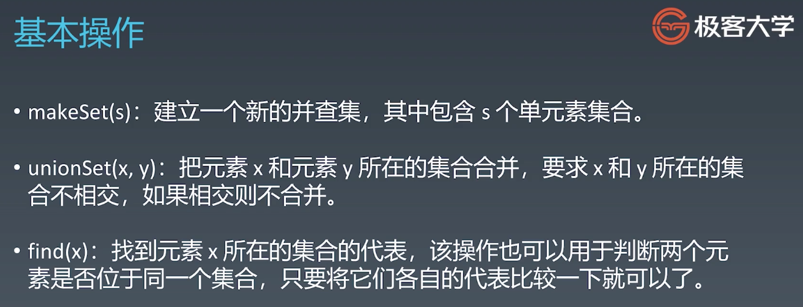

#Week07学习笔记

### 1. 基础知识

#### 1. 字典树

1. 二叉搜索树的中序遍历是升序的

2. 

3. 

4. 

5. 代码模板

   ```java
   //41,92.57;   50.4,100
   class Trie{
       
       class TrieNode {
           //可以根据需要给node增加属性和方法，比如
           //记录当前node中有一个link
           //private int size；
         	//获取某个字符的link
         	//public TrieNode getTrieNode(char c){}
           public boolean isEnd;
           public TrieNode[] links;
   
           public TrieNode(){links=new TrieNode[26];}
       }
   
       private TrieNode root;
   
       public Trie(){ root=new TrieNode();}
   
       /** Inserts a word into the trie. */
       public void insert(String word) {
           if (word == null || word.length() == 0) return;
           char[] wchar=word.toCharArray();
           TrieNode cur=root;
           for(char c:wchar){
               if(cur.links[c-'a']==null){
                   cur.links[c-'a']=new TrieNode();
               }
               cur=cur.links[c-'a'];
           }
           cur.isEnd=true;
       }
       
       /** Returns if the word is in the trie. */
       public boolean search(String word) {
           TrieNode node=searchPrefix(word);
           return node!=null && node.isEnd;
       }
       
       /** Returns if there is any word in  trie that starts with the given prefix. */
       public boolean startsWith(String prefix) {
           TrieNode node=searchPrefix(prefix);
           return node!=null ;
       }
   
    public TrieNode searchPrefix(String word){
           char[] wchar=word.toCharArray();
           TrieNode cur=root;
           for(char c:wchar){
               cur=cur.links[c-'a'];
               if(cur==null) return null;
           }
           return cur;
       }
   }
   ```
   
   

#### 2.并查集

1. 判断两个对象是不是在同一个团体中；两个团体溯源之后是不是可以合并；

2. 

3. 

4. 

5. 代码模板

   ```java
   class UnionFind {
       // 连通分量个数
       private int count;
       // 存储一棵树
       private int[] parent;
       // 记录树的“重量”
       private int[] rank;
   
       
       public UnionFind(int n) {
           //初始化这里需要根据实际情况，比如有的题是二维，要将二维转为一维
           //有的题有些点不需要参与合并，就不需要计算到count，rank和parent写或不写都可以
           this.count = n;
           parent = new int[n];
           rank = new int[n];
           for (int i = 0; i < n; i++) {
               parent[i] = i;
               rank[i] = 1;
           }
       }
       
       public void union(int p, int q) {
           int rootP = find(p);
           int rootQ = find(q);
           if (rootP == rootQ) return;
           
           // 小树接到大树下面，较平衡
           // 控制parent
           //要点2:修改rootx或rooty的parent，实现原团体整体换root，
           //要点3:更新rank和count
           if (rank[rootP] > rank[rootQ]) {
               parent[rootQ] = rootP;
               rank[rootP] += rank[rootQ];
           } else {
               parent[rootP] = rootQ;
               rank[rootQ] += rank[rootP];
           }
           count--;
       }
   
       public boolean connected(int p, int q) {
           return find(p) == find(q);
       }
   
       private int find(int x) {
           while (parent[x] != x) {
               // 要点1:进行路径压缩
               parent[x] = find(parent[x]);
               x = parent[x];
           }
           return x;
       }
   
       public int count() return count;
   }
   ```

6. 并查集本身没有现成的封装类，使用的话要手动实现一个

7. **并查集通过union时修改parent[root]来保证了：只要两个点进行了union，之后就可以保证一直在同一个团体中，在不需要count时，修改parent[rootx]=rooty或者parent[rooty]=rootx都可以；并且只要在同一个团体中，寻根一定可以找到唯一的root；并查集这种结构确实很巧妙，只要union过了，就肯定一直可以保证在一个团体中，方式我认为就是通过修改parent[rootx]而不是修改parent[x]**


#### 高级搜索

一些初级搜索


#### 3.剪枝

1. 在使用一些初级搜索，如DFS时，对于当前枚举的搜索，如果不满足某些条件，或已经确定不是最优解/目标解，直接中止继续搜索；进入下一个搜索方向；

####4. 双向BFS

1. 基于一般的BFS，每次迭代时，从首尾两个方向向对向扩散搜索，因为从首尾两个方向对搜索区间进行约束，所以可以有效的缩小搜索空间，加快搜索速度
2. 视频里将的双向BFS，是指选择两端的状态空间小的那个进行BFS，每次迭代只更新一个状态空间

#### 5. 启发式搜索

1. 基于BFS。使用priorityqueue代替queue进行BFS，主要是定义问题的优先级，即估价函数

   

2. A*算法模板：就是使用估价函数初始化priorityqueue然后进行BFS

   ```python
   def AstarSearch(graph, start, end):
   
   	pq = collections.priority_queue() # 优先级 —> 估价函数
   	pq.append([start]) 
   	visited.add(start)
   
   	while pq: 
   		node = pq.pop() # can we add more intelligence here ?
   		visited.add(node)
   
   		process(node) 
   		nodes = generate_related_nodes(node) 
      	unvisited = [node for node in nodes if node not in visited]
   		pq.push(unvisited)
   ```


#### 6. AVL和红黑树

1. 保证性能的关键：保证二叉树的平衡性

2. 常见的平衡树：2-3、AVL、B、Red-Black、（AA、Splay、Treap...）

3. 一般不会将已经严重失衡的树进行调整，而在插入节点时就调整平衡性

4. AVL树：严格平衡二叉树，不要求实现，但要明白过程和原理；（是严格平衡，只要求任意一个节点的左右子树高度差不超过1，不是绝对平衡，2-3树是绝对平衡的，任意一个节点的左右子树高度相等）

   
   
   保证每个节点的平衡因子在{-1,0,1}，
   
   为什么要保证平衡因子的范围？树的查询复杂度是与树的深度有关的，限定平衡因子可以保证树的平衡性从而使深度最小；
   
   保证平衡因子的4种基本旋转操作：右右->左旋、左左->右旋、左右->左旋+右旋 和 右左->右旋+左旋，如果需要调整的节点不是叶子节点，有子树，就按照下图
   
   
   
   不足：节点需要保存额外信息----平衡因子，且为了保证严格平衡，调整次数频繁，维护成本高，
   
5. 红黑树：近似平衡二叉树

   

   有时也会人为定义红节点是左子节点

   

   不详细展开说明，记住5条基本性质，以及

   从根节点到任意一个叶子节点，最长的路径不会超过最短路径的2倍，即高度差不会超过2倍；

6. AVL vs Red-Black

   

   AVL查询更快，因为严格平衡

   RB添加删除更快

   RB可以只用1个bit存红黑性，AVL使用1个int

   读多用AVL，读改对半或改多用RB
   
   **没有对应习题，掌握原理**


#### 7. 相关题目

##### Trie

1. [208. 实现 Trie (前缀树)](https://leetcode-cn.com/problems/implement-trie-prefix-tree/)->[在这-5](#1. 字典树)
2. [79. 单词搜索](https://leetcode-cn.com/problems/word-search/)
- 这个不使用trie树简单点，维护一个visited数组，根据word的下一个DFSboard即可，是个回溯，7，81.88； 40.8，14.28
3. [212. 单词搜索 II](https://leetcode-cn.com/problems/word-search-ii/)
- 这个题目是四连通，即上下左右方向，此外还可以有8连通，加上斜向
- 暴力方法：对words中的每一个单词，遍历board，找到这个单词的首字母，然后上下左右4个方向，所以时间复杂度`O(N*m*n*4^k)`，其中N是words中单词的数量，m是board的长和宽，k是words中单词的平均长度；当然对这个题，暴力方法肯定是超时的，对[79. 单词搜索](https://leetcode-cn.com/problems/word-search/)可以试试这个方法；暴力方法：803,7.53; 42.3,100；时间长的原因，是没有充分利用之前已经进行过的搜索
- trie：构建words中所有单词的trie树，然后从头开始遍历board，看当前位置的char是不是words中某个单词的首字母，是的话查看该单词的下一个字母是否在当前位置的4个方向之一中，直到找到完整的单词或中途断掉；遍历完整个board之后就找到了所有包含的words中的单词了；注意这里有一个要求是在同一次中，char不能重复使用，所以在遍历过使用后变为其他值；当然在退出这层循环之后，要恢复这个位置的char，所以还有点回溯的用法；也可以用另外一个已访问数组保存访问状态；[时间复杂度分析](#4. 其他作业题)
- 总结对比 暴力和trie：两者的本质过程都是DFS，区别是是否对当前位置的下一个可选位置继续DFS，比如暴力，一次DFS基于一个String，是否对下一个位置进行DFS取决于下一个位置的字符是否是单词的下一个字符；trie也差不多，取决于代表下一个位置字符的节点 是否出现在trie当前节点的下一个，并且由于trie包含了所有单词，所以一次遍历board就相当于遍历了整个strs；另外暴力时，有明确的结束点，就是str到达了结尾，而trie时，因为包含了所有的单词，所以每到一个新的节点，都要检查该节点是否是结束节点，如果是，就将路径代表的单词添加到res，题解中，采用的方式是将结束节点代表的单词直接作为该节点的一个成员变量，到达后直接取出即可，不需要在路径中记录每个字符，受此启发，**在结束节点根据需要添加不同的成员变量作为需要的信息载体**；如果要记录字符的话需要用一个StringBuilder
- [一篇比较好的题解](https://leetcode-cn.com/problems/word-search-ii/solution/java-zi-dian-shu-hui-su-ji-bai-liao-9969-de-yong-h/)


#####UnionFind

4. [547. 朋友圈](https://leetcode-cn.com/problems/friend-circles/)
- 不使用并查集，用一个setAll保存所有的人，然后从编号0开始遍历，初始化另一个set表示编号0所在的团体，有点像层序遍历，不断的从这个set中取出还没有遍历过的编号，可以使用一个boolean保存是否已遍历，直到没有新的编号加入这个团体；如果setAll中还有剩余，就再取出一个组件团体，最后返回团体的数量。这个是BFS，每一次都是迭代上一次新加入的

- 另外就是DFS，使用一个visited标记就可以了，对新加入的立即标记为true，并访问关系数组，将有关系但还没有加入的人标记为true，直到没有新人加入，自然退出递归

  自己在第一次用DFS做的时候，出现的问题是，认为关系矩阵是对称的，所以遍历的时候仅遍历了右上角的一半，错误的原因是，深度遍历时，要尽可能早的发现所有的关联，只遍历一半，虽然的确所有的关系在一半中都有，但是只遍历一半，有的关系无法尽在发现而没有出现在本应在一次的遍历中，从而被分割。1,99.92;  40.5,96

- 并查集：实现简单的并查集，遇到的问题是，在union中，如果随意指定parent[i]=rootj，很容易左右横跳，比如0&1，root[0]=1;0&2,root[0]=2;1&2,root[1]=2;虽然最后3个root都是2了，但是因为3次union都count--，所以最后count=0，而不是应该的1；采取的措施是UnionFind，中定义一个成员变量rank，rank[i]表示当i为root时，以i为root的集合的大小，union时，将rank较小的root合并到rank较大的集合中，这样可以达到最有效的合并；

5. [200. 岛屿数量](https://leetcode-cn.com/problems/number-of-islands/)
- DFS & BFS

- 并查集：将二维转为一维，做之前想的问题时，如何在一次迭代中保证理应合并的所有位置都合并？之后意识到，并查集合并不是一个一蹴而就的过程，与DFS是不同的，使用并查集合并，只要相邻的是1就应该合并，又因为之前的那个相邻的1已经与它前面的1合并过了，这两个1再合并，新的1自然会合并到总集中；使用并查集合并，遍历过的点可以不修改值为0；因为DFS中修改为0是为了避免死循环，而并查集合并是不会死循环的，这个过程就是遍历一遍grid的过程，遍历每个点的时候，只检查其周围的4个点，如果已遍历点没有修改为0，就是再union一下；如果修改了，因为已经和当前的1合并过了，所以已经在同一个集合中，不会影响结果，就是省了再union一下的时间；

  另外每个位置都是和它右下两个点检查，所以都不需要检查左上两个点
6. [130. 被围绕的区域](https://leetcode-cn.com/problems/surrounded-regions/)
- 既然只要不和边界的o相连都要变为x，那就对所有的o合并，如果合并的两个o，有一个是边界上的，就以这个为root，两个都不是，就合并到rank大的；第一遍遍历，肯定是不能确定这个o是否要变化，所以要第二遍遍历时，判断这个o的root是不是边界，不是的话就填充------->可行，但代码量有点大，时间有点长 10,13.41； 41.5，56.25
- DFS：常规思路，检测到是O，就递归查看是否与边界O相连，但是出现了一些问题
- DFS：换个角度，既然是否与边界O相连不好确认，那就将与边界O相连的O找出并标记，这个就是简单的dfs即可，然后再遍历一遍数组，置换剩余的O为X，边界的O还原；


#####剪枝

7. [70. 爬楼梯](https://leetcode-cn.com/problems/climbing-stairs/)
- dp
- 递归，再去重
- 如何转换成Fibonacci
- 爬楼梯转换成换零钱，即有面值为1和2的零钱，比如最少走几步，这里因为2是1的倍数，所以肯定贪心的能走2步先走两步就可以，但是如果可以走其他步数就和换零钱相似了，
8. [22. 括号生成](https://leetcode-cn.com/problems/generate-parentheses/)
- 通过右括号不能超过左括号数量和左括号数量不能超过长度的一半来剪枝

- 可以使用dp解决：定义dp[i]是使用i对可以组成的所有结果的list，那么dp[i+1]就是在dp[i]的基础上再添加一对（），关键是这对（）里面可以包含什么内容，可以是dp[i-1]\~dp[0]，那么相应的，这对（）外面就要有dp[0]\~dp[i-1]组括号，才能保证得到的dp[i]总共有i对括号；

  ```java
  //dp
  //10,14.37;   39.8,5.26
  class Solution{
      public List<String> generateParenthesis(int n){
          List<String>[] dp=new ArrayList[n+1];
          dp[0]=new ArrayList<>();
          dp[0].add("");
          for(int i=1;i<n+1;i++){
              dp[i]=new ArrayList<>();
              for(int j=0;j<i;j++){
                  for(String s1:dp[j]){
                      for(String s2:dp[i-1-j]){
                          dp[i].add( "("+s1+")"+s2 );
                      }
                  }
              }
          }
          return dp[n];
      }
  }
  ```

  
9. [51. N皇后](https://leetcode-cn.com/problems/n-queens/)
- 通过不能在同一列、同一左斜、同一右斜来剪枝，不然就是枚举所有可能后检查是否可行
10. [36. 有效的数独](https://leetcode-cn.com/problems/valid-sudoku/)
- 因为就是判断是否合法，所以这个题目没有回溯或剪枝，就是循环判断

- 划分9宫格的方法还是，求商和余数，每个九宫格的商和余数是不同的

- 比较简洁的一种做法是，空间换时间，用3个9*9的boolean数组保存行、列、宫的出现数字状态

  ```java
  class Solution{
      public boolean isValidSudoku(char[][] board){
          boolean[][] row=new boolean[9][9];
          boolean[][] col=new boolean[9][9];  //第i 行表示九宫格第i 列
          boolean[][] room=new boolean[9][9]; //一行代表一个宫格
  
          for(int i=0;i<9;i++){
              for(int j=0;j<9;j++){
                  char c=board[i][j];
                  if(c!='.'){
                      int num=c-'1';
                      int roomnum=i/3*3 + j/3;
                      if(row[i][num] || col[j][num] || room[roomnum][num]){
                          return false;
                      }
                      row[i][num]=true;
                      col[j][num]=true;
                      room[roomnum][num]=true;
                  }
              }
          }
          return true;
      }
  }
  ```

  

11. [37. 解数独](https://leetcode-cn.com/problems/sudoku-solver/)
- 本质上和皇后差不多，都是通过规则判断这个位置是否可以放某个数字，进行剪枝，使用回溯
- 遇到的问题是，如何在解决问题后，控制程序返回并推出，因为皇后问题，是统计总共有多少个解，所以是遍历完所有的可能情况，这个问题如果按照这个模板写，最后退出时，board将与开始时完全一致；
- 方法也是比较容易想到的，就是在解决问题之后返回boolean
- 自己写的递归中止条件是pos=81,pos是每个位置的i*col+j，另外要注意的问题是，这里虽然也是写数组，但是和皇后问题中用数组保存最终结果时回溯不需要将pos[]也还原为递归之前的状态，因为这里在进入for循环之前要判断，如果是数字就跳过，这样如果不还原为'.'，那么再次到达该位置时，就不会填写；
- 另外遇到的问题是，只填写完第一行就退出了，并且空位全部是9，说明一方面是没有在退出示还原board状态；另一方面，说明现在第一行的填写计划不可行，需要逐级返回，在某一个递归，尝试另一个数字，但是因为返回时board没有还原，都是9，所以对选择新的数字填写之前的位置产生影响，最终在第一个'.'处尝试到9之后发现都不可，就退出了程序。所以主要还是没有还原board的原因。在皇后中，pos数组仅保存位置，该位置是否可行，还要受那3组boolean决定，与pos无关，所以pos数组可以不还原。      本来还以为是递归终止条件pos==81设置的不对，认为每进入一次for 循环pos就会+1，这样很快就达到了81次，其实pos仍然对应的是位置，就像很多回溯用level对应递归层数，这里pos其实也可以理解为递归层数，需要80层递归。当pos\==81，board也就填满了。
- 另外还可以直接使用i和j直接表示点的坐标；这样递归中止条件就是i==9时。
- 以上两种方法的时间 701,5.11; 39.7,7.14，这已经是根据isValid剪枝之后的效果；
- 更高级一点的，可以从9宫格中剩余的空位少的那个开始填写，因为试错的范围比较小；这是一种启发式搜索方法，即有多种选择时，先进行优先级较高的选择，这里优先级高就是空格子比较少；这时，搜索方案就不是简单的DFS或BFS，是**优先级优先**，也即A*，具体的在下面A\*部分有说明；


#####双向BFS

12. [127. 单词接龙](https://leetcode-cn.com/problems/word-ladder/)
- BFS

- DFS

- 双向BFS

  - 基本的双向BFS，就是每次迭代选择状态空间小的进行BFS，直到找到共同的单词，就可以退出

    下面的程序需要加一句`if(!wordList.contains(endWord)) return 0;` ，在定义完visited后也应该加上`visited.add(endWord);`

    这里要注意到的一个问题是：因为beginSet增加新的待选后，向endSet中查看是否存在，但是beginSet和endSet又是不断更新的，会不会出现，beginSet新增加的待选出现在之前的endSet中，而没有出现在现在的endSet中呢？根据结果来看是没有的，现在根据自己的理解解释的话：从begin到end的过程最短的路径要分几步，说明是有一个变化的过程，而每次while是将这个过程往前推进一步，如果用双向，因为从begin和end两头推进，如果有最短路径的话，二者会在中间相遇，之间的变化只有一步了，而之前说的问题，相当于从begin推进几步后，再变化一步，到了end之前的某个状态，而这之间跳过了end，肯定是大于一步的，不可实现。
    
    
    
    
13. [126. 单词接龙 II](https://leetcode-cn.com/problems/word-ladder-ii/)
- 这个题，相比只找出最短路径还是麻烦很多的
- 一开始以为在使用BFS找路径时，边找边保存即可。但是后来想到，BFS会同时找到多个方向和多条路径，这时还没有比较简单的，分别将这些路径保存到res中的方法，所以可以使用双向BFS建立最短路径图后，再DFS回溯找到所有路径
- 这里有一个与之前127不同的地方，127可以再将newStr添加到queue中后立即从wordSet中删除单词，因为那里只要找出最短路径长度即可；但是这里不行，因为这里要找所有可行的最短路径，这个newStr可能本层的多个节点都能到达，如果第一个节点到达后就删除，那之后的节点就不能与newStr建立路径，就会有路径的损失，所以要在这一层都遍历完后，才从`wordSet中removeAll(tmpSet)`，也不需要考虑之后是否有其他层遍历时需要这个单词，因为这个单词第一次被某个层访问时，就是到达它的最短路径，之后即使再次访问了，也不是最短，不需要关心。

14. [433. 最小基因变化](https://leetcode-cn.com/problems/minimum-genetic-mutation/)
- ```java
  //双向BFS，set保存每层状态
  //这里使用预处理bank的方法也不合适，因为字符串比较长和bank中的词汇量比较少
  //1,70.85;  37.4,20
  //相比单向BFS，速度接近，原因是数据集太小无法体现
  ```

  


##### 启发式搜索

15. [1091. 二进制矩阵中的最短路径](https://leetcode-cn.com/problems/shortest-path-in-binary-matrix/)
- 八联通，即可以向右下走，uniquepath都是四联通，所以可以使用dp

- 可以使用BFS：BFS时，每个点第一次被访问时，该路径就是到达这个点的最短路径；

  基本思路：uniquepath是求路径的数量，这个是求最短路径，所以都要找出所有可行路径，然后得到结果；这个题，从左上到右下，每个位置的可选路径虽然有8个方向，但是最短的肯定不会走回头路，所以，可选方向有右、右下、下3个方向，在每个点遍历这3个方向找出最小值即可；

  提交后发现有问题，有时候这3个方向堵住了，需要回头才行，所以还要遍历8个方向，但这样有可能死循环；为了避免死循环，使用数组标记已经走过的路;

  8个方向都检测，使用DFS回溯，就超时了

  其实走过所有方向，可以用深度回溯的方式

  使用BFS，是到达一个点后，将8个方向都添加到队列，队列不空，一直while，直到到达了终点退出；

  但是问题是，不会死循环吗？采取的方法是，走过的位置置为1；虽然题目中没有说明每个位置只能走一次；这个就是标准的BFS

  每个点对应的step是到达其需要的最少step，因为BFS就是这样按层次扩散，从源点开始

  每层是它能到达的所有点，所以每个点第一次被访问时，也是到达的最快路径

- 像这种找最短路径，使用BFS还是有优势的，DFS回溯需要遍历所有可能的路径并选出最短路径；而BFS只需要扩散后，首次找到目标值即可返回。同时为了避免死循环，经过的路径做标记，true或替换为其他值

- [双向BFS](https://leetcode-cn.com/problems/shortest-path-in-binary-matrix/solution/java-shuang-xiang-bfs-ji-bai-100-by-hao-shou-bu-ju/)：使用3个二维boolean数组标识已访问情况，本质上和使用set的双向一样，但是速度较快，原因可能是直接访问数组和取链表元素比从set中取出元素和查看set中是否含有元素要快；可以说是以空间换时间，因为这个过程中要一直保存之前访问的选项的状态，而双向的话，只需要保存当前状态空间即可；

- [另一个双向BFS](https://leetcode.com/problems/shortest-path-in-binary-matrix/discuss/649628/Java-Clean-Code-Bidirectional-BFS)：这个就和[127. 单词接龙](https://leetcode-cn.com/problems/word-ladder/)中官方的双向DFS一样了，在一次while中对begin和end两个集合进行BFS，如果在这个while中找到了step1+step2+1；

- 从127和这个题的两种双向的时间来看，while begin和end中小的的方式 比 同时从两头while会好一点，对这一点的解释，不管是单向还是双向，要走的最短路径是相同的，区别是如何尽可能缩小bfs范围，从这一点来看，选begin和end中较小的，是每一步都选了较小的集合BFS，而双头同时while还是虽然比单向好一些，但是相比每一步都选较小的另一种双向还是差一点；

- A\*：[包含动图演示的一个解法](https://leetcode.com/problems/shortest-path-in-binary-matrix/discuss/313347/A*-search-in-Python)

  这个的估价函数就是该点到终点的曼哈顿距离，这样的话，斜下的点会被优先选择，因为如果一个点的右和右下都可以走的话，到达这俩个点的step是相同的，但是右下的其曼哈顿距离小，所以会被优先检索
  
  自己写A*时，遇到的问题是，因为每次while都是从队列中取出距离终点最近的点，但是这个最近的点不一定是最短路径上的，然后因为多绕过了这一个点，它下一次增加邻节点时将原本最短路径上的点添加到队列，但是step增加了一些，造成最终结果出错。
  
  使用优先队列不能保证取出的每一个都是最短路径上的，有点贪心的意思，但是通过迭代到达相同位置时它的step，可以保证得到的是最短路径。
  
- 从这个题的结果来看，基本的BFS与A*的时间接近，可能是测试集的原因，如果是个较大的地图，那么A\*肯定是比基本BFS要快一些的，因为BFS是全范围扩散，直到找到目标；A\*是在小范围里找出最小后，选择这个方向继续，感觉有点贪心的意思，1. 如果当前路径走不通，也可以选择queue中还有的其他方向，这么说还有点DFS回溯的感觉，在寻找新的路径的过程中，如果遇到了以前走过的位置视情况更新代价函数值；2. 如果当前路径可行，如何保证是最短路径呢？这个问题还不明白，也许保证这个的就是代价函数吧。所以选择代价函数很重要。
16. [773. 滑动谜题](https://leetcode-cn.com/problems/sliding-puzzle/)
- 直接BFS：遍历每层的所有状态，直到找到解火队列空；好像只要能枚举所有状态的棋类游戏都可以这么做

  

  

- A*：使用曼哈顿距离作为估值函数

  过程很好理解，就是估值函数比较难得到，估值函数的含义是，每个数字现在的位置到它应在的位置的曼哈顿距离

  ```java
  for (int r = 0; r < R; ++r)
     for (int c = 0; c < C; ++c) {
         if (board[r][c] == 0) continue;
         int v = (board[r][c] + R*C - 1) % (R*C);
         // v/C, v%C: where board[r][c] should go in a solved puzzle
         heuristic += Math.abs(r - v/C) + Math.abs(c - v%C);
     }
  ```

  

- BFS、A\*、双向BFS/A\* [性能对比](https://zxi.mytechroad.com/blog/searching/8-puzzles-bidirectional-astar-vs-bidirectional-bfs/)

- 这个题，将board转成字符串处理比较方便，direc也不需要offset之后的范围内判断；另外使用step+曼哈顿距离比较安全；另外注意，使用A*的话，状态不能访问之后就不再访问，因为A\*不是BFS，到达每个状态不一定是最少的step，比如之前1091题中将grid记录为step，这个题目可以使用map保存每个状态和到目前为止的最少step，在之后如果得到了更小的step就更新，在获得新状态之后，只有没有出现过或开销更小的旧状态才添加到queue中，否则跳过即可。
17. [37. 解数独](https://leetcode-cn.com/problems/sudoku-solver/)
- 还是挺复杂的。。。位运算的使用绝了，要写出来可不容易了
- 主要也还是DFS，与普通DFS的区别是，每次填写一个空格时，先找出可选数字数量最少的那个空格填写；比较难的是 采取什么方法检查每个空格可选数字有哪些，进而选择可选数字最少的那个空格
---

### 2.每日一题

#### 1. 6-1

1. [1431. 拥有最多糖果的孩子](https://leetcode-cn.com/problems/kids-with-the-greatest-number-of-candies/)
- 遍历找最大值后依次比较即可


#### 2. 6-2

1. [面试题64. 求1+2+…+n](https://leetcode-cn.com/problems/qiu-12n-lcof/)
- 要求不能使用乘除法、for、while、if、else、switch、case等关键字及条件判断语句

- 使用逻辑运算符的短路特性和递归

  ```java
  class Solution {
      public int sumNums(int n) {
          boolean flag = n > 0 && (n += sumNums(n - 1)) > 0;
          return n;
      }
  }
  ```

  

- 使用[俄罗斯农民乘法](https://www.cnblogs.com/yangqingli/p/4745167.html)，位运算计算乘法，使用求和公式，因为题目限制了最大值，所以列举出所有的，代替for循环

  ```java
  class Solution {
      public int sumNums(int n) {
          int ans = 0, A = n, B = n + 1;
          boolean flag;
  
          flag = ((B & 1) > 0) && (ans += A) > 0;
          A <<= 1;
          B >>= 1;
  
          flag = ((B & 1) > 0) && (ans += A) > 0;
          A <<= 1;
          B >>= 1;
  
          flag = ((B & 1) > 0) && (ans += A) > 0;
          A <<= 1;
          B >>= 1;
  
          flag = ((B & 1) > 0) && (ans += A) > 0;
          A <<= 1;
          B >>= 1;
  
          flag = ((B & 1) > 0) && (ans += A) > 0;
          A <<= 1;
          B >>= 1;
  
          flag = ((B & 1) > 0) && (ans += A) > 0;
          A <<= 1;
          B >>= 1;
  
          flag = ((B & 1) > 0) && (ans += A) > 0;
          A <<= 1;
          B >>= 1;
  
          flag = ((B & 1) > 0) && (ans += A) > 0;
          A <<= 1;
          B >>= 1;
  
          flag = ((B & 1) > 0) && (ans += A) > 0;
          A <<= 1;
          B >>= 1;
  
          flag = ((B & 1) > 0) && (ans += A) > 0;
          A <<= 1;
          B >>= 1;
  
          flag = ((B & 1) > 0) && (ans += A) > 0;
          A <<= 1;
          B >>= 1;
  
          flag = ((B & 1) > 0) && (ans += A) > 0;
          A <<= 1;
          B >>= 1;
  
          flag = ((B & 1) > 0) && (ans += A) > 0;
          A <<= 1;
          B >>= 1;
  
          flag = ((B & 1) > 0) && (ans += A) > 0;
          A <<= 1;
          B >>= 1;
  
          return ans >> 1;
      }
  }
  ```


#### 3. 6-3

1. [837. 新21点](https://leetcode-cn.com/problems/new-21-game/)
- dp，不会

2. [面试题 01.07. 旋转矩阵](https://leetcode-cn.com/problems/rotate-matrix-lcci/)
- 这个是4月的打卡题，回顾，
- 直接思路，交换4个相关的位置
- 技巧：使用翻转


#### 4. 6-4

1. [238. 除自身以外数组的乘积](https://leetcode-cn.com/problems/product-of-array-except-self/)
- 前缀积*后缀积，得到这两个数组需要遍历一遍数组，`O(n)`，保存两个数组大小的内存，

- 常数空间的话，本质也是前缀积*后缀积，不过是直接在一个数组中操作，计算结束后直接返回，没什么门道，因为就是nums[i]左边所有元素的乘积\*右边所有的乘积，所以计算res[i]时需要将nums[i]排除，就延迟一位就好了

  ```java
  //1,100;  48.5,11.76
  class Solution{
      public int[] productExceptSelf(int[] nums){
          int length=nums.length;
          int[] res=new int[length];
          int k=1;
          for(int i=0;i<length;i++){
              res[i]=k;
              k*=nums[i];
          }
          k=1;
          for(int i=length-1;i>=0;i--){
              res[i]*=k;
              k*=nums[i];
          }
          return res;
      }
  }
  ```


#### 5. 6-5

1. [面试题29. 顺时针打印矩阵](https://leetcode-cn.com/problems/shun-shi-zhen-da-yin-ju-zhen-lcof/)
- 没什么特殊的门道，但是可以锻炼代码能力

- 可以直接按照直觉思路，螺旋打印即可，但是对代码实现能力很有帮助，自己现在的能力还很弱；

- 分层，每打印完一层向内锁，其实和螺旋打印本质一样

- ```java
  class Solution{
      public int[] spiralOrder(int[][] matrix){
          if(matrix==null || matrix.length==0) return new int[]{};
          int row=matrix.length;
          int col=matrix[0].length;
          int[] res=new int[row*col];
  
          //记录初始最左列、最右列、最上列、最下列
          //left<=right,up<=bottom
          int left=0,right=col-1,up=0,bottom=row-1;
          int count=0;
          while(true){
              //最上行
              for(int i=left;i<=right;i++) res[count++]=matrix[up][i];
              if(++up > bottom) break;
              //最右列
              for(int i=up;i<=bottom;i++) res[count++]=matrix[i][right];
              if(--right < left) break;
              //最下列
              for(int i=right;i>=left;i--) res[count++]=matrix[bottom][i];
              if(--bottom < up) break;
              //最左列
              for(int i=bottom;i >= up;i--) res[count++]=matrix[i][left];
              if(++left > right) break;
          }
          return res;
      }
  }
  
  ```


#### 6 6-6

1. [128. 最长连续序列](https://leetcode-cn.com/problems/longest-consecutive-sequence/)
- 难点在于要求的`O(n)`的时间复杂度，不然的话可以直接排序后遍历即可；

- 既然不能排序，最直接的办法就是在遍历到一个数字后，查看是否有num-1和num+1，查找使用hash确实可以实现`O(n)`的复杂度

- 这个题的使用map也是需要一些思路的，当然最直接的就是将所有添加到set中后，第二次遍历nums，对每一个num检查比他小的有几个，while计数；

- 还有一种思路比较新奇，这种方法需要认识到：每次进入if后的num-1和num+1如果存在的话，一定是作为一个连续序列的边界存在，并且已存在的序列除了两头的，中间的不会再被访问；所以value保存的是在key作为一个连续序列的边界时，该序列的长度。如果这个题目数据有范围并且可以用数组的话，会更快一点

  ```java
  //8,41.08;  40.8,8.33
  class Solution {
      public int longestConsecutive(int[] nums) {
          HashMap<Integer,Integer> map=new HashMap<>();
  
          //value保存的是。。。当前num参与的最长连续序列的长度
          int maxlen=0;
          for(int num:nums){
              //如果之前已经包含了num，就不需要再计算一次
              //因为num是第一次出现，所以num-1和num+1此时也是边界
              //num-1和num+1不可能是已存在的连续序列的中间
              if(!map.containsKey(num)){
                  int left=map.containsKey(num-1)?map.get(num-1):0;
                  int right=map.containsKey(num+1)?map.get(num+1):0;
                  int len=left+right+1;
                  map.put(num,len);
                  map.put(num-left,len);
                  map.put(num+right,len);
                  maxlen=Math.max(maxlen,len);
              }
          }
          return maxlen;
      }
  }
  ```

  
2. [217. 存在重复元素](https://leetcode-cn.com/problems/contains-duplicate/)
- 没什么特别妙的方法，就用hash查重吧

3. [350. 两个数组的交集 II](https://leetcode-cn.com/problems/intersection-of-two-arrays-ii/)
- 比较简单的就是使用双指针，重点是**先排序**，排序也算在数组相关问题中常用的手段了，数组有序之后可以利用有序性简化很多操作；
- 既然是提到查找元素了，自然也可以使用hash，因为重复元素也要都写出，所以使用map保存出现次数；


#### 7 6-7

1. [126. 单词接龙 II](https://leetcode-cn.com/problems/word-ladder-ii/) 

---

### 3. 作业算法题

[这里](#7. 相关题目)

---

### 4. 其他作业题

1. 分析单词搜索 2 用 Tire 树方式实现的时间复杂度

   首先for中遍历的是board数组，所以`O(m*n)`；

   其次，每个位置最多要迭代words中一个单词的长度，每次迭代最多找4个方向，当然这是最坏情况；很多时候这个位置的char不再words首字母中出现，所以时间复杂度最大也是`O(m*n*4^k)`

   其他比如没有遍历完毕就差找到了所有单词而中止或者一个都不是首字母就是概率问题了；

   至于创建trie树的时间，在遍历的时间级数上可以忽略，就是所有单词的总长度
   
2. 总结双向 BFS 代码模版

   ```java
   public int doubleBFS(){
     //待访问集合
     HashSet<>() wordSet;
     if(!wordSet.contains(endWord)) return;
     
     //首尾集合
     HashSet<>() beginSet;
     HashSet<>() endSet;
     //添加beginWord和endWord到相应集合
     
     //初始化计数变量
     int len=1;
     while(!beginSet.isEmpty() && !endSet.isEmpty()){
       //令size小的集合为beginSet，遍历小的集合
       
       //遍历beginSet，并将下一轮遍历的单词保存
       HashSet<>() tmp;
       for(String str:beginSet){
         for(int i=0;i<str.length();i++){
           //BFS,替换第i位为可选字母，查看是否在endSet中，遍历完第i位后记得还原
           String newStr;
           if(endSet.contains(newStr)) return level+1;
           
           //如果不在endSet中并且在wordSet中，则添加到新的beginSet中
           if(wordSet.contains(newStr)) {
             wordSet.remove(newStr);
             tmp.add(newStr);
           }
         }
       }
       beginSet=tmp;
       level++;
     }
     return;
   }
   ```

   

---

###5. Other tips

1. [前缀树习题总结](https://blog.csdn.net/qq_43152052/article/details/101109415)

2. 