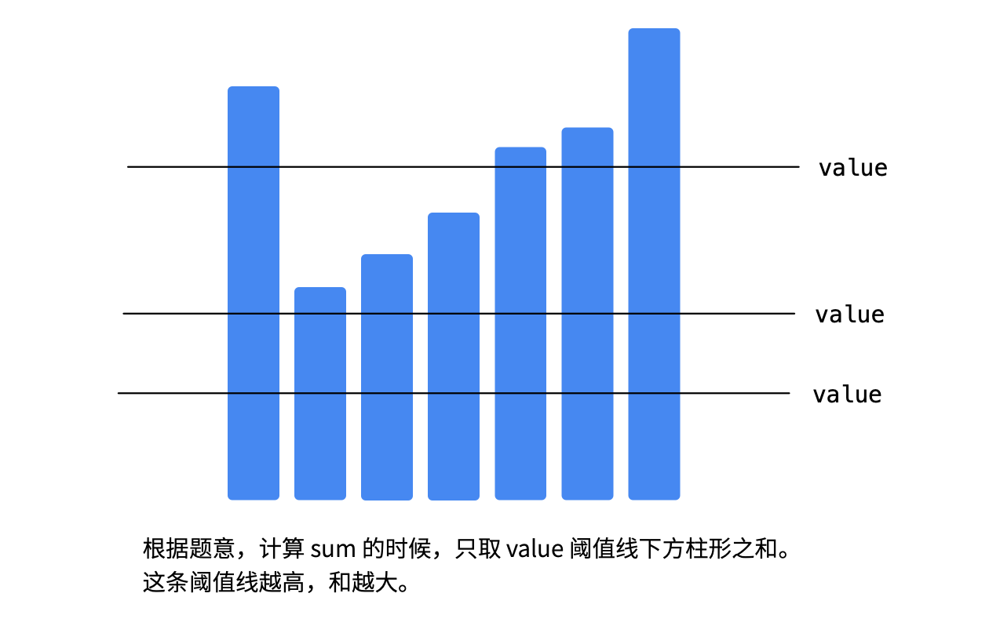

#Week08学习笔记

### 1. 基础知识

#### 1.位运算

0. 

   00000000～11111111对应的int值：0～127，-128～-1；

1. \>> 右移位，\>>左移位，|或，&与，~取反，^异或

2. 常见的异或使用

   

3. 指定位置的位运算

   

4. 实战位运算要点

   

   X&(-X)得到的是只有最低位的1保留时int数值

#### 2.布隆过滤器

1. 与hash表对比，hash表要保存key和value的完成内容；

2. Bloom Filter ，一个很长的二进制向量和**一系列**随机映射函数，只检查一个元素**是否在集合中**，不需要保存元素值

3. 优点是空间效率和查询时间都**远超**一般算法；缺点是有一定的无识别率和删除困难

4. 要注意，每个元素不是对应1个二进制位，而是多个二进制位都为1才表示该元素存在，即一个元素对应多个二进制位；误差的出现是因为，新元素对应的二进制位原本就都是1，但是并不能说明这个元素已经存在于集合中。

5. 如果查到不存在，就一定不存在；查到存在，是可能存在；

6. 所以使用场景是放在最外层的初步检查，如果检查存在需要进一步确认存在；如果检查不存在，则返回即可；因为效率很高，所以放在外层进行不存在判断是可以的；

7. 使用场景：比特币网络、分布式系统(Map Reduce)、Redis缓存、垃圾邮件评论等根据关键字等过滤

8. 可参考博客

   [布隆过滤器的原理和实现](https://www.cnblogs.com/cpselvis/p/6265825.html)

   [使用布隆过滤器解决缓存击穿、垃圾邮件识别、集合判重](https://blog.csdn.net/tianyaleixiaowu/article/details/74721877)

   [高性能布隆过滤器 Python 实现示例](https://github.com/jhgg/pybloof)

   [布隆过滤器 Python 代码示例](https://shimo.im/docs/xKwrcwrDxRv3QpKG/)

   [布隆过滤器 Python 实现示例](https://www.geeksforgeeks.org/bloom-filters-introduction-and-python-implementation/)

   [布隆过滤器 Java 实现示例 1](https://github.com/lovasoa/bloomfilter/blob/master/src/main/java/BloomFilter.java)

   [布隆过滤器 Java 实现示例 2](https://github.com/Baqend/Orestes-Bloomfilter)

#### 3.LRU Cache

1. 与现在的推荐系统有类似的地方，都是根据当前的操作，进行一些优化处理，比如增加权重、移到最前等，所以现在常用的替换算法是使用人工智能实现，面试中可能看原理和基本实现

2. 使用双向链表和哈希表实现`O(1)`的操作复杂度

3. 参考资料：

   [替换算法总揽](https://en.wikipedia.org/wiki/Cache_replacement_policies)

   

#### 4. 排序

1. 比较和非比较排序

   

   

   

2. **考察一般就是3个`O(nlogn)`的排序，要熟悉原理和实现，`O(n^2)`的了解**

3. 初级排序`O(n^2)`，

   

4. 高级排序`O(nlogn)`

   快排

   

   ```java
   public static void quickSort(int[] array, int begin, int end) {
       if (end <= begin) return;
       int pivot = partition(array, begin, end);
       quickSort(array, begin, pivot - 1);
       quickSort(array, pivot + 1, end);
   }
   
   static int partition(int[] a, int begin, int end) {
       // pivot: 标杆位置，counter: 小于pivot的元素的个数
       int pivot = end, counter = begin;
       for (int i = begin; i < end; i++) {
           if (a[i] < a[pivot]) {
               int temp = a[counter]; a[counter] = a[i]; a[i] = temp;
               counter++;
           }
       }
       int temp = a[pivot]; a[pivot] = a[counter]; a[counter] = temp;
       return counter;
   }
   ```

   归并

   

   ```java
   public static void mergeSort(int[] array, int left, int right) {
       if (right <= left) return;
       int mid = (left + right) >> 1; // (left + right) / 2
   
       mergeSort(array, left, mid);
       mergeSort(array, mid + 1, right);
       merge(array, left, mid, right);
   }
   
   public static void merge(int[] arr, int left, int mid, int right) {
           int[] temp = new int[right - left + 1]; // 中间数组
           int i = left, j = mid + 1, k = 0;
   
     			//第一段，两个数组按大小合并
           while (i <= mid && j <= right) {
               temp[k++] = arr[i] <= arr[j] ? arr[i++] : arr[j++];
           }
   
     			//其中一个数组到底了，另一个直接写到tmp
           while (i <= mid)   temp[k++] = arr[i++];
           while (j <= right) temp[k++] = arr[j++];
   
     			//tmp到arr
           for (int p = 0; p < temp.length; p++) {
               arr[left + p] = temp[p];
           }
           // 也可以用 System.arraycopy(a, start1, b, start2, length)
       }
   ```

   

   堆，大多数语言都有实现的堆，比如Java的PriorityQueue，所以不需要自己实现，当然原理还是要明白的，比如基础的二叉堆

   

   ```java
   static void heapify(int[] array, int length, int i) {
       int left = 2 * i + 1, right = 2 * i + 2；
       int largest = i;
   
       if (left < length && array[left] > array[largest]) {
           largest = left;
       }
       if (right < length && array[right] > array[largest]) {
           largest = right;
       }
   
       if (largest != i) {
           int temp = array[i]; array[i] = array[largest]; array[largest] = temp;
           heapify(array, length, largest);
       }
   }
   
   public static void heapSort(int[] array) {
       if (array.length == 0) return;
   
       int length = array.length;
       for (int i = length / 2-1; i >= 0; i-) 
           heapify(array, length, i);
   
       for (int i = length - 1; i >= 0; i--) {
           int temp = array[0]; array[0] = array[i]; array[i] = temp;
           heapify(array, i, 0);
       }
   }
   ```

5. 特殊排序，对代码不做要求

   

6. 参考资料

   [十大经典排序算法](https://www.cnblogs.com/onepixel/p/7674659.html)

   [9 种经典排序算法可视化动画](https://www.bilibili.com/video/av25136272)

   [6 分钟看完 15 种排序算法动画展示](https://www.bilibili.com/video/av63851336)

#### 5. 相关题目

##### 位运算

1. [52. N皇后 II](https://leetcode-cn.com/problems/n-queens-ii/)
- 无论col还是na还是pie，都是用n位表示，col是可以的，但是pie和na在数组中使用2*n-1个位置标记的，在这里也用n位可以吗？是可以的，因为在使用数组的时候，标记的是x+y或x-y，其范围是2*n-1，而使用n位二进制位时，每一位标记的不是其和或者差，而直接是对应的位置是否可用；

- 另一个问题是，当标记做在n位的首位或末位，左移或右移，不会移除范围吗？这样不会导致标记失效吗？回答是，的确会移除范围，但不会失效，要注意到的事，填写接下来的行，其可填写的列肯定只在n的范围内，如果左移或右移出了n的范围，说明这个位置填写后，其pie或na的作用范围已经超出了0～n，而pie或na用位表示时，就表示对应的位置是否可用，超出这个范围的自然没有影响

- 与数组的区别关键在定义，数组的每个位置表示xy之和或差，而二进制位直接表示对应的位置是否可用，用数组直接表示也是可以的，用位运算更加简洁

  ```java
  //位运算练习
  class Solution{
      private int ans=0;
      private int size;
      public int totalNQueens(int n){
          size=(1<<n)-1;
          solve(0,0,0);
          return ans;
      }
  
      private void solve(int col,int pie,int na){
          if(col==size) {
              ans++;
              return;
          }
  
          int pos= size & (~(col | pie | na));
          while(pos != 0){
              int p = pos & -pos;
              solve(col | p, (pie | p)<<1, (na | p)>>1);
              pos  ^= p;
          }
      }
  }
  
  ```

  

2. [191. 位1的个数](https://leetcode-cn.com/problems/number-of-1-bits/)
- 循环32次，检查32个位中有几个

- 每次将最后一个1清零，这样不需要32次

- 先获得最后一个1，再异或清零最低位的1 `n ^= (n & -n);`，直到为零；或者直接清零最后一个1`n = n & (n-1);`

- ```java
  class Solution{
      public int hammingWeight(int n){
          int ans=0;
          while(n!=0){
              ans++;
            	//两种方式都可以
              //n ^= (n & -n);
            	n = n & (n-1);
          }
          return ans;
      }
  }
  ```

- 

3. [231. 2的幂](https://leetcode-cn.com/problems/power-of-two/)
- 二进制表示是否只有1个1

  ```java
  class Solution {
      public boolean isPowerOfTwo(int n) {
          if(n <= 0) return false;
          return (n & (n-1))==0;
      }
  }
  ```

  

4. [190. 颠倒二进制位](https://leetcode-cn.com/problems/reverse-bits/)
- 转成string，逆转这个字符串再转成int，当然这几乎是最差的写法了，尝试了一下，遇到的问题是，如何直接将01字符串转成int，使用Integer.valueOf(String s,int redix)时，当最高位为1，这个函数不会判定为负数，是否是负数通过首字符是否是-来判断，所以很容易出现溢出；暂时没想出来，不想了；

- 直接交换i和（31-i）位，因为java中目前不知道有没有直接进行位交换的方法或比较好的方式，一种想法是在一次迭代中同时获取首和尾，然后赋值到res的尾和首，通过或运算，但这样的话就和下面这种一样了；

- 还有一种思路是，每次迭代取出最低位，将最低位移到最高位并与上次的结果叠加

  ```java
  //迭代32次
  //1,100;  39.2,7.14
  class Solution {
      // you need treat n as an unsigned value
      public int reverseBits(int n) {
          int ans=0;
          for(int i=0;i<32;i++) ans+=((n>>i)&1)<<(31-i);
          return ans;
      }
  }
  
  //迭代到n为0
  //1,100;  39.2,7.14
  class Solution {
      // you need treat n as an unsigned value
      public int reverseBits(int n) {
          int ans=0;
          for(int i=31; n!=0 ;i--){
              // ans += (n&1)<<i;
              ans |= (n&1)<<i;
              n>>>=1;
          } 
          return ans;
      }
  }
  ```

- 其实Integer中已经包含了该方法

  ```java
  return Integer.reverse(n);
  ```

  其内部实现：原理：abcd->badc->dcba；也可以abcd->cdab->dcba，这种写法确实效率会高，但是并不简洁，自己写的话还是推荐位叠加，就上面那种

  ```java
      //先交换单个，再以2个为一组，再4个为一组。。。
  		public static int reverse(int i) {
          // HD, Figure 7-1
          i = (i & 0x55555555) << 1 | (i >>> 1) & 0x55555555;
          i = (i & 0x33333333) << 2 | (i >>> 2) & 0x33333333;
          i = (i & 0x0f0f0f0f) << 4 | (i >>> 4) & 0x0f0f0f0f;
  
          return reverseBytes(i);
      }
  
  		@HotSpotIntrinsicCandidate
      public static int reverseBytes(int i) {
          return (i << 24)            |
                 ((i & 0xff00) << 8)  |
                 ((i >>> 8) & 0xff00) |
                 (i >>> 24);
      }
  ```

  

5. [51. N皇后](https://leetcode-cn.com/problems/n-queens/)

6. [338. 比特位计数](https://leetcode-cn.com/problems/counting-bits/)
- 位运算+dp，目前想法是将二进制分成两段，每段的int值是之前出现过的，将二者相加即可，再精进点就是使用`dp[i]=dp[i&(i-1)]+1`

- 就是数独位运算解法中的ones数组

  ```java
  //dp
  //1,99.84;   43.8,5.88
  class Solution {
      public int[] countBits(int num) {
          int[] dp=new int[num+1];
          dp[0]=0;
          for(int i=1;i<=num;i++){
              //找到比i少了最后一位1的数中的1个数，即清零最后一位1，再+1
              dp[i]=dp[i & (i-1)]+1;
          }
          return dp;
      }
  }
  
  
  //也可以对每个i，分别求其中1的个数
  //3,36.64;  44.1,5.88
  class Solution{
      public int[] countBits(int num){
          int[] res=new int[num+1];
          for(int i=0;i<=num;i++) res[i]=ones(i);
          return res;
      }
      private int ones(int n){
          int count=0;
          while(n!=0){
              count++;
              n=n&(n-1);
          }
          return count;
      }
  }
  ```

  


##### LRU Cache

1. [146. LRU缓存机制](https://leetcode-cn.com/problems/lru-cache/)

- 使用hash表保证查找get时间复杂度为O(1)，使用双向链表保证有序性，为了方便操作头尾元素，使用dummy和tail

- 容易出错的地方有：put时应该先检查，是否已经存在了key，如果存在进行替换；删除和增加元素时map也要更新；新插入的节点和访问已存在节点导致移到首位时略有不同

- 程序中细节比较多，容易出问题

  ```java
  class LRUCache {
  
      class Node{
          int key;
          int value;
          Node pre;
          Node next;
  
          Node(int key,int value,Node pre,Node next){
              this.key=key;
              this.value=value;
              this.pre=pre;
              this.next=next;
          }
      }
  
      private HashMap<Integer,Node> map;
      private int capacity;
      private Node dummy;
      private Node tail;
  
      public LRUCache(int capacity) {
          map=new HashMap<>();
          this.capacity=capacity;
          this.dummy=new Node(0,0,null,null);
          this.tail=new Node(0,0,dummy,null);
          dummy.next=tail;
      }
      
      public int get(int key) {
          if(map.containsKey(key)){
              //移到首位,在列表中的node一定是有pre和next的
              Node target=map.get(key);
              target.pre.next=target.next;
              target.next.pre=target.pre;
              toFirst(target);
              return target.value;
          }else return -1;
      }
      
      public void put(int key, int value) {
          if(map.containsKey(key)){
              Node target=map.get(key);
              target.value=value;
              //访问之后要移到首位
              target.pre.next=target.next;
              target.next.pre=target.pre;
              toFirst(target);
          }else{
              //新的key
              if(map.size()==capacity){
                  //移除末尾
                  Node target=tail.pre;
                  tail.pre=target.pre;
                  target.pre.next=tail;
                  map.remove(target.key);
              }
              Node nNode=new Node(key,value,null,null);
              toFirst(nNode);
              map.put(key,nNode);
          }
      }
  
      private void toFirst(Node node){
          Node dummyNext=dummy.next;
          dummy.next=node;
          node.pre=dummy;
          node.next=dummyNext;
          dummyNext.pre=node;
      }
  }
  ```

  

##### 排序

1. [1122. 数组的相对排序](https://leetcode-cn.com/problems/relative-sort-array/)
- 直接的想法是用map保存arr2中出现的所有数字，然后扫描arr1，统计每个数字出现的次数，在这个过程中，将不在arr2中的数字从0开始保存到arr1中，遍历完arr1后将不在arr2中的数字搬移到arr1后部分，但是这样如果不在arr2中的数字反而多，会出现重叠的问题，如果另外使用一个数组保存这些数字反而会麻烦；

  ```java
  // 本来是想用map保存arr2中出现的元素和次数，将未出现的直接搬移到arr1的末尾，
  // 遍历完arr1后将arr2中出现的从头开始安排到arr1中，
  // 但是在第一遍就进行搬移势必会覆盖后面还没有统计的元素，所以可以额外使用数组保存未出现的数字，最后排序后复制到arr1中
  // 总的来说，如果不使用桶排序的话，还是挺麻烦的
  // 不知道除了桶排序有没有好的方法
  ```

  

- 总之这个题还是要使用桶排序，特征就是数字范围有限，主要要统计出现次数；同时使用桶排序，因为数字是从小到大遍历的，所以还顺便解决了不在arr2中的数字的顺序问题。可以说是极其适合使用桶排序的问题了。

  ```java
  //桶排序
  //0,100;  39.8,10
  class Solution{
      public int[] relativeSortArray(int[] arr1,int[] arr2){
          int[] arr=new int[1001];
          for(int num:arr1) arr[num]++;
          int[] res=new int[arr1.length];
          int index=0;
          for(int num:arr2) while(arr[num]-->0) res[index++]=num;
          for(int i=0;i<1001;i++) while(arr[i]-->0) res[index++]=i;
          return res;
      }
  }
  ```

  
2. [242. 有效的字母异位词](https://leetcode-cn.com/problems/valid-anagram/)
- 计数排序，统计每个字符出现次数，如果相同就是异位词，因为只有26个字符，所以使用数组即可；
- 计数排序
3. [56. 合并区间](https://leetcode-cn.com/problems/merge-intervals/)
- 排序+一次扫描
- 按照区间的左边界排序，排序后，从前往后比较右区间，如果前一个的右区间大于后一个，两个就可以合并
- 注意处理最后一个是否被合并的边界条件
5. [493. 翻转对](https://leetcode-cn.com/problems/reverse-pairs/)
- 暴力：两层嵌套

- merger-sort：关键还是不能死记硬背，记住过程就好复现了

  - 一种比较简洁的写法，判断完之后直接取巧使用sort，复杂度从`O(nlogn)`变成`O(nlogn*logn)`，当然仍然是`O(nlong)`的数量级，但是进行了一些不需要的处理

    ```java
    //先记录比较结果，后直接合并
    //这个不需要cache
    //78,29.19;  48.3,100
    class Solution{
        public int reversePairs(int[] nums){
            if(nums==null || nums.length==0) return 0;
            return mergeSort(nums,0,nums.length-1);
        }
    
        private int mergeSort(int[] nums,int left,int right){
            if(left >= right) return 0;
            
            int mid=left+(right-left)/2;
            int count=mergeSort(nums,left,mid)+mergeSort(nums,mid+1,right);
    
            int i=left;  //[left,mid]
            int j=mid+1;  //[mid+1,right]
          
            //比较的角度，可以以i也可以以j，上面的是以j，移动i
            //这个以i，移动j
            // while(i<=mid){
            //     while(j<=right && nums[i]>2*(long)nums[j]) j++;
            //     //nums[j]不是翻转对
            //     count+=j-(mid+1);
            //     i++;
            // }
    
            //以j
            while(j<=right){
                while(i<=mid && nums[i]<=2*(long)nums[j]) i++;
                //i也是对与j的翻转对
                count+=mid-i+1;
                j++;
            }
            Arrays.sort(nums,left,right+1);
            return count;
        }
    }
    ```

    

  - 模板写法

    ```java
    class Solution{
        public int reversePairs(int[] nums){
            if(nums==null || nums.length==0) return 0;
            return mergeSort(nums,0,nums.length-1);
        }
    
        private int mergeSort(int[] nums,int left,int right){
            //递归中止条件
            if(left >= right) return 0;
    
            int mid= left+(right-left)/2;
            int count=mergeSort(nums,left,mid)+ mergeSort(nums,mid+1,right);
    
            int[] cache=new int[right-left+1];
    
            //策略是，每次迭代，[mid+1,right]增加1个，[left,mid]不断后移，
            //直到i，是翻转对，这时，i到mid都是相对这个j的翻转对
            //如何填写cache呢，还是以这次迭代的j为标准，将小于nums[j]的都写到cache后，
            //将nums[j]写入，本次迭代可以结束
            int i=left;   //指示相对本j出现翻转对的[left,mid]索引
            int t=left;  //写cache时的[left,mid]索引
            int j=mid+1;   //[mid+1,right]的索引
            int c=0;    //cache的索引
          while(j<=right){
                //先找翻转对或者cache都可以，二者是独立的
                //这里的一个问题是，nums[j]是int最大值，那么扩大两倍就会越界，所以需要转为long
                while(i<=mid && nums[i] <= 2*(long)nums[j]) i++;
                //退出上一个while，说明i指示的num是相对j的翻转对,
                //因为两个数组都已排序，所以i之后的都是相对j的翻转对
                count+=mid-i+1;
                
                //下一个while写cache
                while(t<=mid && nums[t]<=nums[j]) cache[c++]=nums[t++];
                //把nums[j]写上
                cache[c++]=nums[j++];
            }
            //退出for的原因是nums[mid+1,right]走完了,只可能nums[left,mid]还有剩余
            while(t<=mid) cache[c++]=nums[t++];
    
            //将排序结果写会原数组
            System.arraycopy(cache,0,nums,left,right-left+1);
            //返回结果
            return count;
    
        }
    }
    
    ```
    
    

- 树状数组.  ==待解决==

6. [面试题51. 数组中的逆序对](https://leetcode-cn.com/problems/shu-zu-zhong-de-ni-xu-dui-lcof/)
- 和上面的题一模一样

  ```java
  
  //归并排序
  //36,84.30;  49.9,100
  class Solution{
      public int reversePairs(int[] nums){
          if(nums==null || nums.length==0) return 0;
          return mergeSort(nums,0,nums.length-1);
      }
  
      private int mergeSort(int[] nums,int left,int right){
          if(left >= right) return 0;
          
          int mid=left+(right-left)/2;
          int count=mergeSort(nums,left,mid)+mergeSort(nums,mid+1,right);
  
          if(nums[mid]>nums[mid+1]){
              int[] cache=new int[right-left+1];
              int i=left;  //index of [left,mid]
              int j=mid+1; //index of [mid+1,right]
              int c=0;  //index of cache 
              while(i<=mid ){
                  //只要[left,mid]没有遍历完，count就有加的可能
                  while(j<=right && nums[j]<nums[i]){
                      cache[c++]=nums[j++];
                      count+=mid-i+1;
                  }
                  cache[c++]=nums[i++];
              }
              while(j<=right) cache[c++]=nums[j++];
              System.arraycopy(cache,0,nums,left,right-left+1);
          }
          return count;
      }
  }
  
  ```

  

---

### 2.每日一题

#### 2.1 6-8

1. [990. 等式方程的可满足性](https://leetcode-cn.com/problems/satisfiability-of-equality-equations/)
- 一开始确实没想到时并查集，但是\==即是同类，所以确实是并查集的使用
- 另外这个题，先要把==的union，再检查所有的!=是否成立，所以需要遍历两遍。

#### 2.2 6-9

1. [面试题46. 把数字翻译成字符串](https://leetcode-cn.com/problems/ba-shu-zi-fan-yi-cheng-zi-fu-chuan-lcof/)

- [91. 解码方法](https://leetcode-cn.com/problems/decode-ways/)与这个题相同，只是范围是0～25，不是1～26，所以边界处理稍有不同，在一位数0一定是有解的，91题中只要以0开头就不可解；二者的相同之处是以0开头的二位数都不可组合；本质上都是跳台阶问题，

- 一般可以使用dp的题目都可以使用递归来做，递归一般是自顶向下的，对这个题目来说，就是一开始就从整个数字入手，如果前两个数字和小于10，或大于25，那就不能将前两个数字合并，就递归成recur(i-1)；否则，就是recur(i-1)+recur(i-2)；这是自顶向下；如果对int使用这种从前往后的自顶向下是很麻烦的，因为要取出最高的1或2位就要知道数字的位数，这个是有些麻烦的，但是可以从后往前自顶向下

  ```java
  //基本递归,数字形式，自顶向下
  //0,100;  36.5,100
  //这种方法应该还有优化的空间，比如走了else 那个分支，计算num/10时可以记录下num/100的结果，
  //这样在计算trans（num/100）时就不需要重新计算了，但此时时间开销也很少，可能是数据集大小的原因
  class Solution {
      public int translateNum(int num) {
          if(num < 10) return 1;
          int twoBit=num%100;
          // if(twoBit < 10 || twoBit > 25 ) return translateNum(num/10);
          // else return translateNum(num/10) + translateNum(num/100);
          int res=translateNum(num/10);
          if(twoBit > 9 && twoBit < 26) res+=translateNum(num/100);
          return res;
      }
  }
  ```

  如果将数字转换成字符串，字符串取出确定的位数就比较方便了，所以从前往后的自顶向下是可以尝试的，只是时间和空间开销可能会比较大；

- 自底向上，可以有两个方向，从前往后自底向上和从后往前自底向上，并且无论是直接对数字还是字符串都比较方便，自底向上，即每次取出一位添加到之前的结果中，直到达到要求的长度，自底向上的一个特征是，计算每一步的值都依赖于之前已经得到的值，可以说是dp

  ```java
  //从后往前自底向上，数字形式
  class Solution {
      public int translateNum(int num) {
          int a = 1, b = 1, x, y = num % 10;
          while(num != 0) {
              num /= 10;
              x = num % 10;
              int tmp = 10 * x + y;
              int c = (tmp >= 10 && tmp <= 25) ? a + b : a;
              b = a;
              a = c;
              y = x;
          }
          return a;
      }
  }
  
  //从前往后，字符串的自底向上，每次迭代加一个数
  //常数空间的dp，因为结果最多只依赖前两个值
  class Solution {
      public int translateNum(int num) {
          String s = String.valueOf(num);
          int a = 1, b = 1;
          for(int i = 2; i <= s.length(); i++) {
              String tmp = s.substring(i - 2, i);
              int c = tmp.compareTo("10") >= 0 && tmp.compareTo("25") <= 0 ? a + b : a;
              b = a;
              a = c;
          }
          return a;
      }
  }
  
  //On空间的dp
  //1，100；36.3，100
  class Solution {
      public int translateNum(int num) {
          String s = String.valueOf(num);
          int[] dp = new int[s.length()+1];
          dp[0] = 1;
          dp[1] = 1;
          for(int i = 2; i <= s.length(); i ++){
              String temp = s.substring(i-2, i);
              if(temp.compareTo("10") >= 0 && temp.compareTo("25") <= 0)
                  dp[i] = dp[i-1] + dp[i-2];
              else
                  dp[i] = dp[i-1];
          }
          return dp[s.length()];
      }
  }
  ```

  

  

- 基本dp题解

  ```java
  //使用字符串后，从头开始，不需要
  class Solution {
      public int translateNum(int num) {
          String s = String.valueOf(num);
          int[] dp = new int[s.length()+1];
          dp[0] = 1;
          dp[1] = 1;
          for(int i = 2; i <= s.length(); i ++){
              String temp = s.substring(i-2, i);
              if(temp.compareTo("10") >= 0 && temp.compareTo("25") <= 0)
                  dp[i] = dp[i-1] + dp[i-2];
              else
                  dp[i] = dp[i-1];
          }
          return dp[s.length()];
      }
  }
  ```

  

#### 2.3 6-10

1. [9. 回文数](https://leetcode-cn.com/problems/palindrome-number/)
- 转成字符串，首尾指针

- 直接在int上，每次取出第一个和最后一个比较

- 根据回文数字是对折相同，取出一半的数字与前一半比较

  ```java
  //字符串
  //19,10.87,  39.7,5.14
  class Solution {
      public boolean isPalindrome(int x) {
          if(x<0 || (x!=0 && x%10==0)) return false;
          String reverseStr=(new StringBuilder(x+"").reverse().toString());
          return (x+"").equals(reverseStr);
      }
  }
  
  //每次循环取出第一个和最后一个数字比较
  //10，67.85；  39.1，5.14
  class Solution {
      public boolean isPalindrome(int x) {
          //边界判断
          if(x<0 || (x!=0 && x%10==0)) return false;
          int div = 1;
          while (x / div >= 10) div *= 10;
          while (x > 0) {
              int left = x / div;
              int right = x % 10;
              if (left != right) return false;
              x = (x % div) / 10;
              div /= 100;
          }
          return true;
      }
  }
  
  
  //取出一半的数字
  //9,99.06;  39.5,5.14
  class Solution{
      public boolean isPalindrome(int x){
          if(x<0 || (x!=0 && x%10==0)) return false;
          int nx=0;
          while(x > nx){
              nx=nx*10 + x%10;
              x/=10;
          }
          return x==nx || x==(nx/10);
      }
  }
  ```


#### 2.4 6-11

1. [739. 每日温度](https://leetcode-cn.com/problems/daily-temperatures/)
- ```java
  //纯暴力
  //939,16.70;   47.7,6.45
  // class Solution {
  //     public int[] dailyTemperatures(int[] T) {
  //         int[] res=new int[T.length];
  //         for(int i=0;i<T.length;i++){
  //             for(int j=i+1;j<T.length;j++){
  //                 if(T[j]>T[i]){
  //                     res[i]=j-i;
  //                     break;
  //                 }
  //             }
  //         }
  //         return res;
  //     }
  // }
  
  
  //优化的暴力,优化的点在于，借助温度范围有限，将每个位置暴力查找范围从n减小到70
  //因为温度范围是有限的，所以用一个数组记录每个温度出现的最小索引，当然T中没有出现的就算了
  //因为要找出i之后第一个大于的，所以采用倒序遍历，这样到i之后，i后面出现的就都记录了
  //寻找第一个比T[i]大的，因为温度值是整数，所以+1递增温度
  //时间复杂度O(mn)
  //17,85.71;   48.3,6.45
  // class Solution{
  //     public int[] dailyTemperatures(int[] T){
  //         int length=T.length;
  //         int[] res=new int[length];
  //         int[] Tindex=new int[71];
  //         Arrays.fill(Tindex,Integer.MAX_VALUE);
  //         Arrays.fill(res,Integer.MAX_VALUE);
  //         for(int i=length-1;i>=0;i--){
  //             for(int more=T[i]+1;more<=100;more++){
  //                 if(Tindex[more-30]!=Integer.MAX_VALUE){
  //                     res[i]=Math.min(Tindex[more-30]-i,res[i]);
  //                 }
  //             }
  //             if(res[i]==Integer.MAX_VALUE) res[i]=0;
  //             Tindex[T[i]-30]=i;
  //         }
  //         return res;
  //     }
  // }
  
  
  //典型的单调栈,遇见比自己小的，弹出，直到大于等于自己的，存入
  //23,65;   47.5,6.45
  //时间复杂度O(n)
  //实际时间长的原因，可能是操作数据结构
  class Solution{
      public int[] dailyTemperatures(int[] T){
          Stack<Integer> stack=new Stack<>();
          int[] res=new int[T.length];
          stack.push(0);
          for(int i=1;i<T.length;i++){
              while(!stack.isEmpty() && T[i]>T[stack.peek()]){
                  int index=stack.pop();
                  res[index]=i-index;
              }
              stack.push(i);
          }
          while(!stack.isEmpty()) res[stack.pop()]=0;
          return res;
      }
  }
  ```


#### 2.5 6-12

1. [15. 三数之和](https://leetcode-cn.com/problems/3sum/)


#### 2.6 6-13

1. 爬楼梯
2. [面试题40. 最小的k个数](https://leetcode-cn.com/problems/zui-xiao-de-kge-shu-lcof/)


#### 2.7 6-14

1. [1300. 转变数组后最接近目标值的数组和](https://leetcode-cn.com/problems/sum-of-mutated-array-closest-to-target/)
- 没有思路，直接看答案

- 

- 这个题是怎么联系到二分查找的呢？（1）在一个上下界中寻找值，0～10^5，这一点在读题时没有注意到，有了上下界就有了二分的前提；（2）找一个正整数，二分这么多题绝大部分都是找正整数，并且可以不是数组中的；（3）题目中，没有明显的数学特性可以利用，至少我还没有发现，只能是枚举可选值；综合以上3点，枚举一定范围内的正整数，最合适的就是二分查找了。另外虽然最大的上下界有了，但由上图可知，当value=max(arr)时，再增加value，sum也不变

- 另一点用到二分的地方是，查找原数组中大于value的元素时，在对原数组排序后使用二分；

- 同时因为选择不同value时，小于value的元素不确定个数，所以可以初始化一个前缀和数组，方便求和；

- 总的来说，这个题目，没有什么好的方法，就是在0～max(arr)中，二分找一个值，使改变数组的部分元素后sum最接近target；因为从0～max，sum是单增的，所以如果不存在一个数字使sum==target，那一定存在value1，sum<target && 存在value2，sum>target，所以二分找出第一个sum>target或者最后一个sum<target的value，再比较value1和value2选出最接近的值。如果以abs(diff)为分界标准，没有明确的指标选择左右区间，因为左右的两个区间，其abs(diff)从整个区间来看，并不是单调的，使用二分，要在单调变化的指标上。

- 自己按照上面的思路写了一遍，思路虽然清晰，遇到的主要问题是：（1）边界处理，在left=0时，要求preSum就会出界；这个问题可以通过将preSum数组在开头添加一个0解决；（2）left是目标值，要取出其对应的preSum就要找到left在arr中对应的索引，而不是直接preSum[left-1]，这是由于使用内外两层二分导致的混淆；（3）为了二分出现死循环，将left==right放在while外面，这样使代码有一部分重复，这个问题比较重要，二分的死循环是一个要处理好的问题。6,23; 40.3,16.67

- 这里是一个比较好的实现

  ```java
  // 不使用preSum，每次求和都是遍历，但是也省去了内二分查找第一个大于mid的index，并且不需要排序
  // 只是使用了外二分查找value，目标也是找第一个sum>target的value，毕竟arr只是用来求和即可，不需要有序
  // 外二分的0～max_arr是天然有序的
  // 对数组排序和二分查找位置并使用前缀和，时间复杂度O(NlogN+log(M+N))->O(NlogN),直接对数组求和，O(NlogM)
  // 2，76.84；  39.9，33.33
  class Solution{
      public int findBestValue(int[] arr, int target) {
          //待查找区间是所有可能的value从小到大排好的数组，要查的目标是能使距离更小的那个value的左边界
          int sum=0,max_arr=arr[0];
          for (int a: arr) {
              if(a>max_arr) max_arr=a;
              sum+=a;
          }
          if(sum<=target) return max_arr;
          //依题意改变arr，只会让sum(arr)不变或变得更小，当target本身就大于等于sum(arr)时，取arr的最大元素，不改变arr
          int left=0;//能取到的最小值,即待查找区间起始点
          int right=max_arr;//能取到的最大值，即待查找区间终结点，实际上更大也可以，但是没有意义，都不改变arr
  
          int mid=-1;
          while (left<=right){
              mid=(left+right)/2;
              int temp=get_sum(arr,mid);
              if(temp-target==0) return mid;
              else if(temp<target) left=mid+1;
              else right=mid-1;
          }
          if(Math.abs(get_sum(arr,left)-target)<Math.abs(get_sum(arr,left-1)-target)) return left;
          else return left-1;
      }
      public int get_sum(int [] arr,int value){//二分的判断函数，用于判断是否距离更小
          int sum=0;
          for (int a: arr) {
              if(a>value) sum+=value;
              else sum+=a;
          }
          return sum;
      }
  }
  ```

- 还是过于死板了，看了题解之后放弃了思考——怎么不利用target来确定初始查找目标呢？既然大于value的会按照value计算，初始目标为什么不选择target/len(arr)呢？一开始就直接使用二分查找，范围还是很大，过于模糊了；还是要发挥主观能动性啊

  ```java
  //优化不使用preSum
  //1,100;  39.5,66.67
  class Solution{
      public int findBestValue(int[] arr,int target){
  
          int sum=0;
          int max_arr=0;
          for (int a: arr) {
              if(a>max_arr) max_arr=a;
              sum+=a;
          }
          if(sum<=target) return max_arr;
  
          int start=target/arr.length;
          sum=getSum(arr,start);
          if(sum==target) return start;
          
          int firstSum=sum;
          int secondSum=sum;
          //之前，还写了if(sum < target)和else,即先判断sum和target的大小，可是sum一定是小于target的，因为如果arr中的数字都大于start，那么就都会按start计算，如果有小于start，就更会小于target了；
          int targetValue=start; 
          while(secondSum < target){
              targetValue++;
              firstSum=secondSum;
              secondSum=getSum(arr,targetValue);
              if(secondSum==target) return targetValue;
          }
          if(Math.abs(firstSum-target) > Math.abs(secondSum-target)) {
              return targetValue;
          }else {
              return targetValue-1;
          }
      }
  
      private int getSum(int[] arr,int senior){
          int sum=0;
          for(int num:arr){
              if(num<=senior) sum+=num;
              else sum+=senior;
          }
          return sum;
      }
  }
  ```

  

2. [88. 合并两个有序数组](https://leetcode-cn.com/problems/merge-sorted-array/)

---

### 3. 作业算法题

---

### 4. 其他作业题

1. 实现各种初级排序

----

###5. Other tips

1. [对逆序对类题目的总结贴](https://leetcode.com/problems/reverse-pairs/discuss/97268/General-principles-behind-problems-similar-to-%22Reverse-Pairs%22)

2. [位操作奇技淫巧之原理加实践](https://mp.weixin.qq.com/s/99HVijYmbk1BrGVi1BqrCg)

   - 一些技巧

     ```java
     //借助a^0=a 和 a^a=0的技巧
     //1.swap（a，b）
     a=a^b;
     b=a^b;
     a=a^b
       
     //2. 找出只出现一次的数
     //leetcode 136. 只出现一次的数字
     //或者说，找出 出现奇数次的 数字， 出现偶数次的数字，偶数次的^结果为0
     ```
     
   - 使用一个指定位数的二进制数，然后将该二进制数指定的范围用于存放指定的数据。例如上面的例子中，使用了一个 char 类型（1 字节长度，即 8 位）来存放两个数据，且每个数据占用 4 位，分别存放于高四位和低四位，
     
     具体的使用，如：（1）作为map的key；（2）网络传输中使用位为单位保存信息，节省开销；

3. [华容道&位运算&BFS](http://blog.lzh.today/klotski-solver/)：主要思想还是使用BFS，里面有许多细节和针对这个问题的特定操作，比如镜像状态判定，棋子可选方式定义等，相比简单的移动数字滑块，因为积木有不同大小和形状，所以有许多比较tricky的操作；另外其中位运算的使用很出彩，比如使用二进制位模拟棋盘和棋子，已经用位运算实现棋子移动，目前还不能完全理解；另外其中对相同棋盘状态的定义和基于此的状态压缩也很有效；

4. [最长公共子串和最长公共子序列](https://www.cnblogs.com/fengziwei/p/7827959.html)

5. [LeetCode前1000题中的二叉树](https://xie.infoq.cn/article/ba3bd860aa18c125d379dbc55)

6. [团灭股票买卖](https://leetcode-cn.com/problems/best-time-to-buy-and-sell-stock/solution/yi-ge-fang-fa-tuan-mie-6-dao-gu-piao-wen-ti-by-l-3/)

7. [一个K数之和的模板](https://leetcode-cn.com/problems/4sum/solution/kshu-zhi-he-de-tong-yong-mo-ban-by-mrxiong/)：虽然万能的总是万万不能的，但是这个模板中对这类问题的基本套路的总结还是挺有意思的，锻炼代码能力有些帮助。

   ```java
   import java.lang.reflect.Array;
   import java.util.ArrayList;
   import java.util.Arrays;
   import java.util.List;
   
   public class K_Sum_Recursive {
       /**
        * 我是一个接口，在系统提供的他们的方法里面调用我即可
        * 
        * 相当加了一层包装，对外提供了一个系统可以使用的接口
        * @param nums 系统给定的数组
        * @param target 系统要求的目标值
        * @return 系统要求的返回值
        */
       public List<List<Integer>> kSum(int[] nums, int target, int k) {
           // 先排序，这个是必须的。
           Arrays.sort(nums);
   
           // 根据模板方法的要求，将该方法需要的输入都准备好。
           int[] stack = new int[k];
           Arrays.fill(stack, 0x3f3f3f3f);
           int stack_index = -1;
           int begin = 0;
           // 递归开始
           List<List<Integer>> ans = K_Sum_Recursive_Template(nums, stack, stack_index, k, begin, target);
           // 递归结束，返回解
           return ans;
       }
   
       /**
        * K数之和问题的模板方法，所有K数问题都可以调用这个方法
        * @param nums 输入的数组
        * @param stack 定义的一个长度为 k_sum 问题中的 k 的数组，初始化为0x3f3f3f3f
        * @param stack_index 栈指针，初始化值为-1
        * @param k 表明当前问题被 分解/递归 成了 k数之和 的问题
        * @param begin 当前问题要固定的值的起点
        * @param target 当前 k数之和 的目标和
        * @return 当前 k数之和 的解集，要在上一层合并到最终解集里去
        */
       private List<List<Integer>> K_Sum_Recursive_Template(int[] nums, int[] stack, int stack_index, int k, int begin, int target){
           List<List<Integer>> ans = new ArrayList<>();
   
           // 当递归到两数之和的时候，不再进行递归，直接使用左右指针法解决
           if(k == 2){
               List<Integer> temp_ans;
   
               int left = begin;
               int right = nums.length - 1;
   
               while(left < right){
                   if(nums[left] + nums[right] > target){
                       // 过大，因此右指针左移
                       right--;
                   }else if(nums[left] + nums[right] < target){
                       // 过小，因此左指针右移
                       left++;
                   }else {
                       // 相等，加入序列中，左右指针同时向内移动一次
                       temp_ans = new ArrayList<>();
                       stack[++stack_index] = nums[left];
                       stack[++stack_index] = nums[right];
   
                       // 当前栈中的元素符合题目要求， 将其加入到List中去，并将该List加入到当前问题的解集中
                       for(int i = 0; i <= stack_index; i++){
                           temp_ans.add(stack[i]);
                       }
                       ans.add(temp_ans);
   
                       // 栈的清理工作，其实不做也可以，因为栈指针属于形参，不会影响外面的那个栈指针，
                       // 但是还是清理掉比较好，方便调试。
                       stack[stack_index--] = 0x3f3f3f3f;
                       stack[stack_index--] = 0x3f3f3f3f;
   
                       left++;
                       right--;
                       while (left < right && nums[left] == nums[left - 1]){
                           left++;
                       }
                       while (right > left && right < nums.length - 1 && nums[right] == nums[right + 1]){
                           right--;
                       }
                   }
               }
           }else {
               int target_temp;
               for(int i = begin; i < nums.length - k + 1; i++){
                   if(i > begin && nums[i] == nums[i - 1]){
                       continue;
                   }
                   // 在固定一个数后，问题被降级为一个 k - 1 数之和 问题
                   // 确定 k - 1 数之和 的目标和
                   target_temp = target - nums[i];
                   // 将当前选定的数字压入栈中，便于最后加入解集中
                   stack[++stack_index] = nums[i];
                   // 递归调用 k - 1 数之和 问题的求解
                   List<List<Integer>> ans_temp = K_Sum_Recursive_Template(nums,stack, stack_index, k - 1, i + 1, target_temp);
                   // 在选定当前数字的情况下， k - 1 数之和 问题求解完毕，
                   // 将该数弹出栈，为选择下一个被选值做准备
                   stack[stack_index--] = 0x3f3f3f3f;
                   // 将当前解集加入当前 k数之和的解集中
                   ans.addAll(ans_temp);
               }
           }
           return ans;
       }
   
       public static void test(){
           K_Sum_Recursive solution = new K_Sum_Recursive();
           int [] input = {0,0,0,0};
           int k = 4;
           int target = 0;
           solution.kSum(input, target, k);
       }
   }
   
   
   作者：mrxiong
   链接：https://leetcode-cn.com/problems/4sum/solution/kshu-zhi-he-de-tong-yong-mo-ban-by-mrxiong/
   来源：力扣（LeetCode）
   著作权归作者所有。商业转载请联系作者获得授权，非商业转载请注明出处。
   ```

   