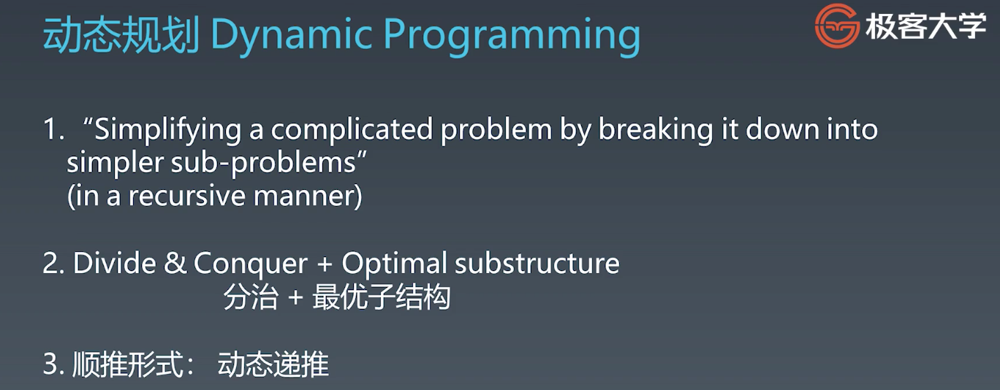
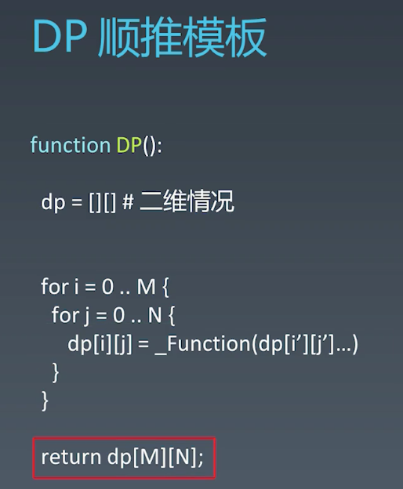
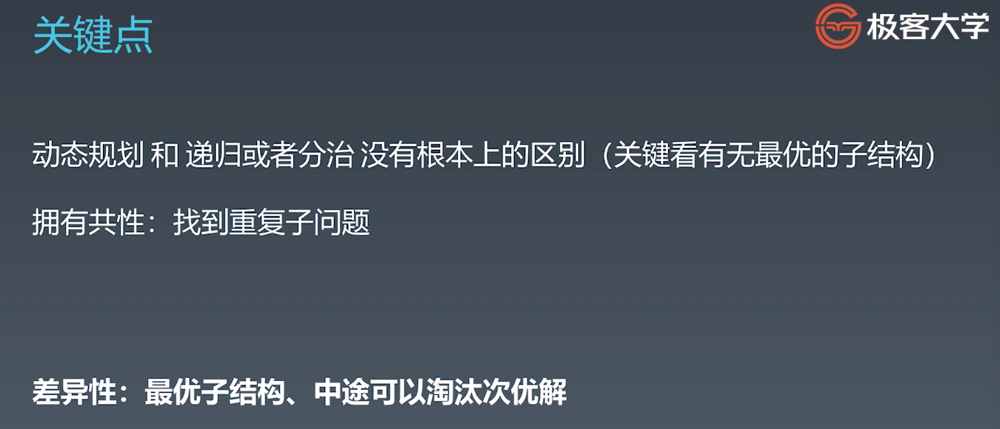
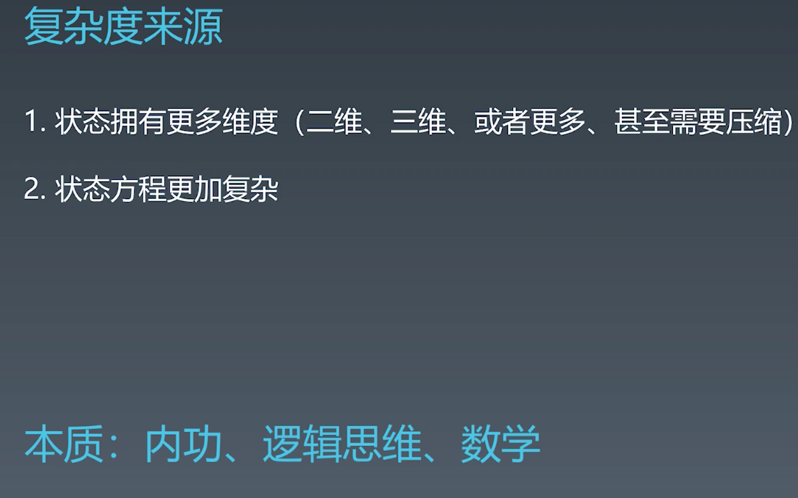
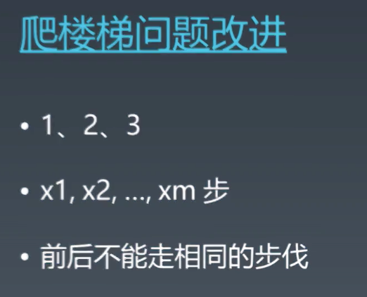
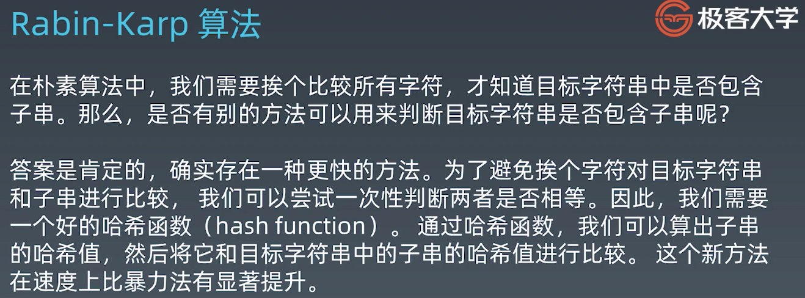
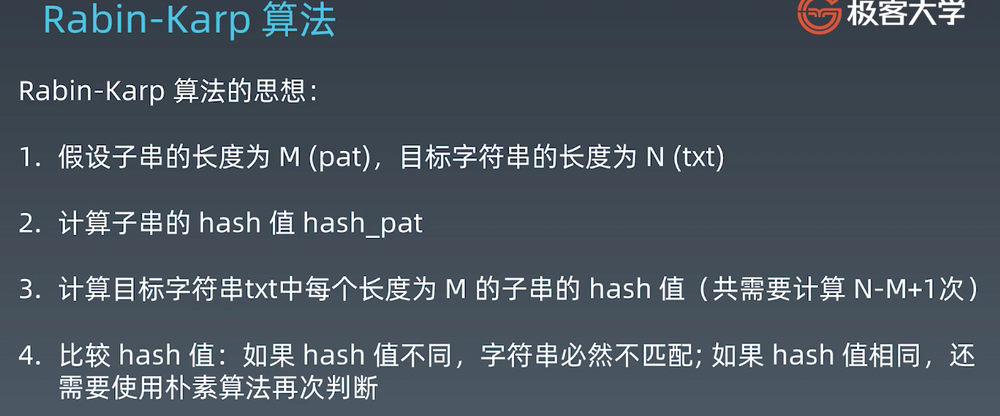
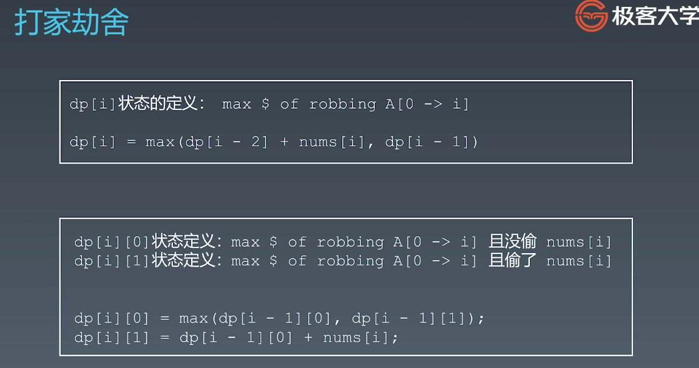
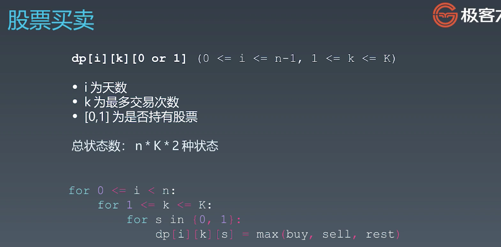
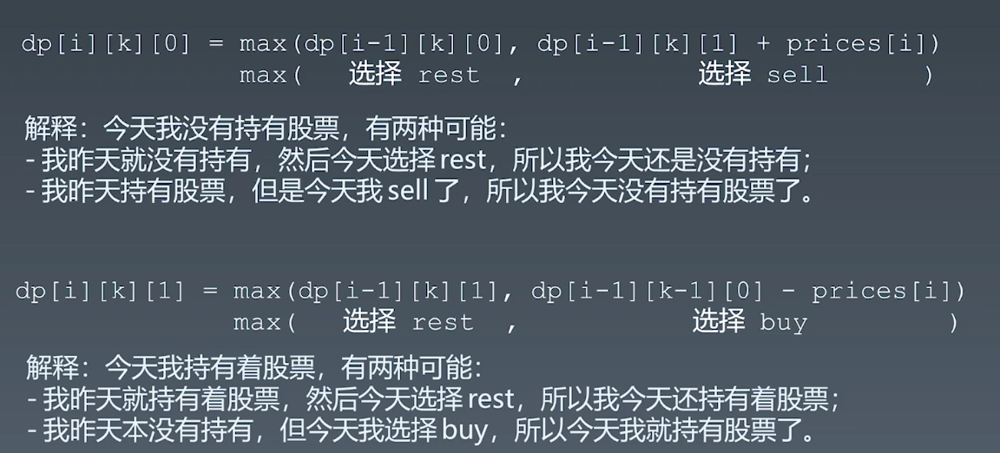

#Week09学习笔记

### 1. 基础知识

#### 1.动态规划

1. 

   图片中的顺推，就是自底向上

   差不多的时候，直接从递推公式入手，即自底向上，这种肯定是最简化和高效的；

2. 

   难点在dp[i]的定义和递推式

3. 

#### 2.高级dp

1. 复杂度来源:多练多思考

   

2. 爬楼梯进阶

   

   进阶1:将固定步数修改为一个数组，数组元素是可以走的步数，这个时候就要把`f(n)=f(n-1)+f(n-2)`换成for循环steps数组，累加`f(n-x)`

   进阶2:不能走与上一步相同的步数，就要增加一个维度，记录上一步走的步数，这一步跳过上一步的步数累加；

3. 编辑距离：

   直接使用BFS，startStr的每个位置可以删除替换或插入，直到找到end；当然盲目的进行这3种操作，复杂度会很高，比如单词接龙中将每个位置的字母替换成a～z的其中一个，然后看是不是在wordbank中，但是这个的话，没有bank，所以操作得到结果就不好判断是否添加到队列中；所以应该进行趋近于end的一些变换，比如horse单词长度过长，可以进行删减操作，或者将h替换为r，就有点启发式搜索的意思了，但是目前觉得仍然是比较迷糊的，替换或删除或插入的规则不太好制定；当然总的俩说是一种可行的方法，之后可以使用双向BFS进行优化；**要看一下BFS解法**

#### 3.字符串算法

1. Java 中已存在的字符串，如果多个变量的String相同，会指向同一个字符串，是immutable的

2. 基础字符串操作，回文等，都不难，多练习就好了

3. 高级字符串算法：结合DP，大多是二维数组

4. 字符串匹配算法：相应的面试题不多，更多的是理论要理解，原理，一般不要求实现

   - 暴力法：O(MN)

     ```java
     public static int forceSearch(String txt, String pat) {
         int M = txt.length();
         int N = pat.length();
     
         for (int i = 0; i <= M - N; i++) {
             int j;
             for (j = 0; j < N; j++) {
                 if (txt.charAt(i + j) != pat.charAt(j))
                     break;
             }
             if (j == N) {
                 return i;
             }
             // 更加聪明？ 
             // 1. 预先判断 hash(txt.substring(i, M)) == hash(pat)
             // 2. KMP 
         }
         return -1;
     }
     
     ```

     

   - Rabin-Karp算法：计算origin的substring(i,j)的hash值与pat的hash值是否相同，如果相同，一般就是了；如果不同，就肯定不是，所以一个好的hash函数很重要。

     

     

     要是每次计算子串的hash值都是完全从头开始，那还是要遍历子串，时间复杂度还是O(N)，所以借助滑窗，每次去掉旧字母添加新字母，计算新子串的hash值时间复杂度只有O(1)，

     算法是使用256进制，计算字符串的值，因为结果会很大，所以mod9997

     ```java
     public final static int D = 256;
     public final static int Q = 9997;
     
     static int RabinKarpSerach(String txt, String pat) {
         int M = pat.length();
         int N = txt.length();
         int i, j;
         int patHash = 0, txtHash = 0;
     
         for (i = 0; i < M; i++) {
             patHash = (D * patHash + pat.charAt(i)) % Q;
             txtHash = (D * txtHash + txt.charAt(i)) % Q;
         }
     9
         int highestPow = 1;  // pow(256, M-1)
         for (i = 0; i < M - 1; i++) 
             highestPow = (highestPow * D) % Q;
     
         for (i = 0; i <= N - M; i++) { // 枚举起点
             if (patHash == txtHash) {
                 for (j = 0; j < M; j++) {
                     if (txt.charAt(i + j) != pat.charAt(j))
                         break;
                 }
                 if (j == M)
                     return i;
             }
             if (i < N - M) {
                 txtHash = (D * (txtHash - txt.charAt(i) * highestPow) + txt.charAt(i + M)) % Q;
                 if (txtHash < 0)
                     txtHash += Q;
             }
         }
     
         return -1;
     }
     ```

     

   - [KMP](http://www.ruanyifeng.com/blog/2013/05/Knuth%E2%80%93Morris%E2%80%93Pratt_algorithm.html)：本质是在匹配失败时，找到失败子串的最大可用前缀来前进i步，而不是下次只前进一步

     

   - 扩展

     - [Boyer-Moore](https://www.ruanyifeng.com/blog/2013/05/boyer-moore_string_search_algorithm.html)
     - [Sunday](https://blog.csdn.net/u012505432/article/details/52210975)

   

   

#### 4. 相关题目

#####dp

1. [198. 打家劫舍](https://leetcode-cn.com/problems/house-robber/)

   使用一维数组和二维数组两种方式

   

2. [121. 买卖股票的最佳时机](https://leetcode-cn.com/problems/best-time-to-buy-and-sell-stock/)

   

   

   过程：定义dp状态；状态转移方程

3. [746. 使用最小花费爬楼梯](https://leetcode-cn.com/problems/min-cost-climbing-stairs/)

4. [64. 最小路径和](https://leetcode-cn.com/problems/minimum-path-sum/)

5. [62. 不同路径](https://leetcode-cn.com/problems/unique-paths/)

6. [70. 爬楼梯](https://leetcode-cn.com/problems/climbing-stairs/)

7. [72. 编辑距离](https://leetcode-cn.com/problems/edit-distance/)

##### 字符串

无

---

### 2.每日一题

#### 2.1 6-15

1. [14. 最长公共前缀](https://leetcode-cn.com/problems/longest-common-prefix/)
- 这个题的解法还是很多的
- 可以直接暴力匹配，即从头开始，两个两个的获取公共子串，直到最后；或者中途为空；
- 也可以先获取最短字符串，以此为res逐个匹配
- 也可以使用trie树，之后取出公共前缀


#### 2.2 6-16

1. [297. 二叉树的序列化与反序列化](https://leetcode-cn.com/problems/serialize-and-deserialize-binary-tree/)
- 就是一个简单的递归遍历，而且之前也做过，但是没想出来，原因是对递归的认识下降了；没事，再做一遍

- CharSequence

  ```java
  CharSequence类是java.lang包下的一个接口，此接口对多种不同的对char访问的统一接口，像String、StringBuffer、StringBuilder类都是CharSequence的子接口；
  
  CharSequence类和String类都可以定义字符串，但是String定义的字符串只能读，CharSequence定义的字符串是可读可写的；
  
  对于抽象类或者接口来说不可以直接使用new的方式创建对象，但是可以直接给它赋值；
  ```

- Integer.valueOf(c)的一点小问题

  - 如果c是String，比如"1"，那么valueOf的结果就是int 1；
  - 如果c是char，比如'1'，那么结果就是49，是'1'的ASCII值；
  - StringBuilder不能使用String[]初始化；sb中没有按索引取String的方法；sb更多的还是用于构造字符串，像这种场景，保存date并取出还是使用容器才对；以下是坑合集；使用容器不香嘛？

  ```java
      // Decodes your encoded data to tree.
      public TreeNode deserialize(String data) {
          System.out.println(data);
          // StringBuilder不能使用string[]初始化
          // return dePreOrder(new StringBuilder(data.split(",")));
          StringBuilder sb=new StringBuilder();
          for(String s:data.split(",")){
              sb.append(s);
          }
          return dePreOrder(sb);
      }
  
      private TreeNode dePreOrder(StringBuilder sb){
          //stringBuilder会有StringIndexOutOfBoundsException：index0,length 0的错误
          //加了if(sb.length()==0) return null;会错乱;
          //哦是sb中包含了data中的，并且忘了删除；
          if(sb.length()==0) return null;
          // 使用char c 得到的结果是[49,50,51,null,null,52,53],
          //但是charAt只能返回char，所以在下面减去
          char c=sb.charAt(0);
          // System.out.println(c);
          sb.deleteCharAt(0);
          // System.out.println(sb);
          if(c=='#') return null;
  
          // int num=Integer.valueOf(c);
          // System.out.println(num);
          // 使用sb确实踩了很多坑，比如节点值并不只在0～9，所以
          TreeNode root=new TreeNode(Integer.valueOf(c)-'0');
          root.left=dePreOrder(sb);
          root.right=dePreOrder(sb);
          return root;
      }
  ```

- 另外还有一个比较在意的问题是，为什么使用容器不会触发返回null造成valueOf 出现NullPointer错误

  因为要发生以上问题，是要在容器为空并且还有节点的子节点信息没有获取完毕再次执行deserial；但是保存方法中，保存了所有节点信息，即使是空节点也保存为了#，所以不会缺失任何节点信息，在得到#会return，不会向下执行deserial，在所有节点信息获取后正好容器为空，这是有serial方法的保存方式保证的。
  
  

2. [面试题52. 两个链表的第一个公共节点](https://leetcode-cn.com/problems/liang-ge-lian-biao-de-di-yi-ge-gong-gong-jie-dian-lcof/)
- 暴力解法，相当于两层for循环，固定其中一个链表的一个节点，遍历另一个链表；

- 将其中一个链表首尾相连不就是找环形链表的入口嘛；

- 还有一种最简单的，不需要改遍链表结构的方法，两者都一步步走，走到尾了再从对方的起点出发；因为是走对方的路，所以到达交点时走过的路程是一样的；最多各自走(M+N)就可以得到结果；

  ```java
  //1,100;  42.8,100
  //不需要担心死循环，因为即使没有交点，在两个指针走完后会同时为null
  public class Solution{
      public ListNode getIntersectionNode(ListNode headA,ListNode headB){
          ListNode curA=headA;
          ListNode curB=headB;
          while(curA!=curB){
              curA=(curA==null?headB:curA.next);
              curB=(curB==null?headA:curB.next);
          }
          return curA;
      
  ```


#### 2.3 6-17

1. [1014. 最佳观光组合](https://leetcode-cn.com/problems/best-sightseeing-pair/)
- 这道题初看是道DP，但仔细分析可以发现并不需要

- 答案由4部分组成，`A[i] + A[j] + i - j`，但是可以分成2部分，``A[i] +  i``和``A[j] - j``，对每个位置来说，这两部分都是固定的，那就固定其中一个做为遍历索引，另一个作为变量，比如固定`j`，因为`i<j`，所以`j`的范围是`1~length-1`，那么``A[j] - j``在每次遍历中就是定值，所以就要寻找``A[i] +  i``的最大值就可以得到全局最大值，因为``A[i] +  i``对每个位置来说也是确定的，所以可以在以`j`为循环索引的过程中，迭代获取``A[i] +  i``的最大值；同时每遍历到一个新的`j`，都与当前已经迭代过的`i:0~j-1`得到的最大值相加，就是到`j`为止的全局最大值，当`j==length-1`就是全局最大值了。

- 这个题最重要的就是发现，对每个位置来说，``A[i] +  i``和``A[j] - j``的值都是确定的，所以二者取得最值是独立的，可以分别迭代获得最大值。

- 再进一步，就是在`i<j`的情况下，分别求``A[i] +  i``和``A[j] - j``的最大值然后相加。

  ```java
  class Solution {
      public int maxScoreSightseeingPair(int[] A) {
          int res=0;
          int max=A[0]+0;
          for(int j=1;j<A.length;j++){
              res=Math.max(res,max+A[j]-j);
              max=Math.max(max,A[j]+j);
          }
          return res;
      }
  }
  ```


2. [56. 合并区间](https://leetcode-cn.com/problems/merge-intervals/)
- 老题新做，发现不足

- 这个题逻辑比较简单，但是实现时容易出很多小问题，比如索引什么时候增加，边界数组的处理，还有一个Java对数组的处理不是很灵活，如何返回不确定长度的二维数组

  ```java
  class Solution{
      public int[][] merge(int[][] intervals){
          if(intervals==null || intervals.length==0) return new int[0][];
          Arrays.sort(intervals,(o1,o2)->(o1[0]-o2[0]));
          int length=intervals.length;
          int[][] res = new int[length][];
          int index=-1;
          for(int[] interval:intervals){
              if(index==-1 || interval[0]>res[index][1]){
                  res[++index]=interval;
              }else{
                  res[index][1]=Math.max(res[index][1],interval[1]);
              }
          }
          return Arrays.copyOf(res,index+1);
      }
  }
  
  
  class Solution{
      public int[][] merge(int[][] intervals){
          if(intervals==null || intervals.length==0) return new int[][]{};
          Arrays.sort(intervals,(o1,o2)->(o1[0]-o2[0]));
          int length=intervals.length;
          
          List<int[]> res=new ArrayList<>();
          for(int i=0;i<length;i++){
              int left=intervals[i][0];
              int right=intervals[i][1];
              while(i<length-1 && right>=intervals[i+1][0]){
                  right=Math.max(right,intervals[++i][1]);
              }
              res.add(new int[]{left,right});
          }
          return res.toArray(new int[0][]);
      }
  }
  ```


#### 2.4 6-18

1. [1028. 从先序遍历还原二叉树](https://leetcode-cn.com/problems/recover-a-tree-from-preorder-traversal/)
- 仅仅是先序自然是无法得到原本的树的，但是这个题有许多条件，比如使用-的数量代表节点所在层数；规定如果只有一个节点一定是左节点；

- **递归**：通过这个题对二叉树的遍历有了更深的认识，比如DFS结果，一定是可以分成节点、左子树和右子树3部分的，也是这个原因可以通过DFS遍历S一遍还原树，得到root后，直接递归调用构造树的函数 顺序遍历S 构造左子树，左子树递归构造完毕后，直接继续遍历S获得右子树，当然这个题目有个限制条件，`如果节点只有一个子节点，那么保证该子节点为左子节点`，这个也是可以先构造左子树的原因

  ```java
  // 递归&非典型回溯
  //2,100;  40.3,25
  class Solution {
      //用于遍历整个S的全局索引
      private int index=0;
      public TreeNode recoverFromPreorder(String S) {
          if(S==null || S.length()==0) return null;
          char[] schar=S.toCharArray();
          TreeNode root=getNode(schar,0);
          // 1是作为root节点的子节点前-的数量
          return makeTree(root,schar,1);
      }
  
      //因为这里是前序遍历，所以所有的左子树节点都在一起，使用DFS构建完左子树，接下来就是右子树的节点
      private TreeNode makeTree(TreeNode root,char[] schar,int dept){
          TreeNode leftNode=getNode(schar,dept);
          //作为左子树
          // 题目中的限制条件，如果只有一个子节点，那么应该是左节点
          // 所以这里可以先把找到的depth层的第一个作为左节点，下一个同层为右节点
          if(leftNode!=null){
              root.left=makeTree(leftNode,schar,dept+1);
              //查看右子树是否存在
              TreeNode rightNode=getNode(schar,dept);
              if(rightNode!=null){
                  root.right=makeTree(rightNode,schar,dept+1);
              }
          }
          return root;
      }
  
      private TreeNode getNode(char[] schar,int dept){
          //统计-的数量，将与dept比较
          int count=0;  
          //index是全局的，直接从index开始，index之前的都是已经使用过的，因为DFS，还原树直接按S顺序即可
          while(index<schar.length && schar[index]=='-'){
              count++;
              index++;
          }
          TreeNode res=null;
          if(count==dept){
              int num=0;
              while(index < schar.length && schar[index]!='-'){
                  num=num*10 + schar[index++]-'0';
              }
              res=new TreeNode(num);
          }else{
              //如果不存在dept的节点，需要将index返回到执行本次getNode之前的状态，这个也是很重要的一步，不算是完全的回溯，可以算是回退，为了避免因为不匹配dept而浪费了这个节点，因为它是之后层的
              index=index-count;
          }
          return res;
      }
  }
  ```

  

- 从昨天的二叉树序列化到今天的还原树，感觉自己对递归的理解还不够，之后还需要再联系更多二叉树的问题。

- **非递归解法：迭代stack，加深对递归的认识，在对这个解法理解后，发现S的代表一棵子树的子串，一定是按照层序出现，不会断层**

  ```java
  //迭代stack
  //4,86.45;  40.4,25
  class Solution{
      public TreeNode recoverFromPreorder(String S) {
          // deque性能更好
          // Stack<TreeNode> stack = new Stack<>();
          Deque<TreeNode> stack=new ArrayDeque<>();
          char[] schar=S.toCharArray();
          int level,i;
          while(i<schar.length){
              //计算当前节点在第几层
              //只有当是左节点时才正好时peek的子节点，如果是右节点需要stack pop，所以还是需要level
              for(level=0;schar[i]=='-';i++) level++;
  
              //计算节点值,i递增的地方就应该先检查索引范围
              int num=0;
              while(i<schar.length && schar[i]!='-'){
                  num=num*10+schar[i++]-'0';
              }
              TreeNode node=new TreeNode(num);
  
              //这一步相当于递归返回时，将右子节点连接到根节点上时发生，如果是左节点，则不会发生
              //同样的，由于输入S的连续性，可以保证在向下逐步构造树时，新的节点是顶层的子节点，
              //比如peek是第一层的节点，那么新的node一定是第二层的，不会是第三层或之后的，
              //因为第三层---之前一定有至少一个--的节点，不然这棵子树就断了
              //查看是否是peek的节点，不是的话pop
              while(stack.size()>level) stack.pollLast();
  
              //非空判断是对root进行的
              if(!stack.isEmpty()){
                  if(stack.peekLast().left==null){
                      stack.peekLast().left=node;
                  }else{
                      stack.peekLast().right=node;
                  }
              }
              // 下面这个并不仅用于root，在普通节点添加到其父节点后，也应该入栈，
              //作为下一个节点的父节点或者被弹出
              // else{
              //     //root节点
              //     stack.addLast(node);
              // }
              stack.addLast(node);
          }
          //添加完节点，返回最下面的root
          return stack.poll();
      }
  }
  ```


#### 2.5 6-19

1. [125. 验证回文串](https://leetcode-cn.com/problems/valid-palindrome/)
- 基本的字符串问题，使用首尾双指针交换即可

- 这个题好像就考察API的使用？完全使用API的写法

  ```java
  //6，39.16；  39.6，7.14
  class Solution{
      public boolean isPalindrome(String s) {
          String str = s.toLowerCase();
          StringBuilder sb = new StringBuilder();
          for(char c : str.toCharArray()){
              if(Character.isLetterOrDigit(c))    sb.append(c);
          }
          return sb.toString().equals(sb.reverse().toString());
      }
  }
  ```

2. [205. 同构字符串](https://leetcode-cn.com/problems/isomorphic-strings/)
- 作业题


#### 2.6 6-20

1. [10. 正则表达式匹配](https://leetcode-cn.com/problems/regular-expression-matching/)
- [一篇](https://leetcode-cn.com/problems/regular-expression-matching/solution/shou-hui-tu-jie-wo-tai-nan-liao-by-hyj8/)
- [另一篇](https://leetcode-cn.com/problems/regular-expression-matching/solution/dong-tai-gui-hua-zen-yao-cong-0kai-shi-si-kao-da-b/)
- labuladong也有讲这个题，从普通的字符串匹配开始讲起，比较清楚
- 这个题主要就是\*的情况比较复杂，i是\*的话，要先判断，p[i-1]与s[i]是不是匹配的，根据这个可以分为两种情况，不配的话，跳过p[i-1]和p[i]；匹配的话，要分匹配0次、1次和多次，只要

#### 2.7 6-21 

1. [124. 二叉树中的最大路径和](https://leetcode-cn.com/problems/binary-tree-maximum-path-sum/)
- 能想到的直接办法就是遍历整棵树，对每个节点找以这个节点为根的最长路径，左右节点中选择大的那一个分支；——选大的分支不可行，有可能另一个分支节点数更多，使和更大；但是这样时间复杂度应该很高
- 顶不住哇，太辣鸡了；看了题解其实很简单，主要是在如何获取每个节点最大值的问题上迷惑了；仔细想想，每个节点最大值其实就是本节点加上左右节点中的较大值；如何获取左右节点的值，递归获取
- 每个节点的最终增益和得到每个节点处的最大路径和更新全局最大值是分开的，

---

### 3. 作业算法题

#####dp

1. [300. 最长上升子序列](https://leetcode-cn.com/problems/longest-increasing-subsequence/)
- 基础的dp也要`O(N^2)`的时间复杂度，因为对每一个index都要遍历`0~index-1`来寻找dp[index]的最大值；
- dp+贪心+二分查找：[一片题解](https://leetcode-cn.com/problems/longest-increasing-subsequence/solution/dong-tai-gui-hua-er-fen-cha-zhao-tan-xin-suan-fa-p/)，暂时先不看这种解法，先熟悉基础的dp

2. [91. 解码方法](https://leetcode-cn.com/problems/decode-ways/)
- 与上楼梯和斐波那契相同，区别是是否可以上两级台阶或者第二个加数，要进行判断
3. [32. 最长有效括号](https://leetcode-cn.com/problems/longest-valid-parentheses/)
- 难点在要求是子串，如果是子序列，计数可匹配的括号对数就可以

- dp

  ```java
  //dp方法没有想出来，看了之后觉得还是有些难的
  //因为有效子串肯定是以）结尾的，所以(的dp=0；所以）的dp记录参与的有效子串的长度
  //dp解法想的是，当遍历到）时，它是否有（可以匹配，如果有的话，它在哪里
  //1.）的左边就是（，这时候的长度除了2，（前面是否就是有效子串，如果是，还要加上前面的长度；
  //2.）的左边是），那么就要向前找是否有可匹配的（，就要跳过左边的）已经存在的有效子串长度，找有没有（，
  //如果没有找到可匹配的（，就是0了，断掉
  //其实第一种情况可以看成第2种的特例，所以两种放在一起讨论即可
  //要是自己想的话，我觉得还是不容易想出来的
  //因为自己的思路是，通过记录左右括号的数量来判断是否有效，
  //像dp这样，直接找可匹配的（，再记录目前的有效长度，还是有些难的
  //1,100;  40.1,9.52
  class Solution{
      public int longestValidParentheses(String s){
          if(s==null || s.length()==0) return 0;
          char[] schar=s.toCharArray();
          int length=schar.length;
          int[] dp=new int[length];
          int max=0;
          for(int i=0;i<length;i++){
              if(schar[i]=='(') dp[i]=0;
              else if(i>0){
                  //找可匹配的(
                  if(i-dp[i-1]-1>=0 && schar[i-dp[i-1]-1]=='('){
                      dp[i]=dp[i-1]+2;
                      if(i-dp[i-1]-2>0) dp[i]+=dp[i-dp[i-1]-2];
                      max=Math.max(max,dp[i]);
                  }
              }
          }
          return max;
      }
  }
  ```

- 尝试用二维dp做一下，发现好像不行，因为二维中没有可使用的重复子问题；
4. [85. 最大矩形](https://leetcode-cn.com/problems/maximal-rectangle/)
- 与最大正方形的区别是要记录两个数值，长和宽；没想出来；想法被困在最大正方形中了，一直想着使用最大正方形的方法解这个题；实际上不可行；
- 暴力，遍历每两个位置组成的矩形，超时`O(N^3*M^3)`
- 优化暴力，使用dp
- 小看这个题了，是个练习各种方法的好例子，应该仔细看
- [多种解](https://leetcode-cn.com/problems/maximal-rectangle/solution/xiang-xi-tong-su-de-si-lu-fen-xi-duo-jie-fa-by-1-8/)
- 对暴力的第一个优化，是可以在每个位置，得到它所在行的1的长度后，向上走一层，得到当前宽度后，乘以高度，得到此时的面积，更新最大面积；
- [84. 柱状图中最大的矩形](https://leetcode-cn.com/problems/largest-rectangle-in-histogram/)，对matrix中，不同层的所有1就是84题中的柱状图，同样是找出最大矩形；
- dp：感觉不像模板式的dp，没有套路的填数组过程，而是向下一层就更新相关数组；只是更新数组时不是完全从头计算，而是根据增加的事1还是0进行更新对应的值，之后还是使用84题中的计算方法；
5. [115. 不同的子序列](https://leetcode-cn.com/problems/distinct-subsequences/)
- [见下](#字符串+DP)
6. [818. 赛车](https://leetcode-cn.com/problems/race-car/)
- 有点像跳跃游戏，找到达终点的最少步数；
- 大体上看得懂，但是细节问题还需要再理解，感觉有点难；
- [一个DFS&DP](https://leetcode.com/problems/race-car/discuss/124326/Summary-of-the-BFS-and-DP-solutions-with-intuitive-explanation)

##### 字符串基础问题

1. [709. 转换成小写字母](https://leetcode-cn.com/problems/to-lower-case/)
- `if(schar[i]>=65 && schar[i]<=90) schar[i]+=32;`

2. [58. 最后一个单词的长度](https://leetcode-cn.com/problems/length-of-last-word/)
- trim后从后往前count

3. [771. 宝石与石头](https://leetcode-cn.com/problems/jewels-and-stones/)
- 遍历两边数组，再count就好了

4. [387. 字符串中的第一个唯一字符](https://leetcode-cn.com/problems/first-unique-character-in-a-string/)
- 第一遍统计次数，第二遍找

5. [8. 字符串转换整数 (atoi)](https://leetcode-cn.com/problems/string-to-integer-atoi/)：这个题主要是对代码能力有要求，处理各种情况，如果可以很顺利的写完，代码能力是没有问题的

   ```java
   //2,99.59;  39.9,5.77
   class Solution {
       public int myAtoi(String str) {
           int index = 0, sign = 1, total = 0;
           //1. Empty string
           if(str.length() == 0) return 0;
           char[] schar=str.toCharArray();
           int length=schar.length;
   
           //2. Remove Spaces
           while(index < length && schar[index] == ' ' ) index ++;
           if(index >= length) return 0;
   
           //3. Handle signs
           if(schar[index] == '+' || schar[index] == '-'){
               sign = schar[index] == '+' ? 1 : -1;
               index ++;
           }
           //4. Convert number and avoid overflow
           while(index < length ){
               int digit = schar[index] - '0';
               if(digit < 0 || digit > 9) break;
   
               //check if total will be overflow after 10 times and add digit
               if(Integer.MAX_VALUE/10 < total ||            
                   Integer.MAX_VALUE/10 == total && Integer.MAX_VALUE %10 < digit)
                   return sign == 1 ? Integer.MAX_VALUE : Integer.MIN_VALUE;
   
               total = 10 * total + digit;
               index ++;
        }
           return total * sign;
       }
   }
   ```
   
   


##### 字符串操作

1. [14. 最长公共前缀](https://leetcode-cn.com/problems/longest-common-prefix/)
   - 暴力匹配
   - 纵向比较
   - trie
2. [344. 反转字符串](https://leetcode-cn.com/problems/reverse-string/)
   - 首尾指针
3. [541. 反转字符串 II](https://leetcode-cn.com/problems/reverse-string-ii/)
- 没啥好说的，找出应该反转的，反转就行了
4. [151. 翻转字符串里的单词](https://leetcode-cn.com/problems/reverse-words-in-a-string/)
  
   - 用系统函数就挺好，split，reverse，join
   
   - reverse整个string，再反转里面每个单词，O(N)，因为循环是独立的，没有嵌套
   
   - 发现一个点：
   
     ```java
     String[] words = s.trim().split(" +");
     Collections.reverse(Arrays.asList(words));
     System.out.println(words instanceof String[]);  //true
     return String.join(" ", words);
     ```
   
     在将words转为list后，再reverse，虽然没有进行赋值，但是之后words是逆序的；
   
     查看源码后解释为：Arrays.asList将words封装为Arrays中的私有内部类ArrayList，该类对象主体也是一个数组，所以将words引用直接赋值给list中的数组；而reverse也是直接对list中数组的引用操作的，所以相当于直接逆序了words
   
     另外判断对象是不是想的类型，instanceof String[]
   
   - 还有一种递归解法，通过看这个递归解，再次认识到自己对递归的理解和使用还不够
   
     ```java
     //1,99.99;  40,5.26
     class Solution{
         public String reverseWords(String s){
             if(s==null || s.length()==0) return "";
             char[] schar=s.toCharArray();
             return reverseHelper(schar,0,new StringBuilder()).toString().trim();
         }
     
         private StringBuilder reverseHelper(char[] schar,int start,StringBuilder sb){
             //跳过空格
             while(start<schar.length && schar[start]==' ') start++;
             //递归中止
             if(start==schar.length) return sb;
             //start为单词起点，接下来找单词终点
             int end=start;
             while(end<schar.length && schar[end]!=' ') end++;
     
             //递归
             reverseHelper(schar,end,sb);
     
             //递归后本层单词之后的都已经添加到sb中了，这里要添加本轮的单词
             //使用char数组构造字符串可以new 也可以valueOf
             sb.append(new String(schar,start,end-start)).append(" ");
             sb.append(String.valueOf(schar,start,end-start)).append(" ");
             return sb;
         }
     }
     ```
   
5. [557. 反转字符串中的单词 III](https://leetcode-cn.com/problems/reverse-words-in-a-string-iii/)
- 遍历一遍字符串，找出每个单词，反转即可
6. [917. 仅仅反转字母](https://leetcode-cn.com/problems/reverse-only-letters/)
- 首尾双指针，isLetter，交换


##### 异位词问题

1. [242. 有效的字母异位词](https://leetcode-cn.com/problems/valid-anagram/)
- 之前做过了
2. [49. 字母异位词分组](https://leetcode-cn.com/problems/group-anagrams/)
- 对数组中的每个字符串排序，将结果作为map的key，排序结果相同的就是异位词
3. [438. 找到字符串中所有字母异位词](https://leetcode-cn.com/problems/find-all-anagrams-in-a-string/)
   - 每个索引检查长度为p.length长度的子串，统计每个子串的时候不需要完全重新开始，可以把上一个子串的第一个去掉加进新的字符
   - 直接思路，用int[26]数组记录子串状态，并与p的状态数组比较，相等则添加本次索引，6.90.4; 41.2,5.88


##### 回文串问题

1. [125. 验证回文串](https://leetcode-cn.com/problems/valid-palindrome/)
- 最直接的，使用首尾双指针
- 将字母保存到sb中，逆序后与正序比较
2. [680. 验证回文字符串 Ⅱ](https://leetcode-cn.com/problems/valid-palindrome-ii/)
- 定义一个方法，比较字符串是不是回文串；可以删除一个字符，再遇到不相等的两个字符时，可以删除左也可以删除右，所以分两种情况中，只要有一种情况是回文就可以
3. [5. 最长回文子串](https://leetcode-cn.com/problems/longest-palindromic-substring/)
- 针对回文子串，有中心扩散法，以i为中心，单中心和双中心

- dp，操作二维矩阵

- 暴力也可以，但效率比较低

- 纯递归会超时，加入剪枝应该会好一点

  


##### 最长子串、子序列问题

1. [1143. 最长公共子序列](https://leetcode-cn.com/problems/longest-common-subsequence/)
- 没啥好说的，二维dp
2. [72. 编辑距离](https://leetcode-cn.com/problems/edit-distance/)
3. [5. 最长回文子串](https://leetcode-cn.com/problems/longest-palindromic-substring/)


##### 字符串+DP

1. [10. 正则表达式匹配](https://leetcode-cn.com/problems/regular-expression-matching/)
- [每日一题](#2.6 6-20)
2. [44. 通配符匹配](https://leetcode-cn.com/problems/wildcard-matching/)
- 这个题的难度比正则是要简单一点的，因为这里的\*不受前一个字符的影响，可以任意匹配，

  ```java
  public boolean isMatch(String s, String p) {
      char[] schar=s.toCharArray();
      char[] pchar=p.toCharArray();
      int slen=schar.length;
      int plen=pchar.length;
      boolean[][] dp = new boolean[slen + 1][plen + 1];
      dp[0][0] = true;
      for (int j = 1; j <= plen; j++) {
          if (pchar[j - 1] == '*') dp[0][j] = dp[0][j-1];
      }
      for (int i = 1; i <= slen; i++) {
          for (int j = 1; j <= plen; j++) {
              if (pchar[j - 1] == '*') {
                  //当前pat的字符是*，可以不匹配，即dp[i][j - 1]；
                  //可以匹配当前字符也可以匹配上，即dp[i - 1][j-1]；
                  //也可以匹配多次，即dp[i - 1][j]，相当于*跳过了当前i，检查与上一个i的匹配情况
                  //并且dp[i-1][j]的结果包含了dp[i - 1][j-1]，
                  //因为当前为*，不对*进行匹配就是dp[i - 1][j-1]，所以可以省略dp[i - 1][j-1]
                  // dp[i][j] = dp[i - 1][j] || dp[i][j - 1] || dp[i-1][j - 1];
                  dp[i][j] = dp[i - 1][j] || dp[i][j - 1];
              } else if (pchar[j - 1] == '?' || schar[i - 1] == pchar[j - 1]) {
                  dp[i][j] = dp[i - 1][j - 1];
              }
          }
      }
      return dp[slen][plen];
  }
  ```

  
3. [115. 不同的子序列](https://leetcode-cn.com/problems/distinct-subsequences/)
- 做了有几道dp题了，总的来说，dp虽然有模板，但是针对每个题都是不同的，因为dp的核心是找递推公式，而递推公式对不同的问题一般是不同的，要怎么得到递推公式就要具体问题具体分析，分析怎么从已知结果得到待求问题；
- 对于字符串的dp，一般就是使用二维dp数组，求dp\[i][j]时，经常使用的已知量就是dp\[i-1][j-1]，dp\[i-1][j]，dp\[i][j-1]，而且一般是根据str1[i]和str2[j]是否相等来区分情况；就是将str1和str2都回退一步，将str1回退一步，将str2回退一步，根据问题，与dp\[i][j]构筑关联；
- 当然上面的正则匹配和通配符匹配用到了dp\[i][j-2]，这也说明递推式是根据具体问题来得到的，
- 回到这个问题，在求dp\[i][j]时，自然也要分两种情况，str1[i]和str2[j]是否相等，当不相等时，schar\[j]就可以认为是对结果没有用处，就等于dp\[i][j-1]；当相等时，除了dp\[i][j-1]，还要加上因为相等新增的，新增的数量时多少呢？就是dp\[i-1][j-1]，schar和tchar都没加这个相等的字符时，匹配的数量；


##### others

1. [205. 同构字符串](https://leetcode-cn.com/problems/isomorphic-strings/)
- 使用一种方法，检查s和t中的字符是否一一对应即可，比如使用map，但是要检查s到t和t到s的双向是否都 一一对应；

- 要注意的一个问题是，要双向检查，任何一个字符串中的字符都不可以对应另一个字符串中的多个字符

- 这里记录一种比较简单的解法

  ```java
  //一种简化一点的写法
  //两个字符串中，相同索引i 对应的map的值是相同的，并且不同i 不同，即可保证替换的两个字母一一对应
  class Solution{
      public boolean isIsomorphic(String s, String t) {
          int n = s.length();
          int[] mapS = new int[128];
          int[] mapT = new int[128];
          for (int i = 0; i < n; i++) {
              char c1 = s.charAt(i);
              char c2 = t.charAt(i);
              //当前的映射值是否相同
              if (mapS[c1] != mapT[c2]) {
                  return false;
              } else {
                  //是否已经修改过，修改过就不需要再处理
                  //相同可能是还没有修改，也可能是已修改
                  if (mapS[c1] == 0) {
                      mapS[c1] = i + 1;
                      mapT[c2] = i + 1;
                  }
              }
          }
          return true;
      }
  }
  ```

  

3. 最长公共子串

   ```java
       public String dpLCS(String s1,String s2){
           int length1=s1.length();
           int length2=s2.length();
           int maxX=0;
           int maxlen=0;
           int[][] dp=new int[length1+1][length2+1];
           for(int i=1;i<length1;i++){
               for(int j=1;j<length2;j++){
                   if(s1.charAt(i)==s2.charAt(j)){
                       dp[i][j]=dp[i-1][j-1]+1;
                       if(dp[i][j] > maxlen){
                           maxlen=dp[i][j];
                           maxX=i;
                       }
                   }else{
                       dp[i][j]=0;
                   }
               }
           }
           return s1.substring(maxX-maxlen,maxX+1);
       }
   ```

   

---

### 4. 其他作业题

1. 在学习总结中，写出[不同路径 2 ](https://leetcode-cn.com/problems/unique-paths-ii/)这道题目的状态转移方程。

   `dp[i][j]=dp[i+1][j]+dp[i][j+1],while 0<=i<row-1 && 0<=j<col-1`;

   `dp[i][j]=dp[i+1][j],while j==col-1`;

   `dp[i][j]=dp[i][j+1],while i==row-1`;

   `dp[i][j]=1,while i==row-1 && j==col-1`

   `dp[i][j]=0,while obs[i][j]==1`

---

###5. Other tips